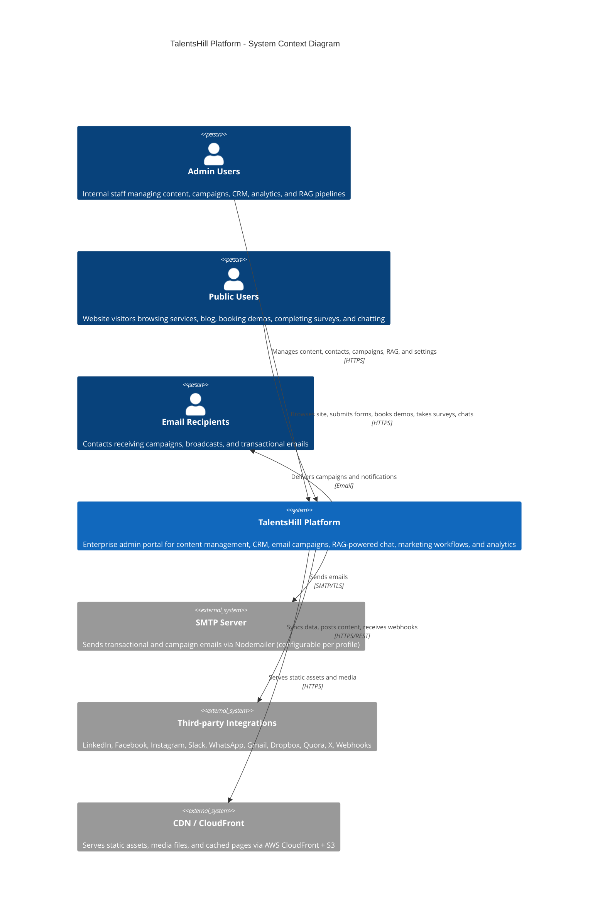
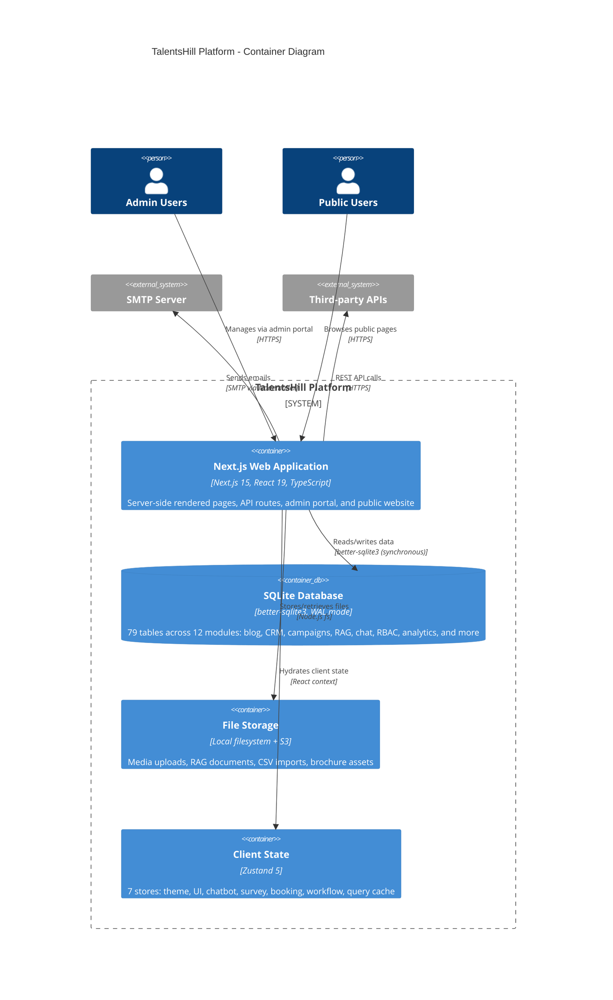
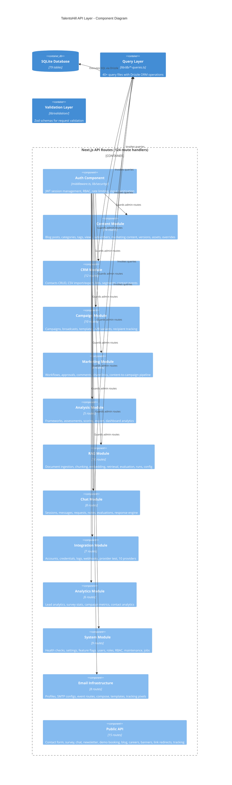
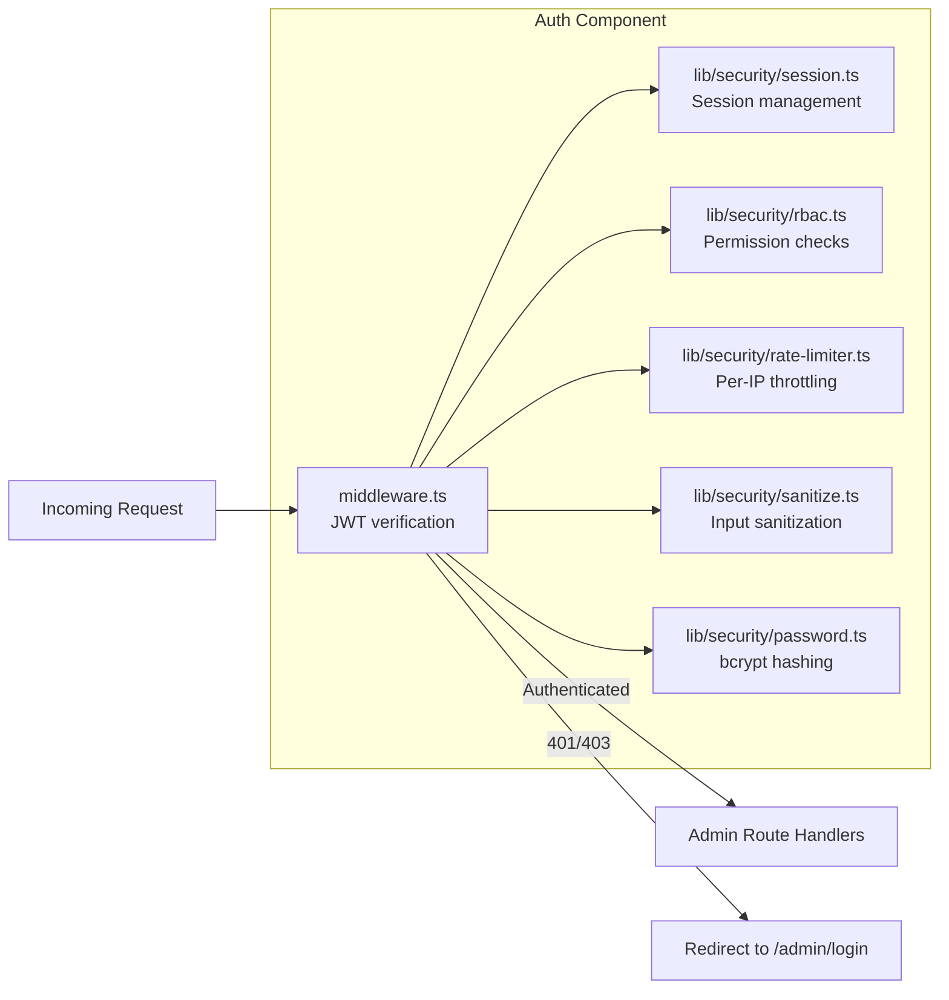
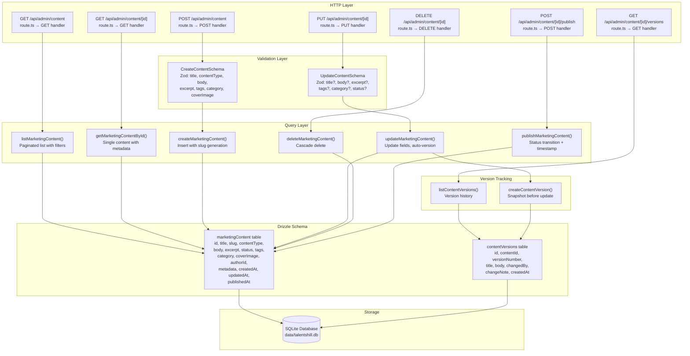
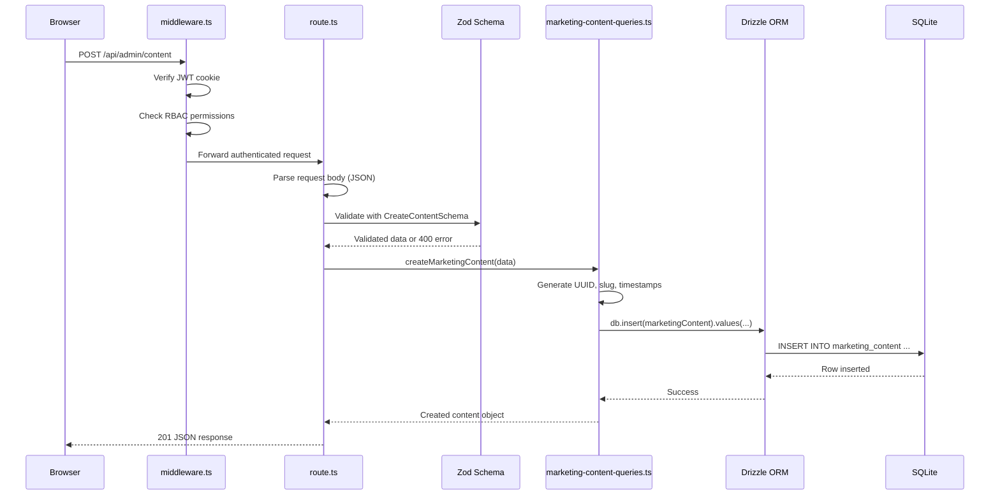
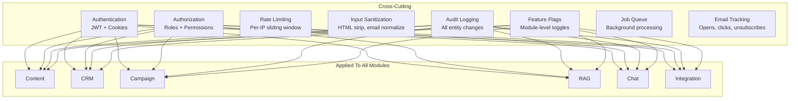

# C4 Architecture Model -- TalentsHill Enterprise Admin Portal

This document describes the TalentsHill platform architecture using the C4 model (Context, Containers, Components, Code). Each level zooms in from the highest-level system view down to implementation detail.

---

## Level 1: System Context Diagram

The system context shows the TalentsHill platform and its relationships with users and external systems.



### Actor Descriptions

| Actor | Role | Interaction |
|-------|------|-------------|
| **Admin Users** | Internal team (admin, editor, viewer roles) | Full admin portal access via JWT session cookies |
| **Public Users** | Website visitors | Browse public pages, submit contact/demo forms, take surveys, use chatbot |
| **Email Recipients** | CRM contacts and subscribers | Receive campaign emails, broadcasts, and transactional notifications |

### External System Descriptions

| External System | Purpose | Protocol |
|-----------------|---------|----------|
| **SMTP Server** | Email delivery for campaigns, broadcasts, and transactional emails | SMTP over TLS (port 587) |
| **Third-party Integrations** | 10 providers: LinkedIn, Facebook, Instagram, Slack, WhatsApp, Gmail, Dropbox, Quora, X, Webhooks | REST/HTTPS |
| **CDN / CloudFront** | Static asset delivery, media files, edge caching | HTTPS via AWS CloudFront + S3 |

---

## Level 2: Container Diagram

The container diagram shows the major deployable units within the TalentsHill platform.



### Container Details

| Container | Technology | Description |
|-----------|-----------|-------------|
| **Next.js Web Application** | Next.js 15.1, React 19, TypeScript 5.7 | Monolithic full-stack app: SSR pages, 124 API route handlers, 62 admin pages |
| **SQLite Database** | better-sqlite3 12.6, Drizzle ORM 0.45 | Single-file database in WAL mode with 79 tables, foreign keys, comprehensive indexes |
| **File Storage** | Local fs + AWS S3 | Media uploads (images, documents), RAG source files, CSV import files |
| **Client State (Zustand)** | Zustand 5.0 with persist middleware | 7 independent stores managing UI, chat, survey, booking, workflow, theme, and server state |

---

## Level 3: Component Diagram -- API Layer

The component diagram shows the internal structure of the Next.js API layer, organized by functional module.



### Module Breakdown

| Module | Route Files | Key Tables | Admin Pages | Description |
|--------|-------------|------------|-------------|-------------|
| **Auth** | 3 | users, roles, permissions, user_roles, groups, group_members | 3 | JWT sessions, RBAC, rate limiting, sanitization |
| **Content** | 14 | blog_posts, blog_categories, blog_tags, blog_views, blog_subscribers, blog_authors, blog_post_categories, blog_post_tags, marketing_content, content_versions, content_assets, content_overrides | 12 | Blog CMS, marketing content, brochures, presentations, versioning |
| **CRM** | 12 | contacts, contact_events, lists, list_members, import_jobs | 4 | Contact management, segmentation, CSV import/export |
| **Campaign** | 10 | campaigns, campaign_recipients, campaign_variants, email_messages, email_events, unsubscribe_tokens | 5 | Email campaigns, A/B testing, recipient tracking |
| **Marketing** | 8 | marketing_workflows, workflow_comments, share_links | 5 | Content-to-campaign pipeline, approvals, share links |
| **Analysis** | 5 | analysis_frameworks, analysis_assessments | 3 | Assessment frameworks, scoring, export |
| **RAG** | 10 | rag_documents, rag_chunks, rag_embeddings, rag_cache, rag_runs, rag_run_steps, rag_run_metrics, rag_configs | 5 | Document ingestion, chunking, vector embeddings, retrieval |
| **Chat** | 8 | chat_sessions, chat_messages, chat_requests, chat_message_evals, admin_notes | 3 | Visitor chatbot, request triage, message evaluation |
| **Integration** | 7 | integrations, integration_accounts, integration_credentials, integration_logs, webhooks | 2 | 10 providers (LinkedIn, Slack, WhatsApp, etc.), webhooks |
| **Analytics** | 6 | survey_responses, survey_answers, contact_submissions | 3 | Lead analytics, survey insights, campaign metrics |
| **Email Infrastructure** | 8 | email_profiles, smtp_configs, email_profile_smtp, event_routes, email_templates, email_template_versions, broadcasts | 4 | SMTP management, profiles, templates, compose |
| **System** | 9 | site_settings, feature_flags, feature_flag_versions, feature_flag_active, audit_log, jobs, job_runs, job_logs | 7 | Health, settings, feature flags, users, roles, maintenance, jobs |
| **Public API** | 15 | -- (reads from multiple modules) | 0 | Public-facing forms, chat, survey, blog, career applications |

---

### Auth Component Detail



### Query Layer Detail

```mermaid
graph TD
    subgraph "Query Layer (lib/db/)"
        BQ[blog-queries.ts]
        CQ[contact-queries.ts]
        CCQ[contact-crm-queries.ts]
        LQ[list-queries.ts]
        CAQ[campaign-queries.ts]
        BRQ[broadcast-queries.ts]
        TQ[template-queries.ts]
        MQ[media-queries.ts]
        MCQ[marketing-content-queries.ts]
        MWQ[marketing-workflow-queries.ts]
        CVQ[content-version-queries.ts]
        CAA[content-asset-queries.ts]
        COQ[content-override-queries.ts]
        RDQ[rag-document-queries.ts]
        RCQ[rag-chunk-queries.ts]
        REQ[rag-embedding-queries.ts]
        RRQ[rag-run-queries.ts]
        RAQ[rag-cache-queries.ts]
        CHQ[chat-queries.ts]
        CEQ[chat-eval-queries.ts]
        IQ[integration-queries.ts]
        ILQ[integration-log-queries.ts]
        AQ[admin-queries.ts]
        ANQ[admin-note-queries.ts]
        AFQ[analysis-framework-queries.ts]
        AAQ[analysis-assessment-queries.ts]
        FFQ[feature-flag-queries.ts]
        JQ[job-queries.ts]
        RQ[run-queries.ts]
        SQ[survey-queries.ts]
        SLQ[share-link-queries.ts]
        TRQ[tracking-queries.ts]
        EPQ[email-profile-queries.ts]
        EEQ[email-event-queries.ts]
        IJQ[import-job-queries.ts]
        BNQ[banner-queries.ts]
        WQ[webhook-queries.ts]
        RBQ[rbac-queries.ts]
    end

    subgraph "ORM"
        DRIZZLE[Drizzle ORM<br/>Type-safe SQL builder]
        SCHEMA[schema.ts<br/>79 table definitions]
    end

    BQ & CQ & CAQ & RDQ & CHQ & IQ --> DRIZZLE
    DRIZZLE --> SCHEMA
    SCHEMA --> DB[(SQLite<br/>WAL mode)]
```



---

## Level 4: Code Diagram -- Content Management Example

This level shows the internal code structure for the Content Management subsystem, from HTTP request to database.



### Request Lifecycle (Content Module)



### Content Module File Map

```
app/api/admin/content/
  route.ts                     # GET (list) + POST (create)
  [id]/
    route.ts                   # GET + PUT + DELETE (single item)
    publish/
      route.ts                 # POST (publish action)
    versions/
      route.ts                 # GET (version history)

lib/validation/
  content-schemas.ts           # CreateContentSchema, UpdateContentSchema (Zod)

lib/db/
  marketing-content-queries.ts # All Drizzle queries for marketing_content table
  content-version-queries.ts   # Version snapshot queries
  content-asset-queries.ts     # Brochure and presentation queries
  content-override-queries.ts  # Page-level override queries

lib/db/schema.ts               # Table definitions:
                               #   marketingContent (12 columns, 3 indexes)
                               #   contentVersions (7 columns, 1 index)
                               #   contentAssets (11 columns, 2 indexes)
                               #   contentOverrides (7 columns, 1 index)
```

---

## Cross-Cutting Concerns



---

## Table Count by Module

| Module | Tables | Table Names |
|--------|--------|-------------|
| Blog | 8 | blog_authors, blog_categories, blog_tags, blog_posts, blog_post_categories, blog_post_tags, blog_views, blog_subscribers |
| Users & RBAC | 6 | users, roles, permissions, role_permissions, user_roles, groups, group_members |
| Contacts & CRM | 4 | contacts, contact_events, lists, list_members |
| Email Infrastructure | 6 | email_profiles, smtp_configs, email_profile_smtp, event_routes, email_templates, email_template_versions |
| Campaigns | 5 | campaigns, campaign_recipients, campaign_variants, email_messages, unsubscribe_tokens |
| Email Tracking | 2 | email_events, broadcasts |
| Marketing Content | 4 | marketing_content, content_versions, content_assets, share_links |
| Marketing Workflows | 2 | marketing_workflows, workflow_comments |
| Content Overrides | 1 | content_overrides |
| RAG Pipeline | 8 | rag_documents, rag_chunks, rag_embeddings, rag_cache, rag_runs, rag_run_steps, rag_run_metrics, rag_configs |
| Chat | 4 | chat_sessions, chat_messages, chat_requests, chat_message_evals |
| Integrations | 5 | integrations, integration_accounts, integration_credentials, integration_logs, webhooks |
| Analysis | 2 | analysis_frameworks, analysis_assessments |
| System | 8 | site_settings, audit_log, feature_flags, feature_flag_versions, feature_flag_active, jobs, job_runs, job_logs |
| Other | 7 | contact_submissions, survey_responses, survey_answers, videos, services, industries, media, banners, admin_notes, import_jobs, runs, run_events |

**Total: 79 tables** (78 exported Drizzle schema definitions + junction/mapping tables)
