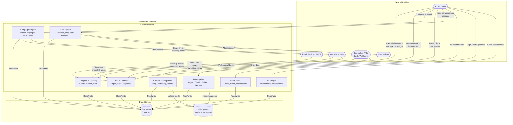
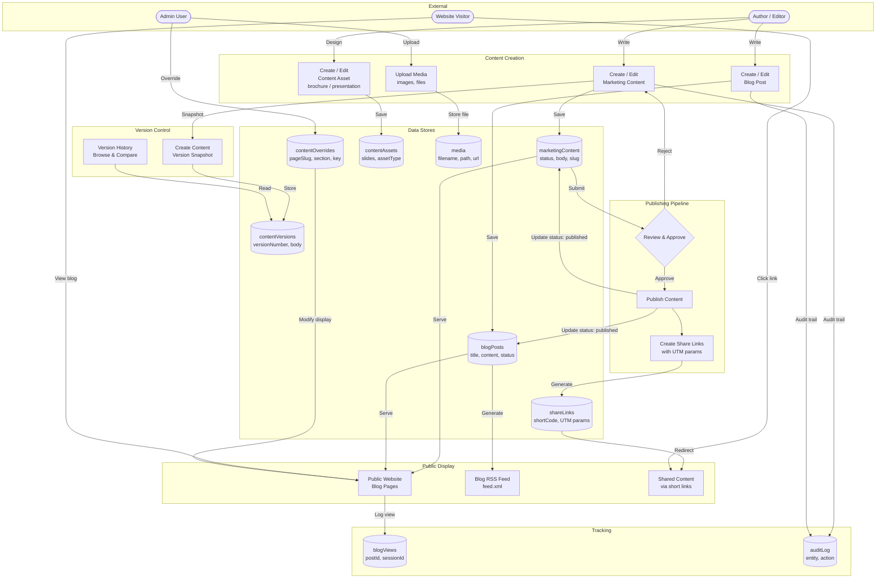
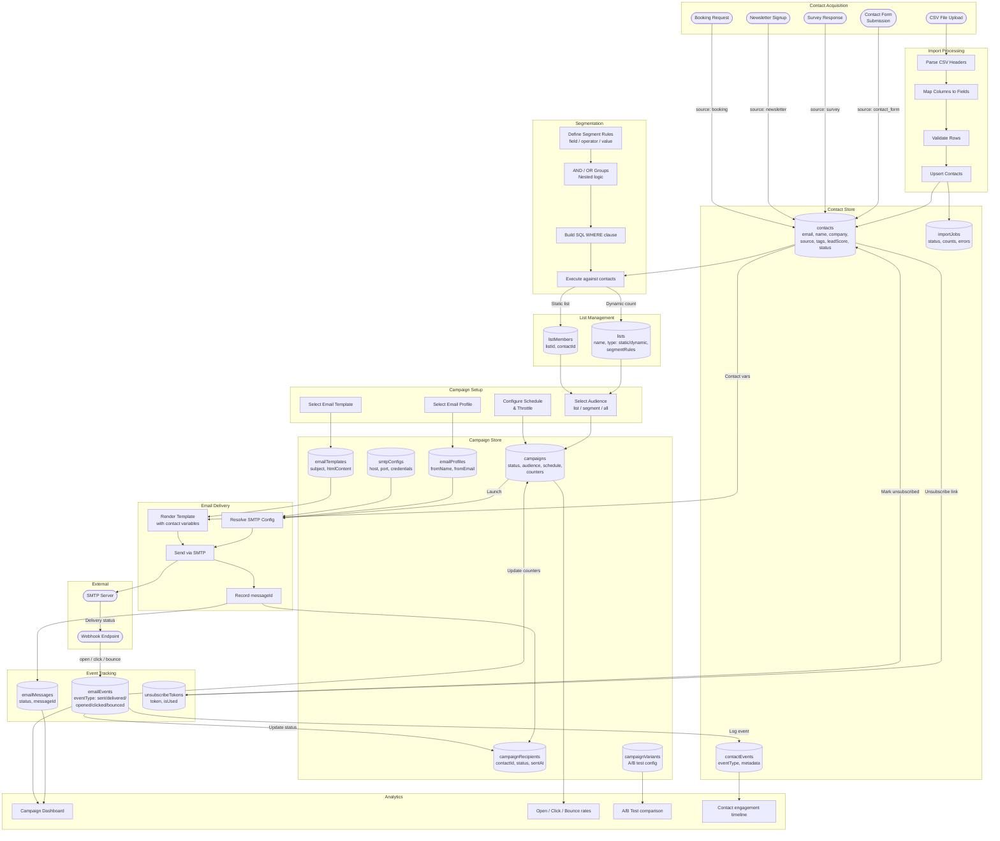
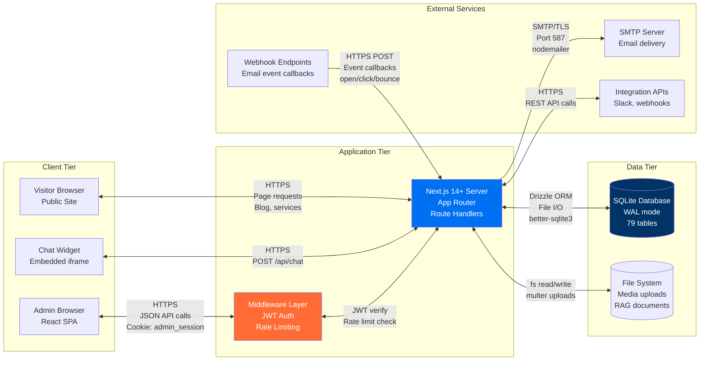
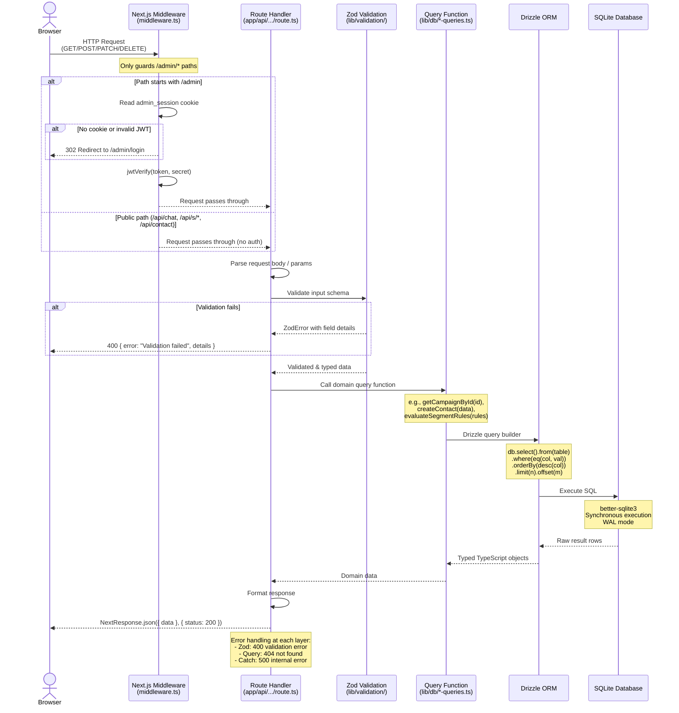
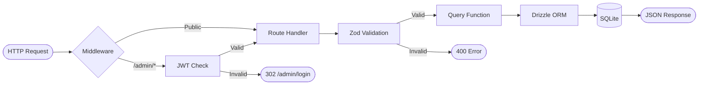
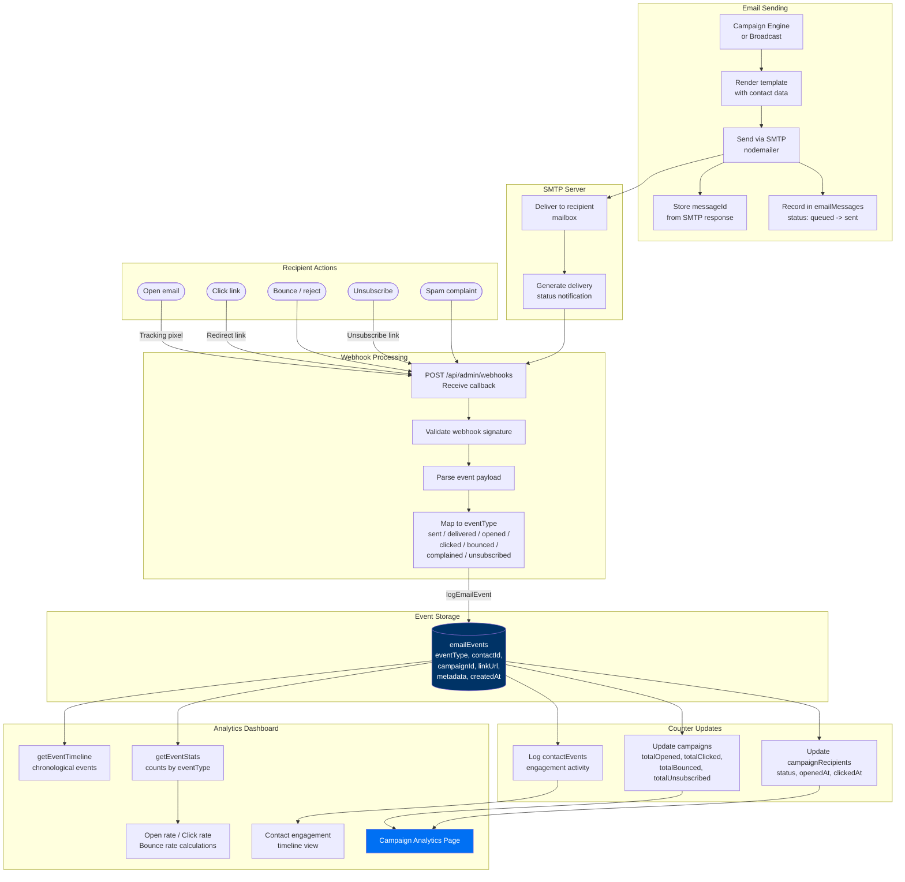
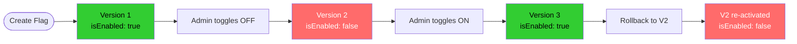

# TalentsHill Admin Portal -- Data Flow & Network Flow

> Next.js 14+ App Router | SQLite + Drizzle ORM | 79 tables | 124 API routes | 62 admin pages

---

## Table of Contents

1. [System Data Flow Diagram (DFD Level 0)](#1-system-data-flow-diagram-dfd-level-0)
2. [DFD Level 1 -- Content Management](#2-dfd-level-1----content-management)
3. [DFD Level 1 -- CRM & Campaign Engine](#3-dfd-level-1----crm--campaign-engine)
4. [Network Flow](#4-network-flow)
5. [API Request Flow](#5-api-request-flow)
6. [Email Event Data Flow](#6-email-event-data-flow)
7. [Feature Flag Data Flow](#7-feature-flag-data-flow)

---

## 1. System Data Flow Diagram (DFD Level 0)

High-level view of all external entities, major processes, and data stores in the TalentsHill platform.

**External entities:** Website visitors, admin users, email service (SMTP), integration APIs (Slack, webhooks), chatbot visitors.
**Core processes:** Content Management, CRM/Contact Management, Campaign Engine, RAG Pipeline, Chat System, Analytics.
**Data stores:** SQLite database (79 tables via Drizzle ORM), file system (media uploads, RAG documents).



---

## 2. DFD Level 1 -- Content Management

Detailed data flow for the content management subsystem covering blog posts, marketing content, content assets (brochures/presentations), and content versions.

**Key tables:** `blogPosts`, `blogAuthors`, `blogCategories`, `blogTags`, `blogPostCategories`, `blogPostTags`, `blogViews`, `marketingContent`, `contentVersions`, `contentAssets`, `contentOverrides`, `shareLinks`, `media`



---

## 3. DFD Level 1 -- CRM & Campaign Engine

End-to-end data flow from contact acquisition through segmentation, campaign execution, and analytics.

**Key tables:** `contacts`, `contactEvents`, `lists`, `listMembers`, `importJobs`, `campaigns`, `campaignRecipients`, `campaignVariants`, `emailTemplates`, `emailTemplateVersions`, `emailProfiles`, `smtpConfigs`, `emailMessages`, `emailEvents`, `unsubscribeTokens`, `broadcasts`



---

## 4. Network Flow

Physical network architecture showing protocol-level communication between the browser, Next.js server, database, and external services.

**Infrastructure:** Next.js 14+ App Router running server-side route handlers. SQLite accessed via Drizzle ORM through file I/O (no network hop). SMTP for outbound email. HTTP for webhook callbacks and integration APIs.



### Protocol Details

| Connection | Protocol | Port | Auth Method | Data Format |
|---|---|---|---|---|
| Browser to Next.js | HTTPS | 443 | JWT cookie (`admin_session`) | JSON |
| Next.js to SQLite | File I/O | N/A | Filesystem permissions | SQL via Drizzle |
| Next.js to SMTP | SMTP/TLS | 587 | Username/password (encrypted in DB) | MIME email |
| Webhook to Next.js | HTTPS POST | 443 | HMAC signature / shared secret | JSON payload |
| Next.js to Integrations | HTTPS | 443 | API key / OAuth token | JSON |
| Next.js to File System | File I/O | N/A | Filesystem permissions | Binary files |

---

## 5. API Request Flow

Every API request passes through the Next.js middleware for auth, then the route handler performs Zod validation before calling Drizzle ORM query functions that execute SQL against SQLite.

**Key files:**
- `middleware.ts` -- JWT verification for `/admin/*` routes
- `lib/validation/` -- Zod schemas for request bodies
- `lib/db/index.ts` -- Drizzle ORM database instance
- `lib/db/*-queries.ts` -- query functions per domain (44 query modules)



### Request Pipeline Summary



---

## 6. Email Event Data Flow

Email events flow from SMTP delivery through webhook callbacks into granular event storage. Events update campaign counters, recipient statuses, and contact activity timelines. The analytics dashboard aggregates events for reporting.

**Key tables:** `emailMessages`, `emailEvents`, `campaignRecipients`, `campaigns`, `contactEvents`
**Key files:** `lib/db/email-event-queries.ts`, `lib/db/campaign-queries.ts`, `app/api/admin/webhooks/route.ts`



### Event Type Reference

| Event Type | Trigger | Updates |
|---|---|---|
| `sent` | SMTP accepts message | emailMessages status, campaignRecipients status |
| `delivered` | Mailbox delivery confirmed | emailMessages status |
| `opened` | Tracking pixel loaded | campaignRecipients openedAt, campaigns totalOpened |
| `clicked` | Redirect link followed | campaignRecipients clickedAt, campaigns totalClicked, linkUrl recorded |
| `bounced` | Hard/soft bounce | campaignRecipients bouncedAt, campaigns totalBounced, contact status |
| `complained` | Spam report | Contact status flagged |
| `unsubscribed` | Unsubscribe link used | unsubscribeTokens isUsed, contact status: unsubscribed, campaigns totalUnsubscribed |

---

## 7. Feature Flag Data Flow

Feature flags control runtime feature visibility across the application. Admins toggle flags in the admin UI. The API reads flag state from the database. Frontend components conditionally render based on flag status. Version history enables rollback to any previous configuration.

**Key tables:** `featureFlags`, `featureFlagVersions`, `featureFlagActive`
**Key files:** `lib/db/feature-flag-queries.ts` -- `toggleFlag()`, `getEnabledFlagKeys()`, `createFlagVersion()`, `rollbackToVersion()`
**Admin UI:** `app/admin/features/`

```mermaid
flowchart TD
    subgraph "Admin Configuration"
        A1([Admin User]) --> A2[Feature Flags Admin Page<br/>/admin/features]
        A2 --> A3{Action}
        A3 -->|Create| A4[Create new flag<br/>key, label, module]
        A3 -->|Toggle| A5[Toggle isEnabled<br/>true / false]
        A3 -->|Rollback| A6[Rollback to<br/>previous version]
    end

    subgraph "Database Storage"
        D1[(featureFlags<br/>key, label, isEnabled,<br/>module, sortOrder)]
        D2[(featureFlagVersions<br/>flagId, version, config,<br/>changedBy, changedAt)]
        D3[(featureFlagActive<br/>flagId, versionId,<br/>activatedAt)]
    end

    subgraph "Version Management"
        VM1[Create version snapshot<br/>on every toggle]
        VM2[Track version history<br/>per flag]
        VM3[Set active version<br/>pointer]
    end

    subgraph "API Layer"
        API1[GET /api/admin/features<br/>List all flags]
        API2[PATCH /api/admin/features/:id<br/>Toggle flag]
        API3[GET /api/admin/features/:id/history<br/>Version history]
        API4[getEnabledFlagKeys<br/>Cache-friendly query]
    end

    subgraph "Frontend Consumption"
        FE1[API Client fetches<br/>enabled flag keys]
        FE2{Check flag key}
        FE3[Render feature<br/>component]
        FE4[Hide feature<br/>component]
    end

    A4 -->|INSERT| D1
    A5 -->|UPDATE isEnabled| D1
    A5 -->|Create version| VM1
    VM1 -->|INSERT| D2
    VM1 -->|UPSERT| D3
    A6 -->|Read version config| D2
    A6 -->|Apply config| D1
    A6 -->|Update active| D3
    VM2 -->|Read| D2
    VM3 -->|Read/write| D3

    D1 -->|getAllFlags| API1
    D1 -->|toggleFlag| API2
    D2 -->|getFlagHistory| API3
    D1 -->|getEnabledFlagKeys| API4

    API4 -->|string[]| FE1
    FE1 --> FE2
    FE2 -->|Key present| FE3
    FE2 -->|Key absent| FE4

    style D1 fill:#003366,color:#fff
    style FE3 fill:#32cd32,color:#000
    style FE4 fill:#d3d3d3,color:#000
```

### Feature Flag Lifecycle



### Flag Module Grouping

Flags are organized by `module` for logical grouping in the admin UI:

| Module | Example Flags | Purpose |
|---|---|---|
| `blog` | `blog.comments`, `blog.related_posts` | Blog feature toggles |
| `crm` | `crm.lead_scoring`, `crm.auto_import` | CRM behavior toggles |
| `marketing` | `marketing.ab_testing`, `marketing.workflows` | Marketing feature toggles |
| `chat` | `chat.ai_responses`, `chat.pii_detection` | Chat system toggles |
| `rag` | `rag.auto_embed`, `rag.cache_enabled` | RAG pipeline toggles |
| `analytics` | `analytics.realtime`, `analytics.export` | Analytics feature toggles |
