# TalentsHill Database Schema Documentation

## Overview

| Property | Value |
|----------|-------|
| Database Engine | SQLite with WAL mode |
| ORM | Drizzle ORM (`drizzle-orm/sqlite-core`) |
| Total Tables | 79 |
| Schema File | `lib/db/schema.ts` |
| Database File | `data/talentshill.db` |
| ID Strategy | UUID text primary keys |
| Timestamps | Unix integer timestamps (`{ mode: 'timestamp' }`) |
| JSON Storage | Serialized as `text` columns |
| Appointments | JSON file storage (`data/appointments.json`) |

All tables use text-based UUIDs as primary keys. Timestamps are stored as Unix integers with Drizzle's timestamp mode for automatic Date conversion. JSON-structured data (arrays, objects) is stored as serialized text columns and parsed at the application layer.

---

## Schema by Module

### 1. Authentication & RBAC (6 tables)

#### `users`

Admin portal user accounts with built-in role field and RBAC role assignments.

| Column | Type | Constraints | Description |
|--------|------|-------------|-------------|
| id | text | PK | UUID |
| email | text | NOT NULL, UNIQUE | Login email |
| passwordHash | text | NOT NULL | bcrypt hash |
| name | text | NOT NULL | Display name |
| role | text | NOT NULL, DEFAULT 'editor' | Enum: `admin`, `editor`, `viewer` |
| isActive | integer(boolean) | NOT NULL, DEFAULT true | Account active flag |
| createdAt | integer(timestamp) | NOT NULL | |
| updatedAt | integer(timestamp) | NOT NULL | |

#### `roles`

RBAC role definitions. System roles cannot be deleted.

| Column | Type | Constraints | Description |
|--------|------|-------------|-------------|
| id | text | PK | UUID |
| name | text | NOT NULL, UNIQUE | Role name (e.g., `super_admin`, `content_editor`) |
| description | text | | Human-readable description |
| isSystem | integer(boolean) | NOT NULL, DEFAULT false | Prevents deletion of built-in roles |
| createdAt | integer(timestamp) | NOT NULL | |

#### `permissions`

Granular permission definitions by resource and action.

| Column | Type | Constraints | Description |
|--------|------|-------------|-------------|
| id | text | PK | UUID |
| resource | text | NOT NULL | Resource name (e.g., `blog`, `contacts`, `campaigns`) |
| action | text | NOT NULL | Action name (e.g., `read`, `write`, `delete`, `admin`) |
| description | text | | Human-readable description |

**Indexes:** `idx_permissions_resource` on `resource`

#### `rolePermissions`

Many-to-many mapping between roles and permissions.

| Column | Type | Constraints | Description |
|--------|------|-------------|-------------|
| roleId | text | PK (composite), FK -> roles.id CASCADE | |
| permissionId | text | PK (composite), FK -> permissions.id CASCADE | |

#### `userRoles`

Many-to-many mapping between users and roles.

| Column | Type | Constraints | Description |
|--------|------|-------------|-------------|
| userId | text | PK (composite), FK -> users.id CASCADE | |
| roleId | text | PK (composite), FK -> roles.id CASCADE | |
| assignedAt | integer(timestamp) | NOT NULL | When role was assigned |

**Indexes:** `idx_user_roles_user` on `userId`, `idx_user_roles_role` on `roleId`

#### `auditLog`

System-wide audit trail for all entity changes and auth events.

| Column | Type | Constraints | Description |
|--------|------|-------------|-------------|
| id | text | PK | UUID |
| entityType | text | NOT NULL | Entity category: `user`, `post`, `contact`, `survey`, `setting`, `video`, `service`, `industry`, `auth` |
| entityId | text | | ID of affected entity |
| action | text | NOT NULL | Action: `create`, `update`, `delete`, `login_success`, `login_failed`, `logout` |
| userId | text | | Actor user ID |
| metadata | text | | JSON: additional context |
| createdAt | integer(timestamp) | NOT NULL | |

**Indexes:** `idx_audit_entity` on `(entityType, entityId)`, `idx_audit_user` on `userId`, `idx_audit_created_at` on `createdAt`

---

### 2. Content Management (4 tables)

#### `marketingContent`

Central content repository for articles, brochure text, social posts, landing pages, and more.

| Column | Type | Constraints | Description |
|--------|------|-------------|-------------|
| id | text | PK | UUID |
| title | text | NOT NULL | Content title |
| slug | text | NOT NULL, UNIQUE | URL-safe identifier |
| contentType | text | NOT NULL | Enum: `article`, `brochure_text`, `ppt_text`, `email_copy`, `social_post`, `landing_page` |
| body | text | NOT NULL, DEFAULT '' | Markdown/HTML content body |
| excerpt | text | | Short summary |
| status | text | NOT NULL, DEFAULT 'draft' | Enum: `draft`, `review`, `approved`, `published`, `archived` |
| tags | text | | JSON array of tag strings |
| category | text | | Content category |
| coverImage | text | | Cover image URL |
| authorId | text | | User ID of author |
| metadata | text | | JSON: arbitrary metadata |
| createdAt | integer(timestamp) | NOT NULL | |
| updatedAt | integer(timestamp) | NOT NULL | |
| publishedAt | integer(timestamp) | | When content was published |

**Indexes:** `idx_mktg_content_type` on `contentType`, `idx_mktg_content_status` on `status`, `idx_mktg_content_slug` on `slug`

#### `contentVersions`

Version history for marketing content. Created on each save to enable rollback.

| Column | Type | Constraints | Description |
|--------|------|-------------|-------------|
| id | text | PK | UUID |
| contentId | text | NOT NULL, FK -> marketingContent.id CASCADE | Parent content |
| versionNumber | integer | NOT NULL | Incrementing version |
| title | text | NOT NULL | Title snapshot |
| body | text | NOT NULL | Body snapshot |
| changedBy | text | | User who made the change |
| changeNote | text | | Reason for the change |
| createdAt | integer(timestamp) | NOT NULL | |

**Indexes:** `idx_content_ver_content` on `contentId`

#### `contentAssets`

Brochures and presentations with slide-based structure.

| Column | Type | Constraints | Description |
|--------|------|-------------|-------------|
| id | text | PK | UUID |
| contentId | text | FK -> marketingContent.id (nullable) | Optional link to source content |
| assetType | text | NOT NULL | Enum: `brochure`, `presentation` |
| title | text | NOT NULL | Asset title |
| description | text | | Asset description |
| slides | text | | JSON array of slide objects (see JSON Formats) |
| status | text | NOT NULL, DEFAULT 'draft' | Enum: `draft`, `review`, `approved`, `published` |
| coverImage | text | | Cover image URL |
| metadata | text | | JSON: arbitrary metadata |
| createdBy | text | | User who created the asset |
| createdAt | integer(timestamp) | NOT NULL | |
| updatedAt | integer(timestamp) | NOT NULL | |

**Indexes:** `idx_assets_type` on `assetType`, `idx_assets_status` on `status`

#### `shareLinks`

Trackable short links with UTM parameter support for content distribution.

| Column | Type | Constraints | Description |
|--------|------|-------------|-------------|
| id | text | PK | UUID |
| contentId | text | FK -> marketingContent.id (nullable) | Linked content |
| assetId | text | FK -> contentAssets.id (nullable) | Linked asset |
| campaignId | text | | Associated campaign ID |
| title | text | NOT NULL | Display title |
| originalUrl | text | NOT NULL | Destination URL |
| shortCode | text | NOT NULL, UNIQUE | Short URL code (e.g., `abc123`) |
| utmSource | text | | UTM source parameter |
| utmMedium | text | | UTM medium parameter |
| utmCampaign | text | | UTM campaign parameter |
| utmTerm | text | | UTM term parameter |
| utmContent | text | | UTM content parameter |
| clickCount | integer | NOT NULL, DEFAULT 0 | Total click count |
| isActive | integer(boolean) | DEFAULT true | Link active flag |
| expiresAt | integer(timestamp) | | Expiration timestamp |
| createdBy | text | | Creator user ID |
| createdAt | integer(timestamp) | NOT NULL | |

**Indexes:** `idx_links_short_code` on `shortCode`, `idx_links_active` on `isActive`

---

### 3. CRM (7 tables)

#### `contacts`

Central contact/subscriber database for the CRM.

| Column | Type | Constraints | Description |
|--------|------|-------------|-------------|
| id | text | PK | UUID |
| email | text | NOT NULL, UNIQUE | Contact email |
| firstName | text | | First name |
| lastName | text | | Last name |
| company | text | | Company name |
| phone | text | | Phone number |
| source | text | NOT NULL, DEFAULT 'manual' | Enum: `manual`, `import`, `contact_form`, `survey`, `booking`, `newsletter` |
| tags | text | | JSON array of tag strings |
| customFields | text | | JSON object of custom field key-value pairs |
| leadScore | integer | DEFAULT 0 | Computed lead score (0-100) |
| status | text | NOT NULL, DEFAULT 'active' | Enum: `active`, `unsubscribed`, `bounced`, `inactive` |
| subscribedAt | integer(timestamp) | | When contact subscribed |
| unsubscribedAt | integer(timestamp) | | When contact unsubscribed |
| createdAt | integer(timestamp) | NOT NULL | |
| updatedAt | integer(timestamp) | NOT NULL | |

**Indexes:** `idx_contacts_email` on `email`, `idx_contacts_status` on `status`, `idx_contacts_source` on `source`

#### `contactEvents`

Timeline of events associated with a contact (email opens, clicks, page visits, etc.).

| Column | Type | Constraints | Description |
|--------|------|-------------|-------------|
| id | text | PK | UUID |
| contactId | text | NOT NULL, FK -> contacts.id CASCADE | |
| eventType | text | NOT NULL | Event type string |
| metadata | text | | JSON: event-specific data |
| createdAt | integer(timestamp) | NOT NULL | |

**Indexes:** `idx_contact_events_contact` on `contactId`

#### `contactSubmissions`

Public contact form submissions with lead scoring.

| Column | Type | Constraints | Description |
|--------|------|-------------|-------------|
| id | text | PK | UUID |
| fullName | text | NOT NULL | |
| email | text | NOT NULL | |
| phone | text | | |
| company | text | NOT NULL | |
| role | text | | Job role |
| industry | text | NOT NULL | |
| interestAreas | text | NOT NULL | JSON array of interest strings |
| projectStage | text | NOT NULL | |
| budgetRange | text | | |
| timeline | text | NOT NULL | |
| message | text | NOT NULL | |
| consent | integer(boolean) | NOT NULL, DEFAULT false | GDPR consent |
| leadScore | integer | DEFAULT 0 | Computed score |
| leadTier | text | DEFAULT 'cold' | Enum: `hot`, `warm`, `cool`, `cold` |
| status | text | NOT NULL, DEFAULT 'new' | Enum: `new`, `contacted`, `qualified`, `closed` |
| ipHash | text | | Hashed IP for dedup |
| userAgent | text | | Browser user agent |
| sourcePage | text | | Originating page URL |
| createdAt | integer(timestamp) | NOT NULL | |

**Indexes:** `idx_contact_status`, `idx_contact_lead_tier`, `idx_contact_industry`, `idx_contact_created_at`

#### `lists`

Static or dynamic contact lists for segmentation and campaign targeting.

| Column | Type | Constraints | Description |
|--------|------|-------------|-------------|
| id | text | PK | UUID |
| name | text | NOT NULL | List name |
| description | text | | |
| type | text | NOT NULL, DEFAULT 'static' | Enum: `static`, `dynamic` |
| segmentRules | text | | JSON: rule tree for dynamic lists (see JSON Formats) |
| memberCount | integer | DEFAULT 0 | Cached member count |
| createdBy | text | | Creator user ID |
| createdAt | integer(timestamp) | NOT NULL | |
| updatedAt | integer(timestamp) | NOT NULL | |

#### `listMembers`

Many-to-many mapping between lists and contacts.

| Column | Type | Constraints | Description |
|--------|------|-------------|-------------|
| listId | text | PK (composite), FK -> lists.id CASCADE | |
| contactId | text | PK (composite), FK -> contacts.id CASCADE | |
| addedAt | integer(timestamp) | NOT NULL | |

**Indexes:** `idx_list_members_list` on `listId`, `idx_list_members_contact` on `contactId`

#### `groups`

User groups for internal team organization.

| Column | Type | Constraints | Description |
|--------|------|-------------|-------------|
| id | text | PK | UUID |
| name | text | NOT NULL, UNIQUE | Group name |
| description | text | | |
| createdAt | integer(timestamp) | NOT NULL | |

#### `groupMembers`

Many-to-many mapping between groups and users.

| Column | Type | Constraints | Description |
|--------|------|-------------|-------------|
| groupId | text | PK (composite), FK -> groups.id CASCADE | |
| userId | text | PK (composite), FK -> users.id CASCADE | |
| addedAt | integer(timestamp) | NOT NULL | |

**Indexes:** `idx_group_members_user` on `userId`

---

### 4. Campaigns & Email (8 tables)

#### `emailTemplates`

Reusable email templates with variable interpolation support.

| Column | Type | Constraints | Description |
|--------|------|-------------|-------------|
| id | text | PK | UUID |
| name | text | NOT NULL | Template name |
| description | text | | |
| category | text | | Template category |
| subject | text | NOT NULL | Email subject line (supports `{{variables}}`) |
| htmlContent | text | NOT NULL | HTML body with variable placeholders |
| textContent | text | | Plain text fallback |
| variables | text | | JSON array of variable names |
| isActive | integer(boolean) | NOT NULL, DEFAULT true | |
| createdBy | text | | |
| createdAt | integer(timestamp) | NOT NULL | |
| updatedAt | integer(timestamp) | NOT NULL | |

#### `emailTemplateVersions`

Version history for email templates.

| Column | Type | Constraints | Description |
|--------|------|-------------|-------------|
| id | text | PK | UUID |
| templateId | text | NOT NULL, FK -> emailTemplates.id CASCADE | |
| version | integer | NOT NULL | Version number |
| subject | text | NOT NULL | Subject snapshot |
| htmlContent | text | NOT NULL | HTML snapshot |
| textContent | text | | Plain text snapshot |
| changedBy | text | | User who made change |
| changedAt | integer(timestamp) | NOT NULL | |

**Indexes:** `idx_template_versions_template` on `templateId`

#### `campaigns`

Email campaign definitions with A/B testing, scheduling, and delivery tracking.

| Column | Type | Constraints | Description |
|--------|------|-------------|-------------|
| id | text | PK | UUID |
| name | text | NOT NULL | Campaign name |
| type | text | NOT NULL, DEFAULT 'email' | Enum: `email`, `sms` |
| status | text | NOT NULL, DEFAULT 'draft' | Enum: `draft`, `scheduled`, `sending`, `paused`, `completed`, `cancelled` |
| audienceType | text | | Enum: `list`, `segment`, `all` |
| audienceId | text | | ID of target list or segment |
| audienceCount | integer | DEFAULT 0 | Total audience size |
| emailProfileId | text | | Sender profile ID |
| templateId | text | | Template to use |
| subject | text | | Subject line override |
| scheduledAt | integer(timestamp) | | Scheduled send time |
| startedAt | integer(timestamp) | | Actual start time |
| completedAt | integer(timestamp) | | Completion time |
| throttlePerMinute | integer | DEFAULT 60 | Send rate limit |
| totalSent | integer | DEFAULT 0 | |
| totalOpened | integer | DEFAULT 0 | |
| totalClicked | integer | DEFAULT 0 | |
| totalBounced | integer | DEFAULT 0 | |
| totalUnsubscribed | integer | DEFAULT 0 | |
| createdBy | text | | |
| createdAt | integer(timestamp) | NOT NULL | |
| updatedAt | integer(timestamp) | NOT NULL | |

**Indexes:** `idx_campaigns_status` on `status`

#### `campaignVariants`

A/B test variants within a campaign.

| Column | Type | Constraints | Description |
|--------|------|-------------|-------------|
| id | text | PK | UUID |
| campaignId | text | NOT NULL, FK -> campaigns.id CASCADE | |
| name | text | NOT NULL | Variant name (e.g., `A`, `B`) |
| subject | text | | Subject line for this variant |
| templateId | text | | Template override |
| percentage | integer | DEFAULT 50 | Traffic split percentage |
| recipientCount | integer | DEFAULT 0 | |
| openCount | integer | DEFAULT 0 | |
| clickCount | integer | DEFAULT 0 | |

**Indexes:** `idx_campaign_variants_campaign` on `campaignId`

#### `campaignRecipients`

Per-recipient delivery status for campaigns.

| Column | Type | Constraints | Description |
|--------|------|-------------|-------------|
| id | text | PK | UUID |
| campaignId | text | NOT NULL, FK -> campaigns.id CASCADE | |
| contactId | text | NOT NULL, FK -> contacts.id CASCADE | |
| status | text | NOT NULL, DEFAULT 'pending' | Enum: `pending`, `sent`, `delivered`, `opened`, `clicked`, `bounced`, `unsubscribed`, `failed` |
| messageId | text | | SMTP message ID |
| sentAt | integer(timestamp) | | |
| openedAt | integer(timestamp) | | |
| clickedAt | integer(timestamp) | | |
| bouncedAt | integer(timestamp) | | |
| error | text | | Error message if failed |

**Indexes:** `idx_campaign_recipients_campaign`, `idx_campaign_recipients_contact`, `idx_campaign_recipients_status`

#### `broadcasts`

One-off email broadcasts (simpler than campaigns, no A/B testing).

| Column | Type | Constraints | Description |
|--------|------|-------------|-------------|
| id | text | PK | UUID |
| name | text | NOT NULL | Broadcast name |
| subject | text | NOT NULL | Email subject |
| htmlContent | text | NOT NULL | Email HTML body |
| profileId | text | FK -> emailProfiles.id SET NULL | Sender profile |
| audienceType | text | NOT NULL, DEFAULT 'list' | Enum: `list`, `segment`, `all` |
| audienceId | text | | Target list/segment ID |
| status | text | NOT NULL, DEFAULT 'draft' | Enum: `draft`, `scheduled`, `sending`, `paused`, `completed` |
| scheduledAt | integer(timestamp) | | |
| startedAt | integer(timestamp) | | |
| completedAt | integer(timestamp) | | |
| throttlePerMinute | integer | DEFAULT 60 | |
| totalSent | integer | DEFAULT 0 | |
| totalFailed | integer | DEFAULT 0 | |
| createdBy | text | | |
| createdAt | integer(timestamp) | NOT NULL | |
| updatedAt | integer(timestamp) | NOT NULL | |

**Indexes:** `idx_broadcasts_status` on `status`

#### `emailMessages`

Individual email message tracking records.

| Column | Type | Constraints | Description |
|--------|------|-------------|-------------|
| id | text | PK | UUID |
| recipientId | text | FK -> campaignRecipients.id SET NULL | |
| contactId | text | NOT NULL, FK -> contacts.id CASCADE | |
| campaignId | text | FK -> campaigns.id SET NULL | |
| profileId | text | FK -> emailProfiles.id SET NULL | |
| subject | text | NOT NULL | |
| status | text | NOT NULL, DEFAULT 'queued' | Enum: `queued`, `sent`, `delivered`, `bounced`, `failed` |
| sentAt | integer(timestamp) | | |
| messageId | text | | SMTP message ID |
| metadata | text | | JSON |
| createdAt | integer(timestamp) | NOT NULL | |

**Indexes:** `idx_email_messages_contact`, `idx_email_messages_campaign`, `idx_email_messages_status`

#### `emailEvents`

Granular email event tracking (opens, clicks, bounces, complaints).

| Column | Type | Constraints | Description |
|--------|------|-------------|-------------|
| id | text | PK | UUID |
| emailMessageId | text | FK -> emailMessages.id SET NULL | |
| recipientId | text | FK -> campaignRecipients.id SET NULL | |
| contactId | text | NOT NULL, FK -> contacts.id CASCADE | |
| campaignId | text | FK -> campaigns.id SET NULL | |
| eventType | text | NOT NULL | Enum: `sent`, `delivered`, `opened`, `clicked`, `bounced`, `complained`, `unsubscribed` |
| linkUrl | text | | Clicked URL (for click events) |
| metadata | text | | JSON |
| createdAt | integer(timestamp) | NOT NULL | |

**Indexes:** `idx_email_events_contact`, `idx_email_events_campaign`, `idx_email_events_type`, `idx_email_events_recipient`, `idx_email_events_created`

---

### 5. Marketing Automation (2 tables)

#### `marketingWorkflows`

Multi-step marketing workflows linking content creation through to campaign launch.

| Column | Type | Constraints | Description |
|--------|------|-------------|-------------|
| id | text | PK | UUID |
| name | text | NOT NULL | Workflow name |
| status | text | NOT NULL, DEFAULT 'draft' | Workflow status |
| currentStep | integer | NOT NULL, DEFAULT 0 | Current step index |
| contentId | text | FK -> marketingContent.id (nullable) | Linked content |
| assetId | text | FK -> contentAssets.id (nullable) | Linked asset |
| shareLinkIds | text | | JSON array of share link IDs |
| listId | text | | Target list ID |
| campaignId | text | | Associated campaign ID |
| approvedBy | text | | Approver user ID |
| approvedAt | integer(timestamp) | | |
| scheduledAt | integer(timestamp) | | |
| completedAt | integer(timestamp) | | |
| metadata | text | | JSON |
| createdBy | text | | |
| createdAt | integer(timestamp) | NOT NULL | |
| updatedAt | integer(timestamp) | NOT NULL | |

**Indexes:** `idx_workflows_status` on `status`, `idx_workflows_step` on `currentStep`

#### `workflowComments`

Discussion comments attached to workflow steps.

| Column | Type | Constraints | Description |
|--------|------|-------------|-------------|
| id | text | PK | UUID |
| workflowId | text | NOT NULL, FK -> marketingWorkflows.id CASCADE | |
| userId | text | | Commenter user ID |
| content | text | NOT NULL | Comment text |
| stepIndex | integer | | Associated step index |
| createdAt | integer(timestamp) | NOT NULL | |

**Indexes:** `idx_wf_comments_workflow` on `workflowId`

---

### 6. AI Analysis (2 tables)

#### `analysisFrameworks`

Predefined analysis framework categories (e.g., competitive analysis, market assessment).

| Column | Type | Constraints | Description |
|--------|------|-------------|-------------|
| id | text | PK | UUID |
| categoryKey | text | NOT NULL, UNIQUE | URL-safe key (e.g., `competitive_analysis`) |
| categoryName | text | NOT NULL | Display name |
| description | text | | Framework description |
| analysisTypes | text | NOT NULL | JSON array of `{index, name}` objects (see JSON Formats) |
| totalItems | integer | NOT NULL | Total assessment items |
| sortOrder | integer | NOT NULL, DEFAULT 0 | Display order |
| createdAt | integer(timestamp) | NOT NULL | |

**Indexes:** `idx_frameworks_key` on `categoryKey`

#### `analysisAssessments`

Individual assessment instances against a framework.

| Column | Type | Constraints | Description |
|--------|------|-------------|-------------|
| id | text | PK | UUID |
| frameworkId | text | NOT NULL, FK -> analysisFrameworks.id | Parent framework |
| projectName | text | NOT NULL | Project/entity being assessed |
| assessorId | text | (nullable) | User performing assessment |
| status | text | NOT NULL, DEFAULT 'not_started' | Enum: `not_started`, `in_progress`, `completed` |
| overallScore | real | | Computed average score (0-100) |
| completedItems | integer | NOT NULL, DEFAULT 0 | Items completed so far |
| totalItems | integer | NOT NULL | Total items to assess |
| itemScores | text | NOT NULL | JSON array of score objects (see JSON Formats) |
| metadata | text | | JSON |
| createdAt | integer(timestamp) | NOT NULL | |
| updatedAt | integer(timestamp) | NOT NULL | |

**Indexes:** `idx_assessments_framework`, `idx_assessments_project`, `idx_assessments_status`

---

### 7. RAG Pipeline (8 tables)

#### `ragDocuments`

Source documents for the retrieval-augmented generation pipeline.

| Column | Type | Constraints | Description |
|--------|------|-------------|-------------|
| id | text | PK | UUID |
| name | text | NOT NULL | Document name |
| sourceType | text | NOT NULL | Enum: `upload`, `url`, `sitepage`, `text`, `api` |
| sourceUrl | text | | Source URL (for url/sitepage) |
| filePath | text | | Local file path (for uploads) |
| mimeType | text | | MIME type |
| size | integer | | File size in bytes |
| status | text | NOT NULL, DEFAULT 'pending' | Enum: `pending`, `ingested`, `chunked`, `embedded`, `failed` |
| chunkCount | integer | DEFAULT 0 | Number of chunks produced |
| metadata | text | | JSON |
| createdBy | text | | |
| createdAt | integer(timestamp) | NOT NULL | |
| updatedAt | integer(timestamp) | NOT NULL | |

**Indexes:** `idx_rag_docs_status`, `idx_rag_docs_source_type`

#### `ragChunks`

Text chunks produced from document splitting.

| Column | Type | Constraints | Description |
|--------|------|-------------|-------------|
| id | text | PK | UUID |
| documentId | text | NOT NULL, FK -> ragDocuments.id | |
| chunkIndex | integer | NOT NULL | Position within document |
| content | text | NOT NULL | Chunk text content |
| tokenCount | integer | | Token count for the chunk |
| metadata | text | | JSON: headings, page number, section info |
| hash | text | | Content hash for deduplication |
| createdAt | integer(timestamp) | NOT NULL | |

**Indexes:** `idx_rag_chunks_doc` on `documentId`

#### `ragEmbeddings`

Vector embeddings for each chunk.

| Column | Type | Constraints | Description |
|--------|------|-------------|-------------|
| id | text | PK | UUID |
| chunkId | text | NOT NULL, FK -> ragChunks.id | |
| model | text | NOT NULL | Embedding model name |
| dimensions | integer | NOT NULL | Vector dimension count |
| vector | text | NOT NULL | JSON-serialized float array |
| createdAt | integer(timestamp) | NOT NULL | |

**Indexes:** `idx_rag_embed_chunk` on `chunkId`

#### `ragRuns`

Pipeline execution runs (ingestion, embedding, evaluation, retrieval).

| Column | Type | Constraints | Description |
|--------|------|-------------|-------------|
| id | text | PK | UUID |
| type | text | NOT NULL | Enum: `ingestion`, `embedding`, `evaluation`, `retrieval` |
| status | text | NOT NULL, DEFAULT 'pending' | Enum: `pending`, `running`, `completed`, `failed` |
| config | text | | JSON: run configuration snapshot |
| documentIds | text | | JSON array of document IDs |
| startedAt | integer(timestamp) | | |
| completedAt | integer(timestamp) | | |
| error | text | | Error message |
| createdBy | text | | |
| createdAt | integer(timestamp) | NOT NULL | |

**Indexes:** `idx_rag_runs_type`, `idx_rag_runs_status`

#### `ragRunSteps`

Individual steps within a pipeline run.

| Column | Type | Constraints | Description |
|--------|------|-------------|-------------|
| id | text | PK | UUID |
| runId | text | NOT NULL, FK -> ragRuns.id | |
| stepName | text | NOT NULL | Step name |
| status | text | NOT NULL | Enum: `pending`, `running`, `completed`, `failed` |
| input | text | | JSON: step input data |
| output | text | | JSON: step output data |
| durationMs | integer | | Execution time in milliseconds |
| createdAt | integer(timestamp) | NOT NULL | |

**Indexes:** `idx_rag_steps_run` on `runId`

#### `ragRunMetrics`

Quality metrics produced by evaluation runs (RAGAS-style).

| Column | Type | Constraints | Description |
|--------|------|-------------|-------------|
| id | text | PK | UUID |
| runId | text | NOT NULL, FK -> ragRuns.id | |
| metricName | text | NOT NULL | Metric name: `faithfulness`, `relevance`, `precision`, `recall`, `pii_detected`, `chunk_quality` |
| value | real | NOT NULL | Metric value (0.0 - 1.0) |
| details | text | | JSON: metric-specific details |
| createdAt | integer(timestamp) | NOT NULL | |

**Indexes:** `idx_rag_metrics_run` on `runId`

#### `ragConfigs`

Versioned RAG pipeline configuration (chunk size, embedding model, retrieval settings).

| Column | Type | Constraints | Description |
|--------|------|-------------|-------------|
| id | text | PK | UUID |
| name | text | NOT NULL | Configuration name |
| version | integer | NOT NULL, DEFAULT 1 | Version number |
| config | text | NOT NULL | JSON: `{chunkSize, chunkOverlap, embeddingModel, retrievalK, ...}` |
| isActive | integer(boolean) | DEFAULT false | Currently active config |
| changedBy | text | | |
| createdAt | integer(timestamp) | NOT NULL | |

#### `ragCache`

Query result cache for frequently asked questions.

| Column | Type | Constraints | Description |
|--------|------|-------------|-------------|
| id | text | PK | UUID |
| queryHash | text | NOT NULL, UNIQUE | SHA hash of query |
| query | text | NOT NULL | Original query text |
| results | text | NOT NULL | JSON: cached results |
| hitCount | integer | DEFAULT 0 | Cache hit counter |
| createdAt | integer(timestamp) | NOT NULL | |
| expiresAt | integer(timestamp) | | TTL expiration |

---

### 8. Blog (8 tables)

#### `blogPosts`

Blog post content with SEO metadata.

| Column | Type | Constraints | Description |
|--------|------|-------------|-------------|
| id | text | PK | UUID |
| title | text | NOT NULL | Post title |
| slug | text | NOT NULL, UNIQUE | URL slug |
| summary | text | NOT NULL | Post summary |
| content | text | NOT NULL | Raw markdown |
| coverImage | text | | Cover image URL |
| status | text | NOT NULL, DEFAULT 'draft' | Enum: `draft`, `published`, `archived` |
| featured | integer(boolean) | DEFAULT false | Featured post flag |
| authorId | text | FK -> blogAuthors.id | |
| metaTitle | text | | SEO title override |
| metaDescription | text | | SEO description |
| publishedAt | integer(timestamp) | | |
| createdAt | integer(timestamp) | NOT NULL | |
| updatedAt | integer(timestamp) | NOT NULL | |

**Indexes:** `idx_posts_status`, `idx_posts_published_at`, `idx_posts_author`, `idx_posts_featured`

#### `blogAuthors`

| Column | Type | Constraints | Description |
|--------|------|-------------|-------------|
| id | text | PK | UUID |
| name | text | NOT NULL | Author name |
| bio | text | | Biography |
| avatarUrl | text | | Avatar URL |
| socialLinks | text | | JSON: `{linkedin?, twitter?}` |
| createdAt | integer(timestamp) | NOT NULL | |

#### `blogCategories`

| Column | Type | Constraints | Description |
|--------|------|-------------|-------------|
| id | text | PK | UUID |
| name | text | NOT NULL, UNIQUE | Category name |
| slug | text | NOT NULL, UNIQUE | URL slug |
| description | text | | |
| color | text | | Hex color for badge |
| sortOrder | integer | DEFAULT 0 | |

#### `blogPostCategories`

Many-to-many: posts to categories.

| Column | Type | Constraints |
|--------|------|-------------|
| postId | text | PK (composite), FK -> blogPosts.id CASCADE |
| categoryId | text | PK (composite), FK -> blogCategories.id CASCADE |

#### `blogTags`

| Column | Type | Constraints |
|--------|------|-------------|
| id | text | PK |
| name | text | NOT NULL, UNIQUE |
| slug | text | NOT NULL, UNIQUE |

#### `blogPostTags`

Many-to-many: posts to tags.

| Column | Type | Constraints |
|--------|------|-------------|
| postId | text | PK (composite), FK -> blogPosts.id CASCADE |
| tagId | text | PK (composite), FK -> blogTags.id CASCADE |

**Indexes:** `idx_post_tags_tag` on `tagId`

#### `blogViews`

Page view tracking per post per session.

| Column | Type | Constraints | Description |
|--------|------|-------------|-------------|
| id | text | PK | UUID |
| postId | text | NOT NULL, FK -> blogPosts.id CASCADE | |
| sessionId | text | NOT NULL | Visitor session token |
| viewedAt | integer(timestamp) | NOT NULL | |

**Indexes:** `idx_views_post` on `postId`, `idx_views_session` on `(postId, sessionId)`

#### `blogSubscribers`

| Column | Type | Constraints | Description |
|--------|------|-------------|-------------|
| id | text | PK | UUID |
| email | text | NOT NULL, UNIQUE | |
| status | text | NOT NULL, DEFAULT 'active' | Enum: `active`, `unsubscribed` |
| subscribedAt | integer(timestamp) | NOT NULL | |
| unsubscribedAt | integer(timestamp) | | |

---

### 9. Chat (4 tables)

#### `chatSessions`

Visitor chat sessions initiated from the public website.

| Column | Type | Constraints | Description |
|--------|------|-------------|-------------|
| id | text | PK | UUID |
| visitorEmail | text | | Captured visitor email |
| visitorName | text | | Captured visitor name |
| sessionToken | text | NOT NULL, UNIQUE | Session identifier |
| ipHash | text | | Hashed IP |
| userAgent | text | | Browser user agent |
| status | text | NOT NULL, DEFAULT 'active' | Enum: `active`, `closed` |
| emailCapturedAt | integer(timestamp) | | When email was captured |
| startedAt | integer(timestamp) | NOT NULL | |
| lastMessageAt | integer(timestamp) | | |
| metadata | text | | JSON |

**Indexes:** `idx_chat_sessions_token`, `idx_chat_sessions_status`, `idx_chat_sessions_email`

#### `chatMessages`

Individual messages within a chat session.

| Column | Type | Constraints | Description |
|--------|------|-------------|-------------|
| id | text | PK | UUID |
| sessionId | text | NOT NULL, FK -> chatSessions.id | |
| requestId | text | FK -> chatRequests.id (nullable) | |
| role | text | NOT NULL | Enum: `user`, `assistant`, `system` |
| content | text | NOT NULL | Message text |
| metadata | text | | JSON |
| isEdited | integer(boolean) | DEFAULT false | |
| editedBy | text | | User who edited |
| createdAt | integer(timestamp) | NOT NULL | |

**Indexes:** `idx_chat_messages_session`, `idx_chat_messages_request`, `idx_chat_messages_role`

#### `chatRequests`

Support/escalation requests from chat sessions, managed by admin users.

| Column | Type | Constraints | Description |
|--------|------|-------------|-------------|
| id | text | PK | UUID |
| sessionId | text | NOT NULL, FK -> chatSessions.id | |
| contactId | text | FK -> contacts.id (nullable) | Matched CRM contact |
| subject | text | | Request subject |
| category | text | | Category tag |
| status | text | NOT NULL, DEFAULT 'new' | Enum: `new`, `triaged`, `responding`, `waiting_user`, `resolved`, `closed` |
| priority | text | NOT NULL, DEFAULT 'medium' | Enum: `low`, `medium`, `high`, `urgent` |
| assignedTo | text | FK -> users.id (nullable) | Assigned admin user |
| resolvedAt | integer(timestamp) | | |
| closedAt | integer(timestamp) | | |
| createdAt | integer(timestamp) | NOT NULL | |
| updatedAt | integer(timestamp) | NOT NULL | |

**Indexes:** `idx_chat_requests_session`, `idx_chat_requests_status`, `idx_chat_requests_assigned`, `idx_chat_requests_priority`

#### `chatMessageEvals`

Automated safety and quality evaluations of chat messages.

| Column | Type | Constraints | Description |
|--------|------|-------------|-------------|
| id | text | PK | UUID |
| messageId | text | NOT NULL, FK -> chatMessages.id | |
| evalType | text | NOT NULL | Enum: `pii`, `toxicity`, `bias`, `safety`, `compliance` |
| score | integer | | Score (0-100 scale) |
| passed | integer(boolean) | NOT NULL | Pass/fail flag |
| details | text | | JSON: evaluation details |
| evaluatedAt | integer(timestamp) | NOT NULL | |

**Indexes:** `idx_chat_evals_message`, `idx_chat_evals_type`

---

### 10. Integrations (4 tables)

#### `integrations`

Available third-party integration definitions (provider registry).

| Column | Type | Constraints | Description |
|--------|------|-------------|-------------|
| id | text | PK | UUID |
| providerKey | text | NOT NULL, UNIQUE | Provider identifier (e.g., `slack`, `hubspot`) |
| name | text | NOT NULL | Display name |
| description | text | | |
| category | text | NOT NULL | Enum: `messaging`, `social`, `productivity`, `data`, `webhook` |
| iconUrl | text | | Provider icon URL |
| isAvailable | integer(boolean) | DEFAULT true | |
| configSchema | text | | JSON: configuration schema definition |
| createdAt | integer(timestamp) | NOT NULL | |

#### `integrationAccounts`

Connected instances of an integration.

| Column | Type | Constraints | Description |
|--------|------|-------------|-------------|
| id | text | PK | UUID |
| integrationId | text | NOT NULL, FK -> integrations.id | |
| name | text | NOT NULL | Account display name |
| status | text | NOT NULL, DEFAULT 'disconnected' | Enum: `connected`, `disconnected`, `error` |
| credentials | text | | JSON (encrypted): OAuth tokens, API keys |
| settings | text | | JSON: account-specific settings |
| connectedBy | text | | User who connected |
| connectedAt | integer(timestamp) | | |
| lastSyncAt | integer(timestamp) | | |
| errorMessage | text | | Last error message |

**Indexes:** `idx_int_accounts_integration`, `idx_int_accounts_status`

#### `integrationCredentials`

Individual credential key-value pairs for integration accounts.

| Column | Type | Constraints | Description |
|--------|------|-------------|-------------|
| id | text | PK | UUID |
| accountId | text | NOT NULL, FK -> integrationAccounts.id | |
| key | text | NOT NULL | Credential key name |
| value | text | NOT NULL | Encrypted value |
| expiresAt | integer(timestamp) | | Token expiration |

**Indexes:** `idx_int_creds_account` on `accountId`

#### `integrationLogs`

Request/response logs for integration API calls.

| Column | Type | Constraints | Description |
|--------|------|-------------|-------------|
| id | text | PK | UUID |
| accountId | text | NOT NULL, FK -> integrationAccounts.id | |
| action | text | NOT NULL | Action name |
| status | text | NOT NULL | Enum: `success`, `error` |
| request | text | | JSON: request data |
| response | text | | JSON: response data |
| durationMs | integer | | Response time in milliseconds |
| createdAt | integer(timestamp) | NOT NULL | |

**Indexes:** `idx_int_logs_account`, `idx_int_logs_action`

---

### 11. System (20+ tables)

#### `banners`

Site-wide notification banners.

| Column | Type | Constraints | Description |
|--------|------|-------------|-------------|
| id | text | PK | UUID |
| title | text | NOT NULL | Banner title |
| content | text | NOT NULL | HTML content |
| placement | text | NOT NULL, DEFAULT 'top' | Enum: `top`, `bottom`, `modal`, `inline` |
| severity | text | NOT NULL, DEFAULT 'info' | Enum: `info`, `success`, `warning`, `error` |
| ctaText | text | | Call-to-action button text |
| ctaUrl | text | | Call-to-action URL |
| mediaId | text | FK -> media.id | Attached media |
| startDate | integer(timestamp) | | Active start date |
| endDate | integer(timestamp) | | Active end date |
| isActive | integer(boolean) | NOT NULL, DEFAULT true | |
| priority | integer | DEFAULT 0 | Display priority |
| createdBy | text | | |
| createdAt | integer(timestamp) | NOT NULL | |
| updatedAt | integer(timestamp) | NOT NULL | |

**Indexes:** `idx_banners_placement`, `idx_banners_active`

#### `media`

Uploaded media files (images, documents, assets).

| Column | Type | Constraints | Description |
|--------|------|-------------|-------------|
| id | text | PK | UUID |
| filename | text | NOT NULL | Generated filename |
| originalName | text | NOT NULL | Original upload filename |
| mimeType | text | NOT NULL | |
| size | integer | NOT NULL | File size in bytes |
| path | text | NOT NULL | Storage path |
| url | text | NOT NULL | Public URL |
| alt | text | | Alt text for accessibility |
| tags | text | | JSON array |
| folder | text | | Virtual folder path |
| uploadedBy | text | | |
| isActive | integer(boolean) | NOT NULL, DEFAULT true | |
| createdAt | integer(timestamp) | NOT NULL | |

#### `featureFlags`

Feature flag definitions for toggling functionality.

| Column | Type | Constraints | Description |
|--------|------|-------------|-------------|
| id | text | PK | UUID |
| key | text | NOT NULL, UNIQUE | Flag key (e.g., `chat_enabled`) |
| label | text | NOT NULL | Human-readable label |
| description | text | | |
| module | text | | Associated module |
| isEnabled | integer(boolean) | NOT NULL, DEFAULT true | |
| sortOrder | integer | DEFAULT 0 | |
| createdAt | integer(timestamp) | NOT NULL | |
| updatedAt | integer(timestamp) | NOT NULL | |

**Indexes:** `idx_feature_flags_key`, `idx_feature_flags_module`

#### `featureFlagVersions`

Version history for feature flag configuration changes.

| Column | Type | Constraints | Description |
|--------|------|-------------|-------------|
| id | text | PK | UUID |
| flagId | text | NOT NULL, FK -> featureFlags.id CASCADE | |
| version | integer | NOT NULL | |
| config | text | | JSON: version configuration |
| changedBy | text | | |
| changedAt | integer(timestamp) | NOT NULL | |

**Indexes:** `idx_flag_versions_flag` on `flagId`

#### `featureFlagActive`

Currently active version pointer for each feature flag.

| Column | Type | Constraints | Description |
|--------|------|-------------|-------------|
| flagId | text | PK, FK -> featureFlags.id CASCADE | |
| versionId | text | NOT NULL, FK -> featureFlagVersions.id CASCADE | |
| activatedAt | integer(timestamp) | NOT NULL | |
| activatedBy | text | | |

#### `siteSettings`

Global key-value site settings store.

| Column | Type | Constraints | Description |
|--------|------|-------------|-------------|
| key | text | PK | Setting key |
| value | text | NOT NULL | JSON string value |
| updatedBy | text | | |
| updatedAt | integer(timestamp) | NOT NULL | |

#### `contentOverrides`

CMS-driven content overrides for specific page sections.

| Column | Type | Constraints | Description |
|--------|------|-------------|-------------|
| id | text | PK | UUID |
| pageSlug | text | NOT NULL | Target page |
| section | text | NOT NULL | Target section |
| key | text | NOT NULL | Override key |
| value | text | | JSON value |
| isActive | integer(boolean) | NOT NULL, DEFAULT true | |
| updatedBy | text | | |
| updatedAt | integer(timestamp) | NOT NULL | |

**Indexes:** `idx_content_overrides_page` on `pageSlug`

#### `smtpConfigs`

SMTP server configurations for email sending.

| Column | Type | Constraints | Description |
|--------|------|-------------|-------------|
| id | text | PK | UUID |
| name | text | NOT NULL | Configuration name |
| host | text | NOT NULL | SMTP host |
| port | integer | NOT NULL, DEFAULT 587 | |
| secure | integer(boolean) | NOT NULL, DEFAULT false | TLS flag |
| username | text | NOT NULL | SMTP username |
| password | text | NOT NULL | Encrypted SMTP password |
| isActive | integer(boolean) | NOT NULL, DEFAULT true | |
| createdAt | integer(timestamp) | NOT NULL | |

#### `emailProfiles`

Sender identity profiles linking to SMTP configs.

| Column | Type | Constraints | Description |
|--------|------|-------------|-------------|
| id | text | PK | UUID |
| name | text | NOT NULL | Profile name |
| fromName | text | NOT NULL | Sender display name |
| fromEmail | text | NOT NULL | Sender email address |
| replyTo | text | | Reply-to address |
| signature | text | | HTML email signature |
| isDefault | integer(boolean) | NOT NULL, DEFAULT false | Default profile flag |
| isActive | integer(boolean) | NOT NULL, DEFAULT true | |
| createdAt | integer(timestamp) | NOT NULL | |
| updatedAt | integer(timestamp) | NOT NULL | |

#### `emailProfileSmtp`

Many-to-many mapping between email profiles and SMTP configs.

| Column | Type | Constraints |
|--------|------|-------------|
| profileId | text | PK (composite), FK -> emailProfiles.id CASCADE |
| smtpConfigId | text | PK (composite), FK -> smtpConfigs.id CASCADE |

#### `eventRoutes`

Maps email event types (e.g., `contact_form`, `broadcast`) to sender profiles.

| Column | Type | Constraints | Description |
|--------|------|-------------|-------------|
| id | text | PK | UUID |
| eventType | text | NOT NULL, UNIQUE | Event type identifier |
| profileId | text | NOT NULL, FK -> emailProfiles.id CASCADE | Assigned profile |
| description | text | | |
| isActive | integer(boolean) | NOT NULL, DEFAULT true | |
| updatedAt | integer(timestamp) | NOT NULL | |

#### `industries`

| Column | Type | Constraints |
|--------|------|-------------|
| id | text | PK |
| name | text | NOT NULL |
| slug | text | NOT NULL, UNIQUE |
| icon | text | |
| description | text | |
| sortOrder | integer | DEFAULT 0 |
| isActive | integer(boolean) | NOT NULL, DEFAULT true |
| createdAt | integer(timestamp) | NOT NULL |
| updatedAt | integer(timestamp) | NOT NULL |

#### `services`

| Column | Type | Constraints |
|--------|------|-------------|
| id | text | PK |
| name | text | NOT NULL |
| slug | text | NOT NULL, UNIQUE |
| category | text | NOT NULL |
| shortDesc | text | |
| longDesc | text | |
| icon | text | |
| tags | text | JSON array |
| useCases | text | JSON array |
| sortOrder | integer | DEFAULT 0 |
| isActive | integer(boolean) | NOT NULL, DEFAULT true |
| createdAt | integer(timestamp) | NOT NULL |
| updatedAt | integer(timestamp) | NOT NULL |

#### `videos`

| Column | Type | Constraints |
|--------|------|-------------|
| id | text | PK |
| title | text | NOT NULL |
| summary | text | |
| videoUrl | text | NOT NULL |
| provider | text | DEFAULT 'youtube' |
| thumbnail | text | |
| tags | text | JSON array |
| category | text | |
| duration | text | |
| sortOrder | integer | DEFAULT 0 |
| isActive | integer(boolean) | NOT NULL, DEFAULT true |
| createdAt | integer(timestamp) | NOT NULL |
| updatedAt | integer(timestamp) | NOT NULL |

#### `jobs`

Background job queue.

| Column | Type | Constraints | Description |
|--------|------|-------------|-------------|
| id | text | PK | UUID |
| type | text | NOT NULL | Job type (e.g., `campaign_send`, `rag_ingest`) |
| status | text | NOT NULL, DEFAULT 'pending' | Enum: `pending`, `running`, `completed`, `failed`, `cancelled`, `paused` |
| payload | text | | JSON: job-specific data |
| priority | integer | DEFAULT 0 | Higher = more important |
| maxRetries | integer | DEFAULT 3 | |
| attempts | integer | DEFAULT 0 | |
| scheduledAt | integer(timestamp) | | |
| startedAt | integer(timestamp) | | |
| completedAt | integer(timestamp) | | |
| error | text | | Error message |
| createdBy | text | | |
| createdAt | integer(timestamp) | NOT NULL | |

**Indexes:** `idx_jobs_status`, `idx_jobs_type`, `idx_jobs_scheduled`

#### `jobRuns`

Individual execution attempts for a job.

| Column | Type | Constraints |
|--------|------|-------------|
| id | text | PK |
| jobId | text | NOT NULL, FK -> jobs.id CASCADE |
| attempt | integer | NOT NULL |
| status | text | NOT NULL |
| startedAt | integer(timestamp) | NOT NULL |
| completedAt | integer(timestamp) | |
| result | text | JSON |
| error | text | |

**Indexes:** `idx_job_runs_job`

#### `jobLogs`

Structured log entries for jobs.

| Column | Type | Constraints |
|--------|------|-------------|
| id | text | PK |
| jobId | text | NOT NULL, FK -> jobs.id CASCADE |
| level | text | NOT NULL, DEFAULT 'info' |
| message | text | NOT NULL |
| metadata | text | JSON |
| createdAt | integer(timestamp) | NOT NULL |

**Indexes:** `idx_job_logs_job`

#### `runs`

Operations console run tracking (campaigns, broadcasts, imports).

| Column | Type | Constraints | Description |
|--------|------|-------------|-------------|
| id | text | PK | UUID |
| type | text | NOT NULL | Enum: `campaign`, `broadcast`, `survey`, `form`, `import` |
| entityId | text | | Related entity ID |
| name | text | NOT NULL | Run name |
| status | text | NOT NULL, DEFAULT 'draft' | Enum: `draft`, `scheduled`, `active`, `paused`, `completed`, `failed` |
| config | text | | JSON: configuration snapshot |
| startedAt | integer(timestamp) | | |
| completedAt | integer(timestamp) | | |
| createdBy | text | | |
| createdAt | integer(timestamp) | NOT NULL | |

**Indexes:** `idx_runs_type`, `idx_runs_status`, `idx_runs_entity`

#### `runEvents`

Event log for operations runs.

| Column | Type | Constraints |
|--------|------|-------------|
| id | text | PK |
| runId | text | NOT NULL, FK -> runs.id CASCADE |
| eventType | text | NOT NULL |
| message | text | NOT NULL |
| metadata | text | JSON |
| createdAt | integer(timestamp) | NOT NULL |

**Indexes:** `idx_run_events_run`

#### `webhooks`

Outgoing webhook configurations for integration events.

| Column | Type | Constraints |
|--------|------|-------------|
| id | text | PK |
| accountId | text | FK -> integrationAccounts.id (nullable) |
| name | text | NOT NULL |
| url | text | NOT NULL |
| secret | text | Webhook signing secret |
| events | text | JSON array of event types |
| isActive | integer(boolean) | DEFAULT true |
| lastTriggeredAt | integer(timestamp) | |
| failCount | integer | DEFAULT 0 |
| createdBy | text | |
| createdAt | integer(timestamp) | NOT NULL |

#### `importJobs`

CSV import job tracking.

| Column | Type | Constraints |
|--------|------|-------------|
| id | text | PK |
| fileName | text | NOT NULL |
| totalRows | integer | DEFAULT 0 |
| processedRows | integer | DEFAULT 0 |
| importedCount | integer | DEFAULT 0 |
| duplicateCount | integer | DEFAULT 0 |
| errorCount | integer | DEFAULT 0 |
| status | text | NOT NULL, DEFAULT 'pending' |
| columnMapping | text | JSON |
| errors | text | JSON array of error objects |
| createdBy | text | |
| createdAt | integer(timestamp) | NOT NULL |
| completedAt | integer(timestamp) | |

**Indexes:** `idx_import_jobs_status`, `idx_import_jobs_created`

#### `surveyResponses`

AI maturity survey response records.

| Column | Type | Constraints |
|--------|------|-------------|
| id | text | PK |
| contactName | text | |
| email | text | |
| company | text | |
| industry | text | |
| companySize | text | |
| role | text | |
| totalScore | integer | NOT NULL, DEFAULT 0 |
| maturityLevel | text | NOT NULL, DEFAULT 'beginner' |
| recommendedPath | text | |
| segmentationTags | text | JSON array |
| createdAt | integer(timestamp) | NOT NULL |

**Indexes:** `idx_survey_maturity`, `idx_survey_industry`, `idx_survey_created_at`

#### `surveyAnswers`

Individual answers within a survey response.

| Column | Type | Constraints |
|--------|------|-------------|
| id | text | PK |
| responseId | text | NOT NULL, FK -> surveyResponses.id CASCADE |
| questionId | text | NOT NULL |
| answerValue | text | NOT NULL |
| scoreValue | integer | DEFAULT 0 |

**Indexes:** `idx_survey_answers_response`

#### `unsubscribeTokens`

One-time-use tokens for email unsubscribe links.

| Column | Type | Constraints |
|--------|------|-------------|
| id | text | PK |
| contactId | text | NOT NULL, FK -> contacts.id CASCADE |
| token | text | NOT NULL, UNIQUE |
| campaignId | text | FK -> campaigns.id SET NULL |
| isUsed | integer(boolean) | NOT NULL, DEFAULT false |
| usedAt | integer(timestamp) | |
| createdAt | integer(timestamp) | NOT NULL |

**Indexes:** `idx_unsubscribe_tokens_token`, `idx_unsubscribe_tokens_contact`

#### `adminNotes`

Internal admin notes attachable to any entity.

| Column | Type | Constraints |
|--------|------|-------------|
| id | text | PK |
| entityType | text | NOT NULL |
| entityId | text | NOT NULL |
| content | text | NOT NULL |
| createdBy | text | |
| createdAt | integer(timestamp) | NOT NULL |

**Indexes:** `idx_admin_notes_entity` on `(entityType, entityId)`

#### Appointments (JSON file storage)

Appointments are stored as a JSON file at `data/appointments.json`, not in SQLite.

```typescript
interface Appointment {
  id: string;
  service: { category: string; service: string };
  dateTime: { date: string; time: string; timezone: string; duration: string };
  contact: { name: string; email: string; phone: string; company: string; jobTitle: string; companySize: string };
  requirements: { useCase: string; budget: string; timeline: string; goals: string[]; challenges: string };
  status: 'pending' | 'confirmed' | 'completed' | 'cancelled';
  leadScore: number;
  leadTier: 'hot' | 'warm' | 'cool' | 'cold';
  createdAt: string;  // ISO 8601
  updatedAt: string;  // ISO 8601
}
```

---

## Entity Relationship Diagram

```mermaid
erDiagram
    %% Authentication & RBAC
    users ||--o{ userRoles : "has"
    roles ||--o{ userRoles : "assigned to"
    roles ||--o{ rolePermissions : "grants"
    permissions ||--o{ rolePermissions : "granted by"
    users ||--o{ groupMembers : "belongs to"
    groups ||--o{ groupMembers : "contains"
    users ||--o{ auditLog : "generates"

    %% Content Management
    marketingContent ||--o{ contentVersions : "versioned"
    marketingContent ||--o{ contentAssets : "produces"
    marketingContent ||--o{ shareLinks : "distributed via"
    contentAssets ||--o{ shareLinks : "distributed via"

    %% Marketing Workflows
    marketingWorkflows }o--|| marketingContent : "uses"
    marketingWorkflows }o--|| contentAssets : "uses"
    marketingWorkflows ||--o{ workflowComments : "has"

    %% CRM
    contacts ||--o{ contactEvents : "logs"
    contacts ||--o{ listMembers : "member of"
    lists ||--o{ listMembers : "contains"

    %% Campaigns & Email
    campaigns ||--o{ campaignVariants : "has variants"
    campaigns ||--o{ campaignRecipients : "targets"
    contacts ||--o{ campaignRecipients : "receives"
    contacts ||--o{ emailMessages : "sent to"
    campaigns ||--o{ emailMessages : "generates"
    emailMessages ||--o{ emailEvents : "tracks"
    contacts ||--o{ emailEvents : "tracked"
    emailProfiles ||--o{ emailProfileSmtp : "uses"
    smtpConfigs ||--o{ emailProfileSmtp : "used by"
    emailProfiles ||--o{ eventRoutes : "routes"
    emailProfiles ||--o{ broadcasts : "sent from"
    contacts ||--o{ unsubscribeTokens : "has"
    emailTemplates ||--o{ emailTemplateVersions : "versioned"

    %% AI Analysis
    analysisFrameworks ||--o{ analysisAssessments : "assessed by"

    %% RAG Pipeline
    ragDocuments ||--o{ ragChunks : "split into"
    ragChunks ||--o{ ragEmbeddings : "embedded as"
    ragRuns ||--o{ ragRunSteps : "contains"
    ragRuns ||--o{ ragRunMetrics : "produces"

    %% Blog
    blogPosts }o--|| blogAuthors : "written by"
    blogPosts ||--o{ blogPostCategories : "categorized"
    blogCategories ||--o{ blogPostCategories : "contains"
    blogPosts ||--o{ blogPostTags : "tagged"
    blogTags ||--o{ blogPostTags : "applied to"
    blogPosts ||--o{ blogViews : "viewed"

    %% Chat
    chatSessions ||--o{ chatMessages : "contains"
    chatSessions ||--o{ chatRequests : "escalates to"
    chatRequests ||--o{ chatMessages : "discussed in"
    chatMessages ||--o{ chatMessageEvals : "evaluated by"
    users ||--o{ chatRequests : "assigned to"

    %% Integrations
    integrations ||--o{ integrationAccounts : "has"
    integrationAccounts ||--o{ integrationCredentials : "stores"
    integrationAccounts ||--o{ integrationLogs : "logs"
    integrationAccounts ||--o{ webhooks : "triggers"

    %% Jobs & Runs
    jobs ||--o{ jobRuns : "executed as"
    jobs ||--o{ jobLogs : "logs"
    runs ||--o{ runEvents : "emits"

    %% Feature Flags
    featureFlags ||--o{ featureFlagVersions : "versioned"
    featureFlags ||--|| featureFlagActive : "activates"
    featureFlagVersions ||--o| featureFlagActive : "pointed to by"

    %% Media
    media ||--o| banners : "used in"

    %% Surveys
    surveyResponses ||--o{ surveyAnswers : "contains"
```



---

## JSON Column Formats

### `contentAssets.slides`

Array of slide objects for brochures and presentations:

```json
[
  {
    "id": "slide-1",
    "title": "Introduction",
    "subtitle": "Company Overview",
    "content": "Markdown text content",
    "layout": "title-slide",
    "backgroundImage": "/images/bg.jpg",
    "notes": "Speaker notes",
    "order": 0
  }
]
```

### `analysisFrameworks.analysisTypes`

Array of analysis type definitions within a framework:

```json
[
  { "index": 0, "name": "Market Size & Growth" },
  { "index": 1, "name": "Competitive Landscape" },
  { "index": 2, "name": "Customer Segmentation" }
]
```

### `analysisAssessments.itemScores`

Array of per-item scoring objects:

```json
[
  {
    "itemIndex": 0,
    "score": 75,
    "status": "completed",
    "notes": "Strong market position",
    "evidence": "Market share data from Q3 report"
  }
]
```

### `lists.segmentRules`

Dynamic list segment rule tree:

```json
{
  "logic": "AND",
  "conditions": [
    { "field": "status", "operator": "equals", "value": "active" },
    { "field": "leadScore", "operator": "gte", "value": 50 },
    {
      "logic": "OR",
      "conditions": [
        { "field": "source", "operator": "equals", "value": "contact_form" },
        { "field": "source", "operator": "equals", "value": "survey" }
      ]
    }
  ]
}
```

### `ragConfigs.config`

RAG pipeline configuration object:

```json
{
  "chunkSize": 512,
  "chunkOverlap": 50,
  "embeddingModel": "text-embedding-3-small",
  "retrievalK": 10,
  "vectorWeight": 0.7,
  "keywordWeight": 0.3,
  "rerankEnabled": false,
  "lambda": 0.7
}
```

### `contacts.customFields`

Arbitrary key-value pairs for extending contact data:

```json
{
  "department": "Engineering",
  "referralSource": "Partner Webinar",
  "preferredLanguage": "en"
}
```

### `blogAuthors.socialLinks`

```json
{
  "linkedin": "https://linkedin.com/in/username",
  "twitter": "https://twitter.com/username"
}
```

---

## Indexing Strategy

All indexes are defined in the Drizzle schema using the `index()` builder and are created automatically on table creation.

### Authentication & RBAC
| Index | Table | Column(s) |
|-------|-------|-----------|
| `idx_permissions_resource` | permissions | resource |
| `idx_user_roles_user` | userRoles | userId |
| `idx_user_roles_role` | userRoles | roleId |
| `idx_group_members_user` | groupMembers | userId |
| `idx_audit_entity` | auditLog | (entityType, entityId) |
| `idx_audit_user` | auditLog | userId |
| `idx_audit_created_at` | auditLog | createdAt |

### Content Management
| Index | Table | Column(s) |
|-------|-------|-----------|
| `idx_mktg_content_type` | marketingContent | contentType |
| `idx_mktg_content_status` | marketingContent | status |
| `idx_mktg_content_slug` | marketingContent | slug |
| `idx_content_ver_content` | contentVersions | contentId |
| `idx_assets_type` | contentAssets | assetType |
| `idx_assets_status` | contentAssets | status |
| `idx_links_short_code` | shareLinks | shortCode |
| `idx_links_active` | shareLinks | isActive |

### CRM
| Index | Table | Column(s) |
|-------|-------|-----------|
| `idx_contacts_email` | contacts | email |
| `idx_contacts_status` | contacts | status |
| `idx_contacts_source` | contacts | source |
| `idx_contact_events_contact` | contactEvents | contactId |
| `idx_contact_status` | contactSubmissions | status |
| `idx_contact_lead_tier` | contactSubmissions | leadTier |
| `idx_contact_industry` | contactSubmissions | industry |
| `idx_contact_created_at` | contactSubmissions | createdAt |
| `idx_list_members_list` | listMembers | listId |
| `idx_list_members_contact` | listMembers | contactId |

### Campaigns & Email
| Index | Table | Column(s) |
|-------|-------|-----------|
| `idx_campaigns_status` | campaigns | status |
| `idx_campaign_variants_campaign` | campaignVariants | campaignId |
| `idx_campaign_recipients_campaign` | campaignRecipients | campaignId |
| `idx_campaign_recipients_contact` | campaignRecipients | contactId |
| `idx_campaign_recipients_status` | campaignRecipients | status |
| `idx_template_versions_template` | emailTemplateVersions | templateId |
| `idx_email_messages_contact` | emailMessages | contactId |
| `idx_email_messages_campaign` | emailMessages | campaignId |
| `idx_email_messages_status` | emailMessages | status |
| `idx_email_events_contact` | emailEvents | contactId |
| `idx_email_events_campaign` | emailEvents | campaignId |
| `idx_email_events_type` | emailEvents | eventType |
| `idx_email_events_recipient` | emailEvents | recipientId |
| `idx_email_events_created` | emailEvents | createdAt |
| `idx_broadcasts_status` | broadcasts | status |
| `idx_unsubscribe_tokens_token` | unsubscribeTokens | token |
| `idx_unsubscribe_tokens_contact` | unsubscribeTokens | contactId |

### Marketing Automation
| Index | Table | Column(s) |
|-------|-------|-----------|
| `idx_workflows_status` | marketingWorkflows | status |
| `idx_workflows_step` | marketingWorkflows | currentStep |
| `idx_wf_comments_workflow` | workflowComments | workflowId |

### AI Analysis
| Index | Table | Column(s) |
|-------|-------|-----------|
| `idx_frameworks_key` | analysisFrameworks | categoryKey |
| `idx_assessments_framework` | analysisAssessments | frameworkId |
| `idx_assessments_project` | analysisAssessments | projectName |
| `idx_assessments_status` | analysisAssessments | status |

### RAG Pipeline
| Index | Table | Column(s) |
|-------|-------|-----------|
| `idx_rag_docs_status` | ragDocuments | status |
| `idx_rag_docs_source_type` | ragDocuments | sourceType |
| `idx_rag_chunks_doc` | ragChunks | documentId |
| `idx_rag_embed_chunk` | ragEmbeddings | chunkId |
| `idx_rag_runs_type` | ragRuns | type |
| `idx_rag_runs_status` | ragRuns | status |
| `idx_rag_steps_run` | ragRunSteps | runId |
| `idx_rag_metrics_run` | ragRunMetrics | runId |

### Blog
| Index | Table | Column(s) |
|-------|-------|-----------|
| `idx_posts_status` | blogPosts | status |
| `idx_posts_published_at` | blogPosts | publishedAt |
| `idx_posts_author` | blogPosts | authorId |
| `idx_posts_featured` | blogPosts | featured |
| `idx_post_tags_tag` | blogPostTags | tagId |
| `idx_views_post` | blogViews | postId |
| `idx_views_session` | blogViews | (postId, sessionId) |

### Chat
| Index | Table | Column(s) |
|-------|-------|-----------|
| `idx_chat_sessions_token` | chatSessions | sessionToken |
| `idx_chat_sessions_status` | chatSessions | status |
| `idx_chat_sessions_email` | chatSessions | visitorEmail |
| `idx_chat_messages_session` | chatMessages | sessionId |
| `idx_chat_messages_request` | chatMessages | requestId |
| `idx_chat_messages_role` | chatMessages | role |
| `idx_chat_requests_session` | chatRequests | sessionId |
| `idx_chat_requests_status` | chatRequests | status |
| `idx_chat_requests_assigned` | chatRequests | assignedTo |
| `idx_chat_requests_priority` | chatRequests | priority |
| `idx_chat_evals_message` | chatMessageEvals | messageId |
| `idx_chat_evals_type` | chatMessageEvals | evalType |

### Integrations
| Index | Table | Column(s) |
|-------|-------|-----------|
| `idx_int_accounts_integration` | integrationAccounts | integrationId |
| `idx_int_accounts_status` | integrationAccounts | status |
| `idx_int_creds_account` | integrationCredentials | accountId |
| `idx_int_logs_account` | integrationLogs | accountId |
| `idx_int_logs_action` | integrationLogs | action |

### System
| Index | Table | Column(s) |
|-------|-------|-----------|
| `idx_banners_placement` | banners | placement |
| `idx_banners_active` | banners | isActive |
| `idx_feature_flags_key` | featureFlags | key |
| `idx_feature_flags_module` | featureFlags | module |
| `idx_flag_versions_flag` | featureFlagVersions | flagId |
| `idx_content_overrides_page` | contentOverrides | pageSlug |
| `idx_jobs_status` | jobs | status |
| `idx_jobs_type` | jobs | type |
| `idx_jobs_scheduled` | jobs | scheduledAt |
| `idx_job_runs_job` | jobRuns | jobId |
| `idx_job_logs_job` | jobLogs | jobId |
| `idx_runs_type` | runs | type |
| `idx_runs_status` | runs | status |
| `idx_runs_entity` | runs | entityId |
| `idx_run_events_run` | runEvents | runId |
| `idx_import_jobs_status` | importJobs | status |
| `idx_import_jobs_created` | importJobs | createdAt |
| `idx_survey_maturity` | surveyResponses | maturityLevel |
| `idx_survey_industry` | surveyResponses | industry |
| `idx_survey_created_at` | surveyResponses | createdAt |
| `idx_survey_answers_response` | surveyAnswers | responseId |
| `idx_admin_notes_entity` | adminNotes | (entityType, entityId) |
