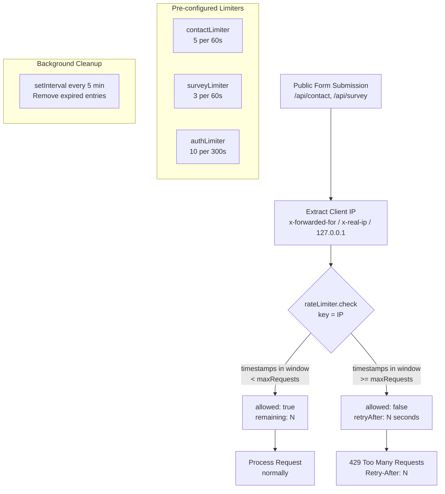
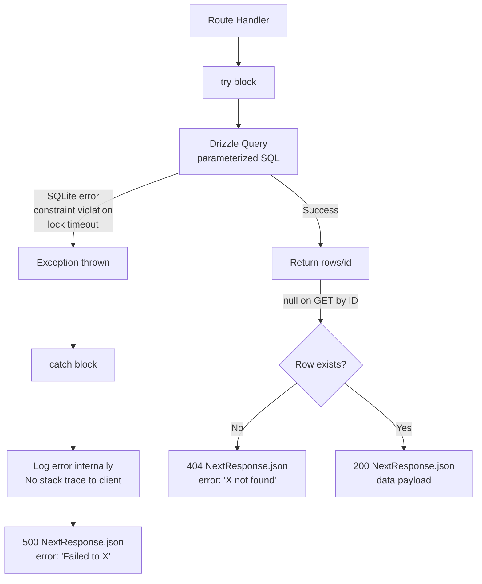

# TalentsHill Admin Portal -- Exception Handling & Error Strategy

> **Stack**: Next.js 14+ App Router | SQLite / Drizzle ORM | Zod validation | JWT auth | Rate limiting

---

## 1. Error Handling Architecture

### 1.1 Layered Defense Model

```
Request
  |
  v
+---------------------------+
|  Middleware Layer          |  JWT validation -> 401 / redirect to /admin/login
|  /middleware.ts            |  Only guards /admin/* paths
+---------------------------+
  |
  v
+---------------------------+
|  Rate Limiting Layer      |  Per-IP sliding window -> 429 Too Many Requests
|  /lib/security/           |  contactLimiter: 5/min, surveyLimiter: 3/min
|  rate-limiter.ts          |  authLimiter: 10/5min
+---------------------------+
  |
  v
+---------------------------+
|  Route Handler Layer      |  try/catch wrapping every handler
|  /app/api/**/route.ts     |  Safe JSON body parsing
+---------------------------+
  |
  v
+---------------------------+
|  Validation Layer         |  Zod safeParse -> 400 with field errors
|  /lib/validation/         |  Type coercion, enum checks, length limits
+---------------------------+
  |
  v
+---------------------------+
|  Business Logic Layer     |  Not found checks -> 404
|  DB query functions       |  Business rule violations -> 400
+---------------------------+
  |
  v
+---------------------------+
|  Database Layer           |  SQLite errors caught by outer try/catch -> 500
|  /lib/db/*-queries.ts     |  Drizzle ORM parameterized queries
+---------------------------+
```

### 1.2 Design Principles

1. **Every route handler is wrapped in try/catch** -- no unhandled exceptions escape to the client
2. **Validation happens before business logic** -- Zod schemas reject bad input at the gate
3. **No stack traces in responses** -- 500 errors return generic messages only
4. **Safe JSON parsing** -- malformed request bodies are caught and defaulted to `{}`
5. **Consistent error shape** -- all errors follow `{ error: string, details?: object }`
6. **HTTP-appropriate status codes** -- 400 for validation, 404 for missing, 500 for server errors
7. **Middleware never throws** -- returns `NextResponse.redirect()` or `NextResponse.json()`

---

## 2. Error Response Format

### 2.1 Standard Error Envelope

All API error responses follow this shape:

```typescript
// Simple error
{
  "error": "Human-readable error message"
}

// Validation error with field details
{
  "error": "Validation failed",
  "details": {
    "formErrors": [],
    "fieldErrors": {
      "title": ["Required"],
      "contentType": ["Invalid enum value. Expected 'article' | 'brochure_text' | ..."]
    }
  }
}

// Success response
{
  "success": true
}

// Create response
{
  "id": "uuid-of-created-resource"
}

// List response
{
  "items": [...],
  "total": 42
}
```

### 2.2 Error Messages by Category

| Category | Example `error` Value |
|----------|----------------------|
| Validation | `"Validation failed"` |
| Not Found | `"Content not found"`, `"Campaign not found"`, `"Framework not found"` |
| Business Rule | `"Campaign cannot be launched in current status"` |
| Required Field | `"Email is required"`, `"Name is required"` |
| Auth | `"Unauthorized"`, `"Insufficient permissions"` |
| Generic Server | `"Failed to fetch content"`, `"Failed to create campaign"` |

---

## 3. HTTP Status Code Usage

| Status | Meaning | When Used |
|--------|---------|-----------|
| **200** | OK | Successful GET, PATCH, DELETE operations |
| **201** | Created | Successful POST that creates a new resource |
| **302** | Redirect | Share link redirect (`/api/s/[code]`), auth redirect to login |
| **400** | Bad Request | Zod validation failure, missing required fields, business rule violations |
| **401** | Unauthorized | Missing or invalid JWT session token, RBAC permission check failure |
| **403** | Forbidden | Valid session but insufficient role permissions |
| **404** | Not Found | Resource not found by ID in database |
| **405** | Method Not Allowed | HTTP method not implemented for route (implicit via Next.js routing) |
| **429** | Too Many Requests | Rate limit exceeded (contact form, survey, auth) |
| **500** | Internal Server Error | Unhandled exceptions caught by outer try/catch |

---

## 4. Exception Flow Diagrams

### 4.1 Complete Request Lifecycle

```mermaid
flowchart TD
    REQ[Incoming Request] --> MW{Middleware<br>/middleware.ts}

    MW -->|Path: /admin/*| AUTH{JWT Cookie<br>Present?}
    MW -->|Path: other| ROUTE[Route Handler]

    AUTH -->|No cookie| REDIR[302 Redirect<br>/admin/login]
    AUTH -->|Has cookie| VERIFY{jwtVerify<br>Valid?}
    VERIFY -->|Invalid/Expired| REDIR
    VERIFY -->|Valid| ROUTE

    ROUTE --> TC[try/catch wrapper]

    TC --> BODY{Parse Request<br>Body}
    BODY -->|Valid JSON| ZOD{Zod<br>safeParse}
    BODY -->|Invalid JSON| FALLBACK[body = {}]
    FALLBACK --> ZOD

    ZOD -->|success: false| ERR400[400<br>Validation failed<br>+ fieldErrors]
    ZOD -->|success: true| BIZ{Business Logic<br>& DB Query}

    BIZ -->|Resource null| ERR404[404<br>Resource not found]
    BIZ -->|Rule violation| ERR400B[400<br>Business rule error]
    BIZ -->|Success| OK[200/201<br>JSON response]
    BIZ -->|Exception thrown| CATCH[catch block]

    CATCH --> ERR500[500<br>Failed to X]
```

### 4.2 Rate Limiting Flow



### 4.3 Authentication & Authorization Flow

```mermaid
flowchart TD
    REQ[Admin API Request] --> MW{Next.js Middleware<br>matcher: /admin/:path*}

    MW -->|Public path<br>/admin/login| PASS[NextResponse.next]
    MW -->|Protected path| COOKIE{admin_session<br>cookie exists?}

    COOKIE -->|No| REDIR[Redirect /admin/login]
    COOKIE -->|Yes| JWT{jwtVerify<br>HS256}

    JWT -->|Expired| REDIR
    JWT -->|Invalid signature| REDIR
    JWT -->|Valid| NEXT[NextResponse.next]

    NEXT --> HANDLER[Route Handler]

    HANDLER --> RBAC{RBAC Check<br>Required?}
    RBAC -->|No| PROCESS[Process Request]
    RBAC -->|Yes| USERID{getSessionUserIdAsync}

    USERID -->|null| ERR401[401 Unauthorized]
    USERID -->|userId| PERM{hasPermission<br>userId, resource, action}

    PERM -->|false| ERR403[403 Insufficient permissions]
    PERM -->|true| PROCESS

    subgraph Session_Payload["JWT Session Payload"]
        SP[userId: string<br>email: string<br>name: string<br>role: admin/editor/viewer<br>roles: string[]<br>exp: 24h TTL]
    end
```

### 4.4 Database Error Handling



---

## 5. Validation Strategy

### 5.1 Zod Schema Validation

All POST and PATCH request bodies are validated using Zod schemas defined in `/lib/validation/`.

**Schema Files:**

| File | Schemas |
|------|---------|
| `content-schemas.ts` | `CreateContentSchema`, `UpdateContentSchema`, `CreateAssetSchema`, `UpdateAssetSchema`, `UpdateAssetSlidesSchema`, `UpdateAssetStatusSchema`, `CreateShareLinkSchema`, `UpdateShareLinkSchema`, `CreateWorkflowSchema`, `UpdateWorkflowStepSchema`, `UpdateWorkflowStatusSchema`, `WorkflowCommentSchema`, `CreateAssessmentSchema`, `UpdateItemScoresSchema` |
| `marketing-schemas.ts` | `CreateTemplateSchema`, `UpdateTemplateSchema`, `CreateCampaignSchema`, `LaunchCampaignSchema`, `TestSendSchema`, `ImportContactsSchema` |

### 5.2 Validation Patterns

```typescript
// Pattern 1: Zod safeParse with safe body parsing
export async function POST(request: NextRequest) {
  try {
    let body;
    try { body = await request.json(); } catch { body = {}; }

    const parsed = CreateContentSchema.safeParse(body);
    if (!parsed.success) {
      return NextResponse.json(
        { error: 'Validation failed', details: parsed.error.flatten() },
        { status: 400 }
      );
    }

    // Use parsed.data (typed, validated)
    const id = createContent(parsed.data);
    return NextResponse.json({ id }, { status: 201 });
  } catch {
    return NextResponse.json({ error: 'Failed to create content' }, { status: 500 });
  }
}

// Pattern 2: Manual required field check (simpler routes)
export async function POST(request: NextRequest) {
  try {
    const body = await request.json();
    if (!body.email) {
      return NextResponse.json({ error: 'Email is required' }, { status: 400 });
    }
    // ... process
  } catch {
    return NextResponse.json({ error: 'Failed to create contact' }, { status: 500 });
  }
}
```

### 5.3 Validation Rules

| Rule Type | Example | Zod Method |
|-----------|---------|------------|
| Required string | `title` | `z.string().min(1)` |
| Max length | `title` max 300 chars | `z.string().max(300)` |
| Enum | `contentType` | `z.enum(['article', 'brochure_text', ...])` |
| Optional field | `excerpt` | `z.string().optional()` |
| URL format | `originalUrl` | `z.string().url()` |
| Email format | `to` (test send) | `z.string().email()` |
| Number range | `score` 0-100 | `z.number().min(0).max(100)` |
| Nullable | `score` | `z.number().nullable()` |
| Array of objects | `slides`, `itemScores` | `z.array(z.object({...}))` |
| Datetime string | `expiresAt`, `scheduledAt` | `z.string().datetime()` |
| Boolean default | `enableAbTest` | `z.boolean().default(false)` |
| Record/Map | `variables` | `z.record(z.string(), z.string())` |
| Nested object | `slide` | `z.object({ index: z.number(), title: z.string(), ... })` |

---

## 6. Security Error Handling

### 6.1 JWT Session Management

```
File: /middleware.ts
File: /lib/security/session.ts

- Session cookie name: "admin_session"
- Algorithm: HS256
- TTL: 24 hours
- Secret: SESSION_SECRET env var (fallback: "dev-secret-change-me")
```

| Scenario | Handler | Response |
|----------|---------|----------|
| No session cookie | Middleware | 302 Redirect to `/admin/login` |
| Expired JWT | Middleware | 302 Redirect to `/admin/login` |
| Invalid JWT signature | Middleware | 302 Redirect to `/admin/login` |
| Malformed JWT (not 3 parts) | `getSessionUserId()` | Returns `null` (no crash) |
| Missing userId in payload | `verifyToken()` | Returns `null` |
| Missing required session fields | `verifyToken()` | Returns `null` |

### 6.2 RBAC Permission Checks

```
File: /lib/security/rbac.ts

- getSessionUserId(request): Sync decode (middleware already verified)
- getSessionUserIdAsync(request): Full jwtVerify for route handlers
- checkPermission(userId, resource, action): DB lookup
- withPermission(resource, action): Higher-order function wrapper
```

| Scenario | Response |
|----------|----------|
| No valid session | 401 `{ error: "Unauthorized" }` |
| Valid session, no permission | 403 `{ error: "Insufficient permissions" }` |
| Valid session, has permission | Request proceeds |

### 6.3 Rate Limiting

```
File: /lib/security/rate-limiter.ts

Class: RateLimiter
  - Sliding window algorithm (in-memory Map)
  - Automatic cleanup every 5 minutes
  - Timer unreffed to not block process exit
```

| Limiter | Window | Max Requests | Applies To |
|---------|--------|-------------|------------|
| `contactLimiter` | 60 seconds | 5 | `/api/contact` |
| `surveyLimiter` | 60 seconds | 3 | `/api/survey` |
| `authLimiter` | 300 seconds | 10 | `/api/auth/login` |

**Rate Limit Response:**
```json
{
  "allowed": false,
  "remaining": 0,
  "retryAfter": 45
}
```

### 6.4 Input Sanitization

```
File: /lib/security/sanitize.ts

- sanitizeText(input): Strip HTML tags, trim, limit to 10,000 chars
- normalizeEmail(email): Lowercase + trim
- hashIp(ip): SHA-256 truncated to 16 hex chars (privacy protection)
```

### 6.5 Client IP Extraction

```typescript
// /lib/security/rate-limiter.ts -> getClientIp()
// Priority: x-forwarded-for (first IP) > x-real-ip > 127.0.0.1
```

---

## 7. Client-Side Error Handling

### 7.1 Fetch Pattern in Admin Pages

```typescript
// Standard fetch pattern used across all admin pages
const [data, setData] = useState(null);
const [loading, setLoading] = useState(true);
const [error, setError] = useState('');

useEffect(() => {
  async function fetchData() {
    try {
      setLoading(true);
      const res = await fetch('/api/admin/content?offset=0&limit=50');
      if (!res.ok) {
        const err = await res.json();
        throw new Error(err.error || 'Failed to fetch');
      }
      const json = await res.json();
      setData(json.items);
    } catch (e) {
      setError(e instanceof Error ? e.message : 'An error occurred');
    } finally {
      setLoading(false);
    }
  }
  fetchData();
}, []);
```

### 7.2 Form Submission Pattern

```typescript
// Standard form submission with validation error display
async function handleSubmit(formData: FormData) {
  try {
    setSaving(true);
    setError('');

    const res = await fetch('/api/admin/content', {
      method: 'POST',
      headers: { 'Content-Type': 'application/json' },
      body: JSON.stringify(formData),
    });

    if (!res.ok) {
      const err = await res.json();
      if (err.details?.fieldErrors) {
        // Display field-level errors
        setFieldErrors(err.details.fieldErrors);
      } else {
        setError(err.error || 'Save failed');
      }
      return;
    }

    const { id } = await res.json();
    router.push(`/admin/content/editor/${id}`);
  } catch {
    setError('Network error. Please try again.');
  } finally {
    setSaving(false);
  }
}
```

### 7.3 Loading States

All admin pages implement loading states:

```typescript
if (loading) return <div className={styles.loading}>Loading...</div>;
if (error) return <div className={styles.error}>{error}</div>;
if (!data || data.length === 0) return <div className={styles.empty}>No items found</div>;
```

---

## 8. Graceful Degradation

### 8.1 Empty States

| Scenario | UI Behavior |
|----------|-------------|
| No items in list | "No items found" message with create button |
| No search results | "No results match your search" with clear filter option |
| No frameworks loaded | Empty card grid with loading skeleton |
| No assessment scores | Progress bar at 0%, all items show "not_started" |

### 8.2 Pagination Edge Cases

| Input | Behavior |
|-------|----------|
| `offset=0, limit=50` | Default. Returns first 50 items. |
| `offset=-1` | Parsed as NaN, defaults to `0` via `parseInt` fallback |
| `limit=0` | Returns empty array (valid but no results) |
| `limit=999999` | Returns all items (no server-side max enforced; relies on UI defaults) |
| `offset > total` | Returns empty `items[]` with correct `total` count |

### 8.3 JSON Parse Safety

Every POST/PATCH route that uses Zod validation implements safe body parsing:

```typescript
// Safe body parsing pattern - prevents crash on malformed JSON
let body;
try {
  body = await request.json();
} catch {
  body = {};
}
// {} will fail Zod validation and return a clean 400
```

### 8.4 Session Decode Safety

```typescript
// Sync session decode (for non-critical user ID extraction)
try {
  const parts = token.split('.');
  if (parts.length !== 3) return null;
  const payload = JSON.parse(Buffer.from(parts[1], 'base64url').toString());
  return payload.userId || null;
} catch {
  return null;  // Never crash, just return null
}
```

---

## 9. Error Handling by Route Category

### 9.1 Admin CRUD Routes (Content, Assets, Links, etc.)

```
GET  (list)  : try/catch -> 500 on failure
GET  (by id) : try/catch -> 404 if null, 500 on failure
POST         : safe body parse -> Zod validate (400) -> create (201) -> 500 on failure
PATCH        : Zod validate (400) -> update (200) -> 500 on failure
DELETE       : delete (200) -> 500 on failure
```

### 9.2 Public Form Routes (Contact, Survey, Demo)

```
POST : Rate limit check (429) -> parse body -> validate -> save -> 200/201 -> 500 on failure
```

### 9.3 Tracking Routes (Open, Click, Unsubscribe)

```
GET /api/t/o/[id] : Record open event -> return 1x1 tracking pixel (image/gif)
GET /api/t/c/[id] : Record click event -> 302 redirect to original URL
GET /api/t/u/[token] : Validate token -> mark unsubscribed -> redirect to confirmation
```

### 9.4 Auth Routes

```
POST /api/auth/login    : Validate credentials -> sign JWT -> set cookie -> 200
POST /api/auth/logout   : Clear cookie -> 200
GET  /api/auth/session  : Verify JWT -> return session payload or 401
```

---

## 10. Error Handling Checklist

| Rule | Implementation |
|------|----------------|
| Every route handler has try/catch | All 124 routes wrapped |
| No stack traces in client responses | Catch blocks return generic messages |
| Zod validation on all POST/PATCH | Via `safeParse` returning 400 |
| Safe JSON body parsing | `try { body = await request.json() } catch { body = {} }` |
| Not-found checks on ID lookups | `if (!resource) return 404` |
| Business rule validation | Status checks before state transitions |
| Rate limiting on public forms | `contactLimiter`, `surveyLimiter`, `authLimiter` |
| JWT verification in middleware | `jwtVerify` with redirect on failure |
| RBAC permission checks | `withPermission()` wrapper, `hasPermission()` function |
| Input sanitization | `sanitizeText()`, `normalizeEmail()`, `hashIp()` |
| Parameterized SQL queries | Drizzle ORM (no raw SQL string interpolation) |
| Client-side error handling | try/catch on all fetch calls, loading/error states |
| Graceful empty states | UI handles zero-result and error scenarios |
