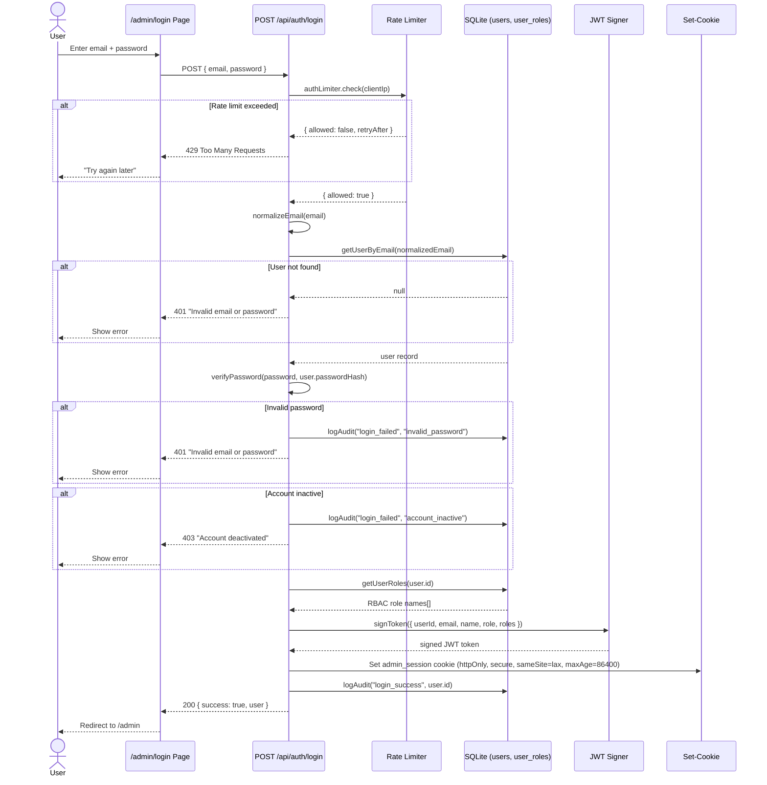
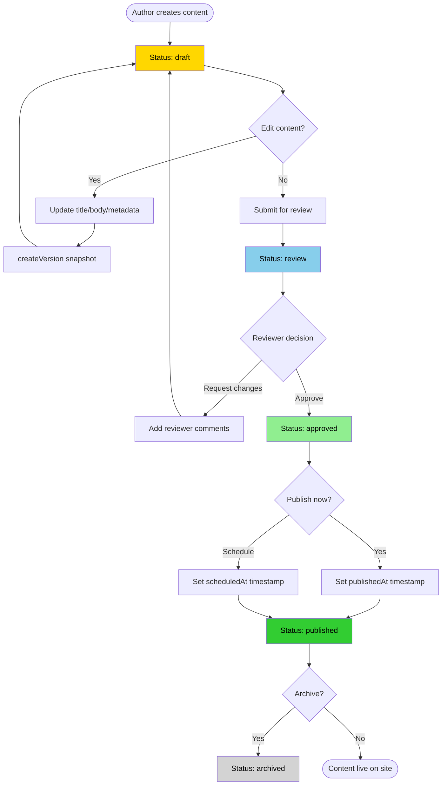
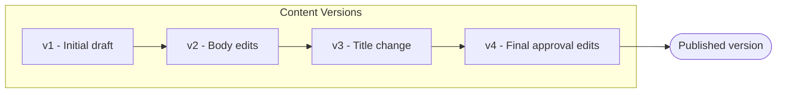
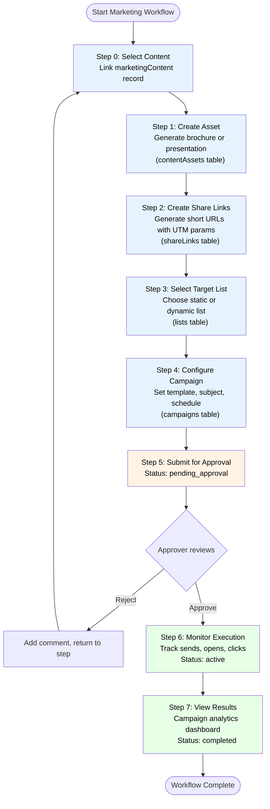
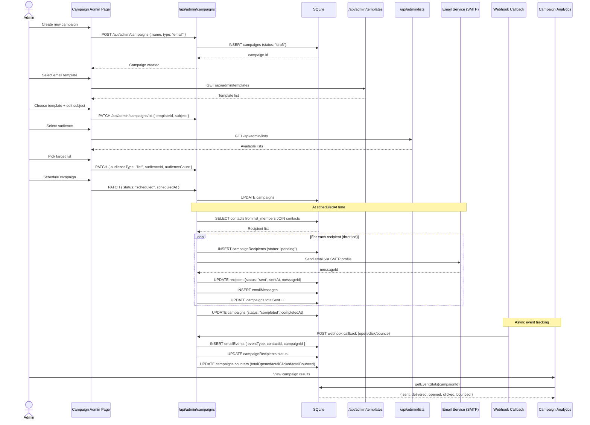
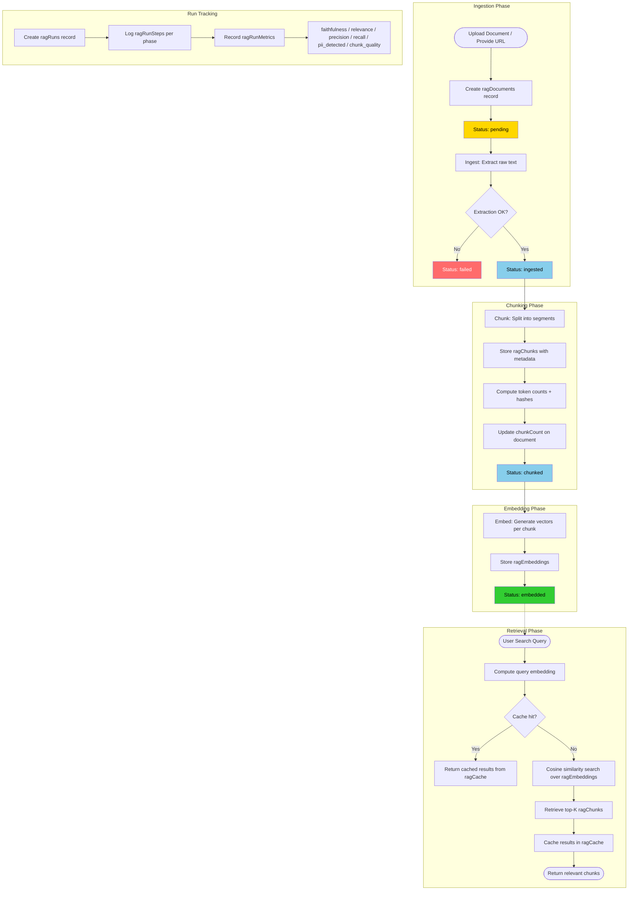
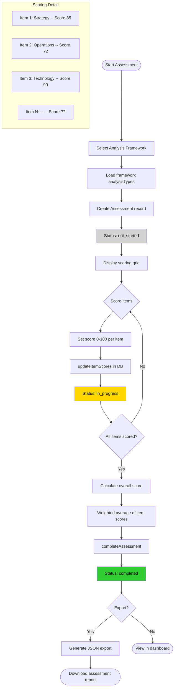
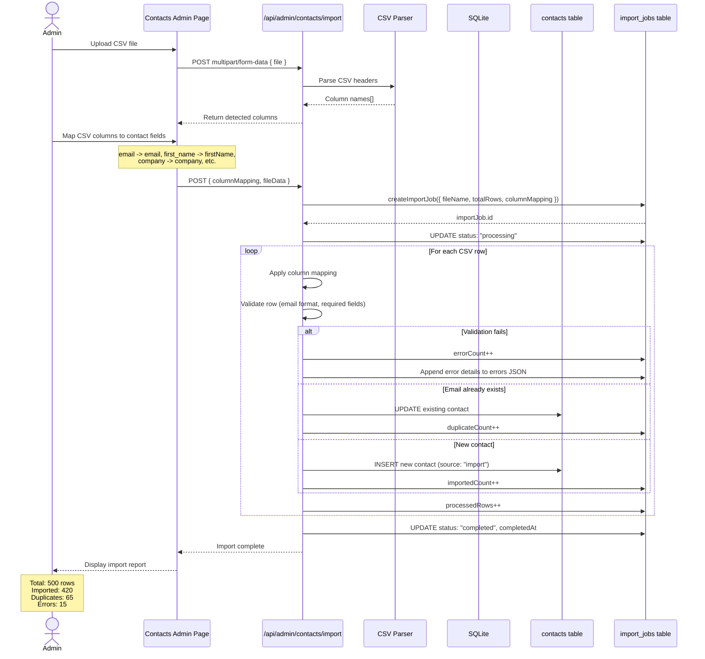
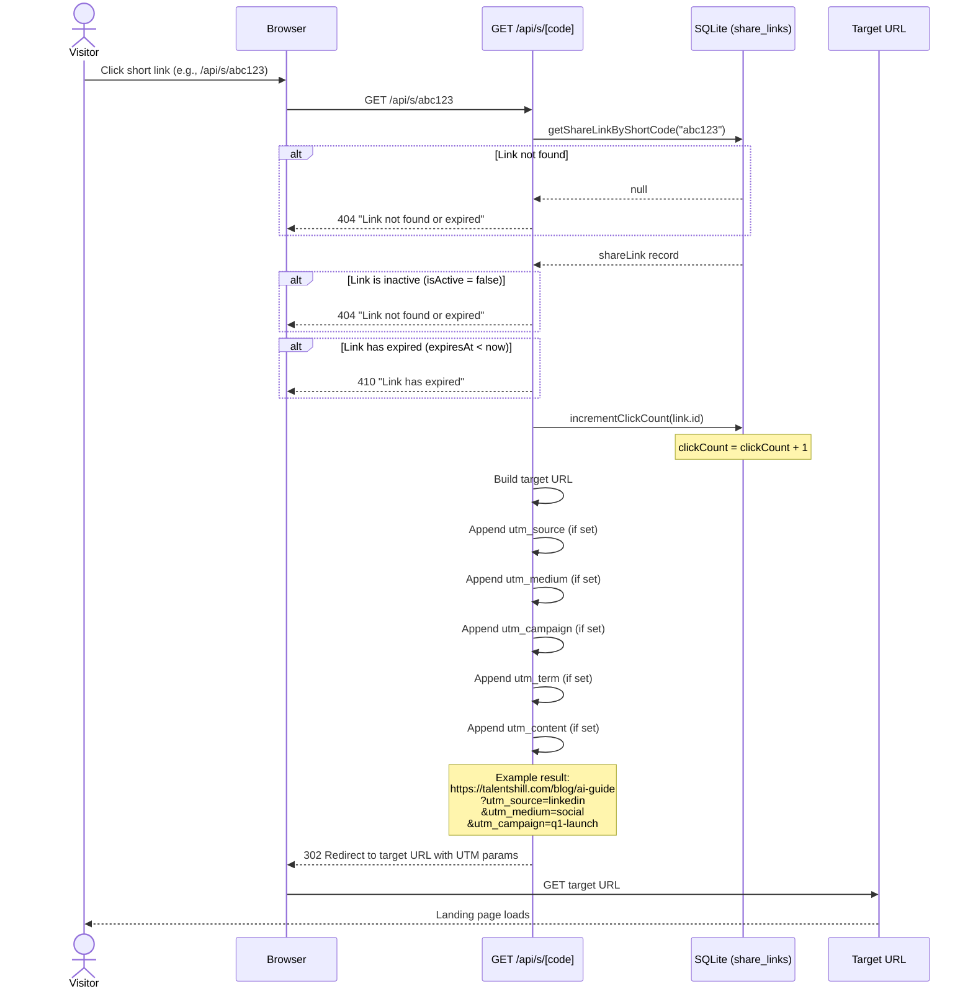
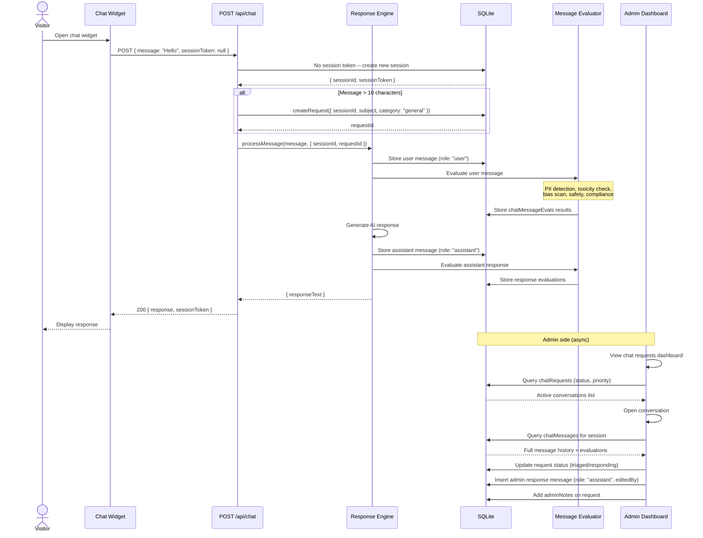

# TalentsHill Admin Portal -- Flowcharts, Sequence Diagrams & Process Flows

> Next.js 14+ App Router | SQLite + Drizzle ORM | 79 tables | 124 API routes | 62 admin pages

---

## Table of Contents

1. [Authentication Flow](#1-authentication-flow)
2. [Content Publishing Flow](#2-content-publishing-flow)
3. [Marketing Workflow](#3-marketing-workflow)
4. [Campaign Execution Flow](#4-campaign-execution-flow)
5. [RAG Pipeline Flow](#5-rag-pipeline-flow)
6. [AI Analysis Assessment Flow](#6-ai-analysis-assessment-flow)
7. [Contact Import Flow](#7-contact-import-flow)
8. [Share Link Click Flow](#8-share-link-click-flow)
9. [Chatbot Request Flow](#9-chatbot-request-flow)
10. [Segment Evaluation Flow](#10-segment-evaluation-flow)

---

## 1. Authentication Flow

Admin users authenticate via email/password. The middleware (`middleware.ts`) guards all `/admin/*` routes by verifying a JWT stored in an `admin_session` cookie. Rate limiting is enforced per-IP on the login endpoint.

**Key files:**
- `middleware.ts` -- JWT verification, redirect to `/admin/login` on failure
- `app/api/auth/login/route.ts` -- credential validation, JWT signing, cookie setting
- `lib/security/session.ts` -- `signToken()`, `SESSION_COOKIE_NAME`
- `lib/security/rate-limiter.ts` -- `authLimiter.check(clientIp)`
- `lib/db/rbac-queries.ts` -- `getUserRoles()`



---

## 2. Content Publishing Flow

Marketing content (`marketingContent` table) follows a lifecycle from draft through review, approval, and publication. Each edit creates a version snapshot in `contentVersions`. Content types include articles, brochure text, presentation text, email copy, social posts, and landing pages.

**Key files:**
- `lib/db/marketing-content-queries.ts` -- CRUD for marketing content
- `lib/db/content-version-queries.ts` -- `createVersion()`, `getVersions()`
- `app/admin/content/editor/` -- content editor admin page
- Schema: `marketingContent` (status: draft/review/approved/published/archived), `contentVersions`



### Content Version History

Each save creates an immutable version record:



---

## 3. Marketing Workflow

The 8-step marketing workflow orchestrates end-to-end content distribution. The `marketingWorkflows` table tracks `currentStep` (0-7), linked entity IDs, and approval state. Each step can have comments via `workflowComments`.

**Key files:**
- `lib/db/marketing-workflow-queries.ts` -- `createWorkflow()`, `updateWorkflowStep()`, `approveWorkflow()`
- `app/admin/marketing/` -- workflow admin UI
- Schema: `marketingWorkflows` (currentStep 0-7), `workflowComments`



---

## 4. Campaign Execution Flow

Campaigns send emails to a targeted audience (list or segment). The system supports A/B testing via `campaignVariants`, throttled sending, and granular event tracking through `emailEvents`. Each recipient gets a row in `campaignRecipients` with individual delivery status.

**Key files:**
- `lib/db/campaign-queries.ts` -- `createCampaign()`, `updateCampaignCounters()`
- `lib/db/email-event-queries.ts` -- `logEmailEvent()`, `getEventStats()`
- `lib/email/` -- email sending infrastructure
- Schema: `campaigns`, `campaignRecipients`, `campaignVariants`, `emailMessages`, `emailEvents`



---

## 5. RAG Pipeline Flow

The Retrieval-Augmented Generation pipeline processes documents through ingestion, chunking, and embedding stages. Each document progresses through statuses in `ragDocuments`: pending -> ingested -> chunked -> embedded. Pipeline runs are tracked in `ragRuns` with step-level detail in `ragRunSteps` and quality metrics in `ragRunMetrics`.

**Key files:**
- `lib/rag/ingestion.ts` -- text extraction from uploads/URLs
- `lib/rag/chunking.ts` -- split documents into segments
- `lib/rag/embedding.ts` -- generate vector embeddings
- `lib/rag/retrieval.ts` -- semantic search over embeddings
- `lib/rag/vector-store.ts` -- vector storage and similarity search
- `lib/rag/evaluation.ts` -- faithfulness, relevance, precision metrics
- `lib/rag/pii.ts` -- PII detection in chunks
- `lib/db/rag-document-queries.ts`, `rag-chunk-queries.ts`, `rag-embedding-queries.ts`, `rag-run-queries.ts`, `rag-cache-queries.ts`
- Schema: `ragDocuments`, `ragChunks`, `ragEmbeddings`, `ragRuns`, `ragRunSteps`, `ragRunMetrics`, `ragCache`, `ragConfigs`



---

## 6. AI Analysis Assessment Flow

Analysis assessments use predefined frameworks (`analysisFrameworks`) containing categories of analysis types. Each assessment scores individual items on a 0-100 scale, calculates a weighted overall score, and can be exported as JSON.

**Key files:**
- `lib/db/analysis-framework-queries.ts` -- framework definitions
- `lib/db/analysis-assessment-queries.ts` -- `createAssessment()`, `updateItemScores()`, `completeAssessment()`
- `app/admin/analysis/` -- assessment admin UI
- Schema: `analysisFrameworks` (categoryKey, analysisTypes JSON), `analysisAssessments` (itemScores JSON, overallScore)



---

## 7. Contact Import Flow

CSV contact imports are tracked as `importJobs` with row-level progress counters. The system parses headers, maps columns to contact fields, validates each row, and creates or updates contacts. Duplicate detection uses email uniqueness.

**Key files:**
- `lib/db/import-job-queries.ts` -- `createImportJob()`, `updateImportJob()`
- `lib/db/contact-queries.ts` -- contact upsert logic
- `app/admin/contacts/` -- import UI
- Schema: `importJobs` (totalRows, processedRows, importedCount, duplicateCount, errorCount, columnMapping JSON, errors JSON)



---

## 8. Share Link Click Flow

Share links provide short URLs with UTM parameter injection for marketing attribution. The `shareLinks` table stores the mapping from `shortCode` to `originalUrl` with UTM fields. Each click increments `clickCount` and issues a 302 redirect.

**Key files:**
- `app/api/s/[code]/route.ts` -- short link redirect handler
- `lib/db/share-link-queries.ts` -- `getShareLinkByShortCode()`, `incrementClickCount()`
- Schema: `shareLinks` (shortCode, originalUrl, utmSource, utmMedium, utmCampaign, utmTerm, utmContent, clickCount, isActive, expiresAt)



---

## 9. Chatbot Request Flow

The chatbot widget creates sessions (`chatSessions`), auto-generates support requests (`chatRequests`) for substantive messages, and processes messages through a response engine. Admins view and respond to conversations from the admin dashboard. Messages are evaluated for PII, toxicity, and safety via `chatMessageEvals`.

**Key files:**
- `app/api/chat/route.ts` -- public chat endpoint
- `lib/chat/response-engine.ts` -- `processMessage()` (persist, evaluate, respond)
- `lib/db/chat-queries.ts` -- `createSession()`, `getSessionByToken()`, `createRequest()`
- `lib/db/chat-eval-queries.ts` -- message evaluation storage
- `app/admin/chat/` -- admin chat dashboard
- Schema: `chatSessions`, `chatRequests` (status: new/triaged/responding/waiting_user/resolved/closed, priority), `chatMessages` (role: user/assistant/system), `chatMessageEvals`



---

## 10. Segment Evaluation Flow

Dynamic list segments use a rule-based query builder. Rules are defined as nested groups with AND/OR logic. The `segment-evaluator.ts` translates rule definitions into SQL WHERE clauses executed against the `contacts` table, returning matching counts and sample IDs.

**Key files:**
- `lib/crm/segment-evaluator.ts` -- `evaluateSegmentRules()`, `buildCondition()`, `buildGroupCondition()`
- `lib/db/list-queries.ts` -- lists with `segmentRules` JSON for dynamic type
- Schema: `lists` (type: static/dynamic, segmentRules JSON), `contacts`
- Supported operators: equals, not_equals, contains, starts_with, greater_than, less_than, is_empty, is_not_empty

```mermaid
flowchart TD
    A([Admin defines segment rules]) --> B[Define Rule Conditions]

    subgraph Rule Definition
        B --> C[Select field<br/>e.g., status, company, leadScore]
        C --> D[Select operator<br/>equals / contains / greater_than / ...]
        D --> E[Set value<br/>e.g., "active", "Acme", 50]
        E --> F{Add more conditions?}
        F -- Yes --> G[Choose AND / OR logic]
        G --> C
        F -- No --> H[Finalize rule group]
    end

    subgraph Nested Groups
        H --> I{Nested sub-group?}
        I -- Yes --> J[Create child RuleGroup]
        J --> K[Set child logic: AND / OR]
        K --> C
        I -- No --> L[Complete rule tree]
    end

    subgraph Query Building
        L --> M[buildGroupCondition]
        M --> N[Recursively process groups]
        N --> O[buildCondition per rule]
        O --> P[Map operator to SQL]
        P --> Q[Join with AND / OR]
        Q --> R[Final SQL WHERE clause]
    end

    subgraph Execution
        R --> S["SELECT COUNT(*) FROM contacts WHERE ..."]
        S --> T[Return total count]
        R --> U["SELECT id FROM contacts WHERE ... LIMIT 10"]
        U --> V[Return sample IDs]
    end

    T --> W([Display: 1,247 contacts match])
    V --> X([Preview: sample contact list])

    style A fill:#e6f3ff,color:#000
    style R fill:#fff3e6,color:#000
    style W fill:#e6ffe6,color:#000
    style X fill:#e6ffe6,color:#000
```

### Rule-to-SQL Operator Mapping

| Rule Operator   | SQL Output                                    |
|-----------------|-----------------------------------------------|
| `equals`        | `"field" = value`                             |
| `not_equals`    | `"field" != value`                            |
| `contains`      | `"field" LIKE '%value%'`                      |
| `starts_with`   | `"field" LIKE 'value%'`                       |
| `greater_than`  | `"field" > value`                             |
| `less_than`     | `"field" < value`                             |
| `is_empty`      | `("field" IS NULL OR "field" = '')`           |
| `is_not_empty`  | `("field" IS NOT NULL AND "field" != '')`     |
