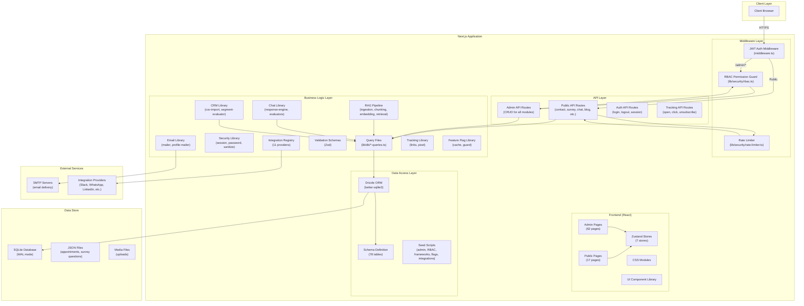
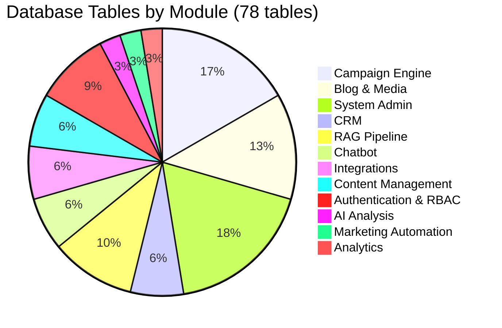
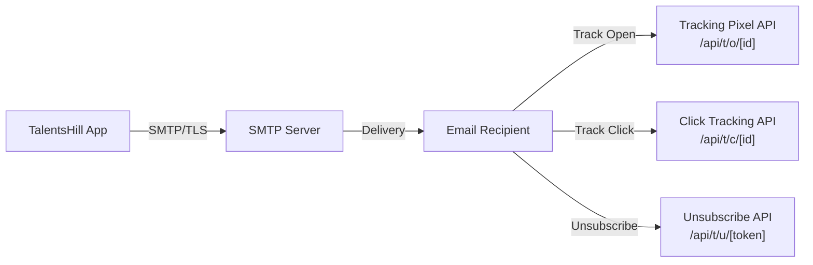
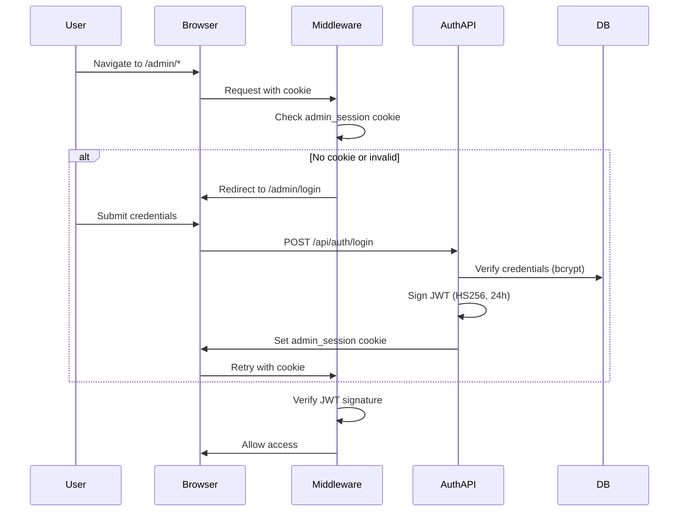
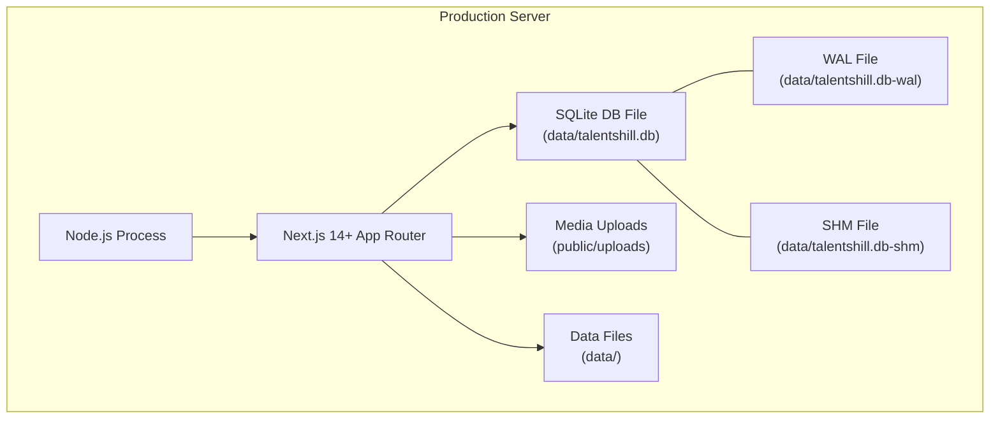

# High Level Design (HLD)

## TalentsHill Enterprise Admin Portal

**Version:** 1.0
**Last Updated:** 2026-02-14

---

## 1. System Overview

TalentsHill is a monolithic Next.js 14+ application serving as an enterprise admin portal and public-facing marketing website. The system combines a public website (marketing pages, blog, survey, booking, chatbot) with a comprehensive admin portal covering CRM, campaign management, content marketing, AI analysis, RAG pipeline, integrations, and operational tooling.

**Key Metrics:**
- 79 database tables (SQLite with Drizzle ORM)
- 124 API route handlers
- 62 admin pages
- 17 public pages
- 35 AI analysis frameworks
- 7 Zustand client-side stores

**Architecture Style:** Monolithic MVC with clear layer separation using Next.js App Router conventions.

---

## 2. High-Level Architecture Diagram

---

## 3. Module Decomposition

The system is decomposed into 12 functional modules:

### 3.1 Authentication & RBAC

**Purpose:** Secure access to the admin portal with role-based authorization.

| Component | Description |
|-----------|-------------|
| `middleware.ts` | JWT verification on all `/admin/*` routes |
| `lib/security/session.ts` | JWT token signing/verification (HS256, 24h expiry) |
| `lib/security/password.ts` | bcryptjs password hashing (cost factor 12) |
| `lib/security/rbac.ts` | Permission checking and `withPermission()` HOF |
| `lib/security/rate-limiter.ts` | Per-IP sliding window rate limiting |
| `lib/security/sanitize.ts` | HTML stripping, email normalization, IP hashing |
| `app/admin/login/` | Login page |
| `app/api/auth/` | Login, logout, session API routes |

### 3.2 Content Management

**Purpose:** Create, version, and publish marketing content with asset management.

| Component | Description |
|-----------|-------------|
| Marketing Content | Articles, brochure text, PPT text, email copy, social posts, landing pages |
| Content Versions | Full version history with change notes |
| Content Assets | Brochures and presentations with slide-level editing |
| Share Links | Short URLs with UTM parameters and click tracking |
| Content Library | Centralized browsing of all content items |

**Tables:** `marketingContent`, `contentVersions`, `contentAssets`, `shareLinks`, `contentOverrides`

### 3.3 CRM (Customer Relationship Management)

**Purpose:** Manage contacts, lists, segments, and import/export operations.

| Component | Description |
|-----------|-------------|
| Contacts | Unified contact store with lead scoring and status tracking |
| Lists | Static and dynamic lists with segment rules |
| Segment Evaluator | Rule-based dynamic list evaluation (AND/OR conditions) |
| CSV Import | Bulk contact import with column mapping and error tracking |
| Contact Events | Activity timeline per contact |

**Tables:** `contacts`, `contactEvents`, `lists`, `listMembers`, `importJobs`

### 3.4 Campaign Engine

**Purpose:** Create, schedule, and execute email campaigns with A/B testing.

| Component | Description |
|-----------|-------------|
| Campaigns | Multi-step campaign creation with audience targeting |
| Campaign Variants | A/B testing with percentage-based splits |
| Recipients | Per-contact delivery tracking (sent, opened, clicked, bounced) |
| Broadcasts | One-time email blasts with throttling |
| Email Messages | Individual message tracking with SMTP message IDs |
| Email Events | Granular event stream (sent, delivered, opened, clicked, bounced, complained, unsubscribed) |
| Email Templates | HTML/text templates with variable substitution and versioning |
| Email Profiles | Sender identity management with SMTP configuration |

**Tables:** `campaigns`, `campaignVariants`, `campaignRecipients`, `broadcasts`, `emailMessages`, `emailEvents`, `emailTemplates`, `emailTemplateVersions`, `emailProfiles`, `smtpConfigs`, `emailProfileSmtp`, `eventRoutes`, `unsubscribeTokens`

### 3.5 Marketing Automation

**Purpose:** End-to-end marketing workflow from content creation to campaign execution.

| Component | Description |
|-----------|-------------|
| Workflows | 8-step wizard (content -> asset -> links -> list -> campaign -> approval -> schedule -> monitor) |
| Approvals | Review and approval workflow with comments |
| Monitoring | Real-time workflow status tracking |
| Workflow Comments | Step-level discussion threads |

**Tables:** `marketingWorkflows`, `workflowComments`

### 3.6 AI Analysis

**Purpose:** Structured AI assessment platform with 35 analysis frameworks.

| Component | Description |
|-----------|-------------|
| Frameworks | 35 pre-seeded assessment categories (Reliable AI, Trustworthy AI, Safe AI, etc.) |
| Assessments | Project-level assessments with per-item scoring (0-100) |
| Scoring | Status tracking (not_started, in_progress, completed, not_applicable) per analysis item |
| Dashboard | Aggregate analytics across assessments |

**Framework Categories:** Reliable AI, Trustworthy AI, Safe AI, Accountable AI, Auditable AI, Model Lifecycle, Monitoring & Drift, Sustainable/Green AI, Responsible GenAI, Debug AI, Portability AI, Interpretable AI, Trust AI, Responsible AI, Explainable AI, Fairness AI, Mechanistic & Causal AI, Human-Centered AI, Human-in-the-Loop AI, Transparent Data AI, Social AI, Compliance AI, Privacy-Preserving AI, Long-Term Risk AI, Environmental Impact AI, Ethical AI, Sensitivity Analysis AI, Governance AI, Secure AI, Energy-Efficient AI, Hallucination Prevention AI, Hypothesis AI, Threat AI, Fine-Tuning Analysis, Interpretability AI

**Tables:** `analysisFrameworks`, `analysisAssessments`

### 3.7 RAG Pipeline

**Purpose:** Document ingestion, chunking, embedding, and semantic search pipeline.

| Component | Description |
|-----------|-------------|
| Document Ingestion | Upload, URL, and site page source types |
| Chunking | Configurable chunk size and overlap with token counting |
| Embedding | Vector embedding generation with model selection |
| Retrieval | Semantic search with cosine similarity |
| Evaluation | Pipeline quality metrics (faithfulness, relevance, precision, recall) |
| PII Detection | Email, phone, SSN, credit card, IP detection |
| Cache | Query-level result caching with TTL |
| Config | Versioned pipeline configuration |
| Runs | Pipeline execution tracking with step-level monitoring |

**Tables:** `ragDocuments`, `ragChunks`, `ragEmbeddings`, `ragCache`, `ragRuns`, `ragRunSteps`, `ragRunMetrics`, `ragConfigs`

### 3.8 Chatbot

**Purpose:** Visitor chatbot with session management, request triage, and message evaluation.

| Component | Description |
|-----------|-------------|
| Sessions | Visitor chat sessions with email capture |
| Messages | User/assistant/system message storage |
| Requests | Support request triage (priority, assignment, resolution) |
| Evaluation | Message safety scoring (PII, toxicity, bias, safety, compliance) |
| Response Engine | AI-powered response generation |
| Admin Notes | Internal notes on requests/sessions |

**Tables:** `chatSessions`, `chatMessages`, `chatRequests`, `chatMessageEvals`, `adminNotes`

### 3.9 Integrations

**Purpose:** Third-party service connectivity with credential management and logging.

| Component | Description |
|-----------|-------------|
| Provider Registry | 11 providers (Slack, WhatsApp, LinkedIn, Gmail, Facebook, Instagram, X, Quora, Dropbox, Database, Webhook) |
| Accounts | Per-integration connection management |
| Credentials | Encrypted credential storage with expiry |
| Webhooks | Inbound/outbound webhook management |
| Logs | Request/response logging with duration tracking |

**Tables:** `integrations`, `integrationAccounts`, `integrationCredentials`, `integrationLogs`, `webhooks`

### 3.10 Blog & Media

**Purpose:** Blog publishing platform and media asset management.

| Component | Description |
|-----------|-------------|
| Blog Posts | Markdown content with SEO metadata, categories, and tags |
| Blog Categories | Hierarchical content categorization |
| Blog Tags | Content tagging system |
| Blog Authors | Author profiles with social links |
| Blog Views | View tracking per session |
| Blog Subscribers | Email subscription management |
| Videos | Video library with provider support (YouTube, Vimeo, custom) |
| Media | File upload management with tagging and folders |

**Tables:** `blogPosts`, `blogCategories`, `blogTags`, `blogAuthors`, `blogPostCategories`, `blogPostTags`, `blogViews`, `blogSubscribers`, `videos`, `media`

### 3.11 Analytics

**Purpose:** Lead management, survey analytics, and campaign performance tracking.

| Component | Description |
|-----------|-------------|
| Lead Management | Contact form submissions with automated lead scoring and tiering |
| Survey Analytics | AI maturity survey responses with segmentation |
| Campaign Analytics | Send, open, click, bounce, and unsubscribe metrics |
| Contact Analytics | Contact growth and engagement metrics |

**Tables:** `contactSubmissions`, `surveyResponses`, `surveyAnswers`

### 3.12 System Administration

**Purpose:** Platform health, configuration, and operational tooling.

| Component | Description |
|-----------|-------------|
| Health Check | System health monitoring endpoint |
| Site Settings | Key-value configuration store |
| Feature Flags | Module-level feature toggles with versioning and activation |
| Banners | Configurable site-wide notification banners |
| Audit Log | Entity-level action logging |
| Job Queue | Async job execution with retry and logging |
| Runs Console | Unified view of campaign, broadcast, and import executions |
| Maintenance | Database maintenance operations |
| Content Overrides | Page-level content customization |
| Services & Industries | Service catalog and industry taxonomy management |

**Tables:** `siteSettings`, `featureFlags`, `featureFlagVersions`, `featureFlagActive`, `banners`, `auditLog`, `jobs`, `jobRuns`, `jobLogs`, `runs`, `runEvents`, `contentOverrides`, `services`, `industries`

---

## 4. Data Store Design

### 4.1 Database Engine

- **Engine:** SQLite via `better-sqlite3`
- **ORM:** Drizzle ORM with type-safe schema
- **File Location:** `data/talentshill.db`
- **Mode:** WAL (Write-Ahead Logging) for concurrent read performance
- **Pragmas:** `journal_mode=WAL`, `busy_timeout=5000`, `foreign_keys=ON`

### 4.2 Table Distribution by Module

### 4.3 Supplementary Data Stores

| Store | Format | Purpose |
|-------|--------|---------|
| `data/appointments.json` | JSON file | Booking appointment storage |
| `data/survey-questions.json` | JSON file | Survey question definitions |
| `data/blog/` | Directory | Blog static assets |
| `data/jobs/` | Directory | Job listing data |

### 4.4 Indexing Strategy

All tables with query-heavy columns include explicit indexes. The schema defines indexes on:

- Foreign key columns (all `_id` references)
- Status and type columns used in WHERE clauses
- Timestamp columns used in ORDER BY
- Unique lookup columns (email, slug, token, shortCode)

---

## 5. External Interfaces

### 5.1 SMTP (Email Delivery)

- Multiple SMTP configurations supported
- Email profile to SMTP mapping via `emailProfileSmtp` junction table
- Event-based routing via `eventRoutes` table
- Throttled delivery (configurable per-minute rate)
- Open tracking via 1x1 pixel
- Click tracking via redirect URLs
- One-click unsubscribe via token-based URLs

### 5.2 Integration Providers

| Provider | Category | Description |
|----------|----------|-------------|
| Slack | Messaging | Channel notifications |
| WhatsApp | Messaging | Business messaging |
| Gmail | Messaging | Email integration |
| LinkedIn | Social | Social publishing |
| Facebook | Social | Social publishing |
| Instagram | Social | Social publishing |
| X (Twitter) | Social | Social publishing |
| Quora | Social | Q&A publishing |
| Dropbox | Productivity | File storage |
| Database | Data | External DB connections |
| Webhook | Webhook | Custom HTTP callbacks |

### 5.3 Short URL Redirect

- Public short URL service at `/api/s/[code]`
- Resolves share link short codes to original URLs
- Increments click count on each redirect
- Supports UTM parameter injection

---

## 6. Security Architecture

### 6.1 Authentication Flow

### 6.2 Authorization Model

- **Role-Based Access Control (RBAC)**
  - Roles: admin, editor, viewer (legacy column) + custom roles via `roles` table
  - Permissions: resource + action pairs (e.g., `contacts:read`, `campaigns:write`)
  - Junction tables: `userRoles`, `rolePermissions`
  - Groups: `groups`, `groupMembers` for bulk assignment
- **Permission Check:** `withPermission(resource, action)` HOF wraps API route handlers
- **Session Payload:** JWT contains `userId`, `email`, `name`, `role`, `roles[]`

### 6.3 Rate Limiting

| Limiter | Window | Max Requests | Protects |
|---------|--------|-------------|----------|
| `contactLimiter` | 60 seconds | 5 | Contact form submissions |
| `surveyLimiter` | 60 seconds | 3 | Survey submissions |
| `authLimiter` | 300 seconds | 10 | Login attempts |

Implementation: In-memory sliding window with automatic cleanup every 5 minutes.

### 6.4 Input Sanitization

- HTML tag stripping with 10,000 character limit
- Email normalization (lowercase, trim)
- IP address hashing (SHA-256, truncated to 16 chars)
- SQL injection prevention via Drizzle ORM parameterized queries

---

## 7. Deployment Architecture

**Deployment Characteristics:**

- **Single Process:** Node.js server handles both frontend rendering and API requests
- **No External Database:** SQLite file co-located with the application
- **Static Export Support:** `next.config.js` configured with `trailingSlash: true` and `images.unoptimized: true`
- **External Packages:** `better-sqlite3` listed in `serverExternalPackages` for proper bundling
- **File-Based State:** Appointments and survey questions stored as JSON files alongside the SQLite database

---

## 8. Technology Stack

| Layer | Technology |
|-------|-----------|
| Framework | Next.js 14+ (App Router) |
| Language | TypeScript |
| UI | React (Server + Client Components) |
| Styling | CSS Modules |
| State Management | Zustand (7 stores) |
| API | Next.js Route Handlers |
| ORM | Drizzle ORM |
| Database | SQLite (better-sqlite3) |
| Authentication | JWT (jose library) |
| Password Hashing | bcryptjs |
| Validation | Zod |
| Email | Nodemailer (via lib/email/) |

---

## 9. Non-Functional Requirements

| Requirement | Approach |
|-------------|----------|
| **Performance** | SQLite WAL mode for concurrent reads; client-side state caching via Zustand `persist` middleware |
| **Security** | JWT session authentication; RBAC authorization; bcrypt password hashing; IP rate limiting; input sanitization |
| **Scalability** | Monolithic design suitable for single-server deployment; SQLite handles moderate write loads |
| **Reliability** | WAL mode with busy_timeout for write contention; foreign key constraints for data integrity |
| **Auditability** | Comprehensive audit log table tracking entity-level changes with user attribution |
| **Extensibility** | Feature flag system for module-level toggling; integration provider registry for new connectors |
