# Low Level Design (LLD)

## TalentsHill Enterprise Admin Portal

**Version:** 1.0
**Last Updated:** 2026-02-14

---

## 1. Directory Structure

```
talentshill/
├── app/                               # Next.js App Router
│   ├── layout.tsx                     # Root layout (global styles, metadata)
│   ├── page.tsx                       # Home page (public)
│   ├── globals.css                    # Global CSS imports
│   ├── loading.tsx                    # Global loading state
│   ├── not-found.tsx                  # 404 page
│   ├── robots.ts                      # Robots.txt generation
│   ├── sitemap.ts                     # Sitemap generation
│   ├── feed.xml/                      # RSS feed
│   │
│   ├── admin/                         # Admin portal (62 pages)
│   │   ├── layout.tsx                 # Admin shell: sidebar nav, session check, logout
│   │   ├── AdminLayout.module.css     # Admin layout styles
│   │   ├── AdminDashboard.module.css  # Dashboard styles
│   │   ├── page.tsx                   # Admin dashboard
│   │   ├── login/page.tsx             # Login page
│   │   ├── analysis/                  # AI Analysis module (hub, project list, per-framework)
│   │   ├── analytics/                 # Campaign analytics dashboard
│   │   ├── appointments/              # Appointment management
│   │   ├── banners/                   # Site banner management
│   │   ├── blog/                      # Blog post CRUD with preview
│   │   ├── broadcasts/                # Email broadcast management
│   │   ├── campaigns/                 # Campaign builder (list, detail, new)
│   │   ├── chat/                      # Chat conversations, requests, sessions
│   │   ├── contacts/                  # CRM contacts with import
│   │   ├── content/                   # Content library, brochures, presentations, links, editor
│   │   ├── content-overrides/         # Page content overrides
│   │   ├── email-compose/             # Ad-hoc email composition
│   │   ├── email-profiles/            # Sender identity management
│   │   ├── features/                  # Feature flag management
│   │   ├── health/                    # System health dashboard
│   │   ├── industries/                # Industry taxonomy CRUD
│   │   ├── integrations/              # Integration hub and detail
│   │   ├── leads/                     # Lead management (list, detail)
│   │   ├── lists/                     # CRM list management
│   │   ├── login/                     # Admin login page
│   │   ├── maintenance/               # Database maintenance
│   │   ├── marketing/                 # Marketing automation (workflow, approvals, segments, monitor)
│   │   ├── media/                     # Media library
│   │   ├── rag/                       # RAG pipeline (dashboard, documents, runs, config, search)
│   │   ├── roles/                     # Role and permission management
│   │   ├── runs/                      # Operations run console
│   │   ├── services/                  # Service catalog CRUD
│   │   ├── settings/                  # Site settings
│   │   ├── survey/                    # Survey response analytics
│   │   ├── templates/                 # Email template editor (list, detail)
│   │   ├── users/                     # User management
│   │   └── videos/                    # Video library management
│   │
│   ├── api/                           # API route handlers (124 routes)
│   │   ├── admin/                     # Admin API routes (auth-protected)
│   │   │   ├── activity/              # Recent activity feed
│   │   │   ├── analysis/              # Frameworks, assessments, dashboard, export
│   │   │   ├── analytics/             # Campaign and contact analytics
│   │   │   ├── assets/                # Content asset CRUD
│   │   │   ├── banners/               # Banner CRUD
│   │   │   ├── broadcasts/            # Broadcast CRUD
│   │   │   ├── campaigns/             # Campaign CRUD, launch, recipients
│   │   │   ├── chat/                  # Chat requests, sessions, notes, respond
│   │   │   ├── contacts/              # Contact CRUD, import, export
│   │   │   ├── content/               # Marketing content CRUD, versions, publish
│   │   │   ├── content-overrides/     # Content override management
│   │   │   ├── dashboard/             # Admin dashboard stats
│   │   │   ├── email-compose/         # Send ad-hoc emails
│   │   │   ├── email-profiles/        # Email profile CRUD
│   │   │   ├── event-routes/          # Email event routing
│   │   │   ├── features/              # Feature flag CRUD, cache bust
│   │   │   ├── health/                # Health check endpoint
│   │   │   ├── industries/            # Industry CRUD
│   │   │   ├── integrations/          # Integration CRUD, test, logs
│   │   │   ├── jobs/                  # Job queue management
│   │   │   ├── leads/                 # Lead CRUD, export
│   │   │   ├── links/                 # Share link CRUD
│   │   │   ├── lists/                 # List CRUD, preview
│   │   │   ├── maintenance/           # DB maintenance operations
│   │   │   ├── media/                 # Media upload and management
│   │   │   ├── rag/                   # RAG documents, runs, config, search, evaluate, health
│   │   │   ├── roles/                 # Role and permission CRUD
│   │   │   ├── runs/                  # Operations run CRUD
│   │   │   ├── services/              # Service CRUD
│   │   │   ├── settings/              # Site settings CRUD
│   │   │   ├── smtp-configs/          # SMTP configuration CRUD
│   │   │   ├── survey/                # Survey response management
│   │   │   ├── templates/             # Template CRUD, test send
│   │   │   ├── users/                 # User CRUD
│   │   │   ├── videos/                # Video CRUD
│   │   │   ├── webhooks/              # Webhook CRUD
│   │   │   └── workflows/             # Workflow CRUD, approve, comments
│   │   ├── auth/                      # Authentication (login, logout, session)
│   │   ├── appointments/              # Booking CRUD, slots
│   │   ├── banners/active/            # Public active banners
│   │   ├── blog/                      # Public blog (posts, categories, tags, views, stats, subscribers)
│   │   ├── careers/                   # Job listing API
│   │   ├── chat/                      # Public chatbot (session, message, email capture)
│   │   ├── contact/                   # Contact form submission
│   │   ├── demo/                      # Demo request submission
│   │   ├── newsletter/                # Newsletter subscription
│   │   ├── s/[code]/                  # Short URL redirect
│   │   ├── survey/                    # Survey submission
│   │   └── t/                         # Tracking endpoints
│   │       ├── o/[id]/                # Open tracking pixel
│   │       ├── c/[id]/                # Click tracking redirect
│   │       └── u/[token]/             # Unsubscribe handler
│   │
│   ├── blog/                          # Public blog pages
│   ├── book/                          # Appointment booking page
│   ├── careers/                       # Job listings page
│   ├── contact/                       # Contact form page
│   ├── demo/                          # Demo request page
│   ├── industries/                    # Industry listing page
│   ├── maintenance/                   # Maintenance mode page
│   ├── services/                      # Service listing page
│   ├── solutions/                     # Solution pages (GenAI, Quantum AI, Robotics AI)
│   ├── survey/                        # AI maturity survey
│   ├── unsubscribe/                   # Email unsubscribe page
│   └── videos/                        # Video gallery page
│
├── components/                        # Shared React components
│   ├── BackToTop.tsx                  # Scroll-to-top button
│   ├── CookieConsent.tsx              # Cookie consent banner
│   ├── EngagementFlow.tsx             # Lead engagement wizard
│   ├── Footer.tsx                     # Site footer
│   ├── HeroSection.tsx                # Home page hero
│   ├── IndustriesPreview.tsx          # Industries section
│   ├── Navbar.tsx                     # Public navigation bar
│   ├── ServicesPreview.tsx            # Services section
│   ├── ThemeProvider.tsx              # Dark/light theme provider
│   ├── ThemeToggle.tsx                # Theme toggle switch
│   ├── WhatsAppWidget.tsx             # WhatsApp CTA widget
│   ├── *.module.css                   # Component-specific CSS modules
│   └── ui/                            # Reusable UI primitives
│       ├── Accordion.tsx              # Collapsible accordion
│       ├── Badge.tsx                  # Status/label badges
│       ├── Button.tsx                 # Button variants
│       ├── Card.tsx                   # Content card
│       ├── Input.tsx                  # Form input
│       ├── Modal.tsx                  # Dialog modal
│       ├── SectionHeader.tsx          # Section title with subtitle
│       ├── Tabs.tsx                   # Tab navigation
│       ├── Toast.tsx                  # Notification toasts
│       └── *.module.css               # UI component styles
│
├── features/                          # Feature-specific components
│   ├── blog/                          # Blog feature components
│   ├── booking/                       # Booking wizard components
│   ├── careers/                       # Career listing components
│   ├── chatbot/                       # Chatbot widget components
│   ├── demo/                          # Demo request components
│   ├── forms/                         # Shared form components
│   └── survey/                        # Survey wizard components
│
├── store/                             # Zustand state stores
│   ├── booking-store.ts               # Appointment booking wizard state
│   ├── chatbot-store.ts               # Chatbot message state
│   ├── query-provider.tsx             # React Query provider
│   ├── survey-store.ts                # Survey wizard state
│   ├── theme-store.ts                 # Dark/light theme preference
│   ├── ui-store.ts                    # UI state (chatbot open, modals, toasts)
│   └── workflow-store.ts              # Marketing workflow wizard state
│
├── lib/                               # Business logic and utilities
│   ├── db/                            # Database layer
│   │   ├── index.ts                   # Database connection (better-sqlite3 + Drizzle)
│   │   ├── schema.ts                  # Drizzle table definitions (78 tables)
│   │   ├── *-queries.ts               # Query functions (45 query files)
│   │   ├── seed.ts                    # Master seed runner
│   │   ├── seed-admin.ts              # Default admin user seed
│   │   ├── seed-analysis-frameworks.ts # 35 AI frameworks seed
│   │   ├── seed-flags.ts              # Default feature flags seed
│   │   ├── seed-integrations.ts       # Integration providers seed
│   │   └── seed-rbac.ts              # Default roles/permissions seed
│   ├── security/                      # Security utilities
│   │   ├── session.ts                 # JWT signing/verification
│   │   ├── password.ts                # bcrypt hashing/comparison
│   │   ├── rbac.ts                    # Permission checking, withPermission HOF
│   │   ├── rate-limiter.ts            # Sliding window rate limiter
│   │   └── sanitize.ts               # Input sanitization helpers
│   ├── validation/                    # Zod validation schemas
│   │   ├── content-schemas.ts         # Content, asset, share link, workflow, assessment schemas
│   │   └── marketing-schemas.ts       # Template, campaign, launch, test send, import schemas
│   ├── email/                         # Email sending
│   │   ├── mailer.ts                  # Core email sending via Nodemailer
│   │   ├── profile-mailer.ts          # Profile-aware email sending
│   │   └── templates/                 # Email template functions
│   │       ├── contact-admin.ts       # Admin notification for contact form
│   │       ├── contact-user.ts        # User confirmation for contact form
│   │       └── survey-user.ts         # Survey results email
│   ├── chat/                          # Chatbot engine
│   │   ├── response-engine.ts         # AI response generation
│   │   └── evaluators.ts             # Message safety evaluators
│   ├── crm/                           # CRM utilities
│   │   ├── csv-import.ts              # CSV file parsing and contact import
│   │   └── segment-evaluator.ts       # Dynamic list segment rule evaluation
│   ├── rag/                           # RAG pipeline modules
│   │   ├── ingestion.ts               # Document ingestion
│   │   ├── chunking.ts                # Text chunking
│   │   ├── embedding.ts               # Vector embedding generation
│   │   ├── retrieval.ts               # Semantic search retrieval
│   │   ├── evaluation.ts              # Pipeline quality evaluation
│   │   ├── pii.ts                     # PII detection
│   │   └── vector-store.ts            # Vector storage and similarity search
│   ├── integrations/                  # Integration framework
│   │   ├── registry.ts                # Provider registry
│   │   ├── types.ts                   # Integration type definitions
│   │   └── providers/                 # Per-provider implementations
│   │       ├── slack.ts
│   │       ├── whatsapp.ts
│   │       ├── gmail.ts
│   │       ├── linkedin.ts
│   │       ├── facebook.ts
│   │       ├── instagram.ts
│   │       ├── x.ts
│   │       ├── quora.ts
│   │       ├── dropbox.ts
│   │       ├── database.ts
│   │       └── webhook.ts
│   ├── contact/                       # Contact form utilities
│   │   └── lead-scoring.ts            # Automated lead score calculation
│   ├── tracking/                      # Email tracking
│   │   ├── links.ts                   # Click tracking URL generation
│   │   └── pixel.ts                   # Open tracking pixel generation
│   ├── feature-flags/                 # Feature flag utilities
│   │   ├── cache.ts                   # In-memory flag cache
│   │   └── guard.ts                   # Feature gate checking
│   ├── ops/                           # Operations utilities
│   │   └── maintenance.ts             # Database maintenance tasks
│   ├── survey/                        # Survey utilities
│   ├── jobs/                          # Job processing utilities
│   ├── media/                         # Media handling utilities
│   ├── appointments-db.ts             # JSON-file appointment storage
│   ├── blog.ts                        # Blog utility functions
│   ├── booking-utils.ts               # Booking slot calculation
│   ├── constants.ts                   # Application constants
│   ├── seo.ts                         # SEO metadata generation
│   └── utils.ts                       # Shared utility functions (cn, generateId, etc.)
│
├── types/                             # TypeScript type definitions
│   └── index.ts                       # All shared interfaces and types
│
├── styles/                            # Global styles
│   └── globals.css                    # CSS custom properties and global rules
│
├── data/                              # Data files
│   ├── talentshill.db                 # SQLite database
│   ├── talentshill.db-wal             # WAL journal
│   ├── talentshill.db-shm             # Shared memory
│   ├── appointments.json              # Appointment data
│   ├── survey-questions.json          # Survey question definitions
│   ├── blog/                          # Blog static data
│   └── jobs/                          # Job listing data
│
├── public/                            # Static assets
├── terraform/                         # Infrastructure as code
├── tests/                             # Test suite
├── middleware.ts                       # Next.js edge middleware (JWT auth)
├── next.config.js                     # Next.js configuration
├── drizzle.config.ts                  # Drizzle ORM configuration
├── package.json                       # Dependencies
├── tsconfig.json                      # TypeScript configuration
└── vitest.config.mts                  # Vitest test runner configuration
```

---

## 2. Layer Architecture

```mermaid
graph TB
    subgraph "Layer 1: Presentation"
        RC["React Components<br/>(components/, features/)"]
        CSS["CSS Modules<br/>(*.module.css)"]
        ZS["Zustand Stores<br/>(store/)"]
        Pages["Pages<br/>(app/admin/, app/*)"]
    end

    subgraph "Layer 2: API"
        Routes["Route Handlers<br/>(app/api/**/route.ts)"]
        Validation["Zod Schemas<br/>(lib/validation/)"]
        AuthCheck["Auth & RBAC Checks<br/>(lib/security/)"]
    end

    subgraph "Layer 3: Business Logic"
        Queries["Query Files<br/>(lib/db/*-queries.ts)"]
        Services["Service Libraries<br/>(lib/email/, lib/crm/, lib/rag/, lib/chat/)"]
        Utils["Utilities<br/>(lib/utils.ts, lib/contact/, lib/tracking/)"]
    end

    subgraph "Layer 4: Data Access"
        Drizzle["Drizzle ORM<br/>(lib/db/index.ts)"]
        SchemaLayer["Schema<br/>(lib/db/schema.ts)"]
        SQLite["SQLite<br/>(data/talentshill.db)"]
    end

    Pages --> RC
    Pages --> ZS
    RC --> CSS
    Pages -->|fetch()| Routes
    Routes --> Validation
    Routes --> AuthCheck
    Routes --> Queries
    Routes --> Services
    Queries --> Drizzle
    Services --> Queries
    Drizzle --> SchemaLayer
    Drizzle --> SQLite
```

### 2.1 Presentation Layer

**React Components** (`components/`, `features/`)
- Public components in `components/` (Navbar, Footer, HeroSection, etc.)
- Feature-specific components in `features/` (blog, booking, chatbot, careers, survey)
- Reusable UI primitives in `components/ui/` (Button, Card, Modal, Input, Tabs, etc.)
- All styling via CSS Modules (co-located `*.module.css` files)

**Zustand Stores** (`store/`)
- Client-side state management for interactive features
- `persist` middleware for localStorage persistence where appropriate
- No server-side state -- stores are client-only

### 2.2 API Layer

**Route Handlers** (`app/api/**/route.ts`)
- Standard Next.js route handlers exporting `GET`, `POST`, `PUT`, `PATCH`, `DELETE`
- Admin routes check authentication via `getSessionUserIdAsync()`
- Request body validation via Zod schemas
- Consistent JSON response format

**Auth Flow in Routes:**
```typescript
// Typical admin route handler pattern
export async function GET(request: NextRequest) {
  const userId = await getSessionUserIdAsync(request);
  if (!userId) {
    return NextResponse.json({ error: 'Unauthorized' }, { status: 401 });
  }
  // ... business logic via query functions
  return NextResponse.json({ items, total });
}
```

### 2.3 Business Logic Layer

**Query Files** (`lib/db/*-queries.ts`)
- One query file per domain area (45 total query files)
- All database interactions via Drizzle ORM query builder
- Parameterized queries -- no raw SQL string interpolation
- Functions return plain objects suitable for JSON serialization

**Service Libraries:**
- `lib/email/` -- Email composition and sending
- `lib/crm/` -- CSV import, segment evaluation
- `lib/rag/` -- Full RAG pipeline (ingest, chunk, embed, retrieve, evaluate)
- `lib/chat/` -- Response engine and safety evaluators
- `lib/integrations/` -- Provider registry and implementations
- `lib/contact/` -- Lead scoring
- `lib/tracking/` -- Email open/click tracking

### 2.4 Data Access Layer

**Drizzle ORM** (`lib/db/index.ts`)
```typescript
import Database from 'better-sqlite3';
import { drizzle } from 'drizzle-orm/better-sqlite3';

const sqlite = new Database(DB_PATH);
sqlite.pragma('journal_mode = WAL');
sqlite.pragma('busy_timeout = 5000');
sqlite.pragma('foreign_keys = ON');

export const db = drizzle(sqlite, { schema });
```

- Synchronous SQLite via `better-sqlite3`
- WAL mode for concurrent read performance
- 5-second busy timeout for write contention
- Foreign keys enforced at the database level

---

## 3. Detailed Module Designs

### 3.1 Content Management Module

#### Tables

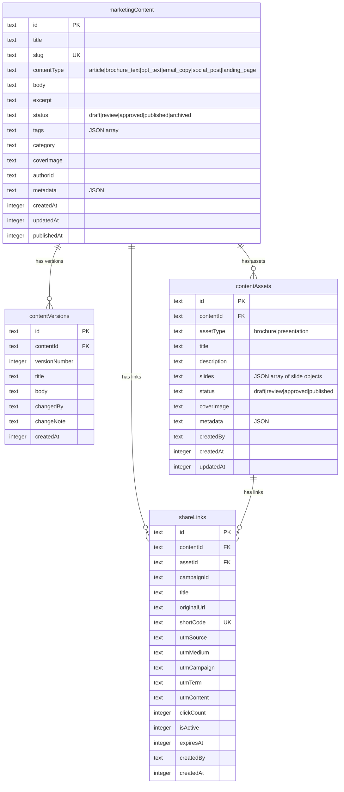

#### Query Functions (`lib/db/marketing-content-queries.ts`, `content-version-queries.ts`, `content-asset-queries.ts`, `share-link-queries.ts`)

| Function | Description |
|----------|-------------|
| `listMarketingContent(filters)` | Paginated content list with type/status filters |
| `getMarketingContentById(id)` | Single content item by ID |
| `getMarketingContentBySlug(slug)` | Lookup by slug |
| `createMarketingContent(data)` | Create with auto-slug generation |
| `updateMarketingContent(id, data)` | Update with version snapshot |
| `publishContent(id, userId)` | Set status to published, record publishedAt |
| `createContentVersion(contentId, data)` | Snapshot current state as new version |
| `listContentVersions(contentId)` | Version history for a content item |
| `createContentAsset(data)` | Create brochure/presentation asset |
| `updateAssetSlides(id, slides)` | Update slide content |
| `createShareLink(data)` | Create short URL with UTM params |
| `incrementShareLinkClicks(shortCode)` | Atomic click count increment |

#### API Endpoints

| Method | Path | Description |
|--------|------|-------------|
| GET | `/api/admin/content` | List content with filters |
| POST | `/api/admin/content` | Create new content |
| GET | `/api/admin/content/[id]` | Get content by ID |
| PUT | `/api/admin/content/[id]` | Update content |
| POST | `/api/admin/content/[id]/publish` | Publish content |
| GET | `/api/admin/content/[id]/versions` | List version history |
| GET/POST | `/api/admin/assets` | List/create assets |
| GET/PUT/DELETE | `/api/admin/assets/[id]` | Asset CRUD |
| GET/POST | `/api/admin/links` | List/create share links |
| GET/PUT/DELETE | `/api/admin/links/[id]` | Share link CRUD |

#### Admin Pages

| Page | Path | Description |
|------|------|-------------|
| Content Library | `/admin/content/library` | Browse all content items |
| Content Editor | `/admin/content/editor/[id]` | Rich text editor with metadata |
| New Content | `/admin/content/editor/new` | Create new content |
| Brochure List | `/admin/content/brochures` | Brochure asset management |
| Brochure Editor | `/admin/content/brochures/[id]` | Slide-by-slide brochure editor |
| Presentation List | `/admin/content/presentations` | Presentation management |
| Presentation Editor | `/admin/content/presentations/[id]` | Slide editor for presentations |
| Share Links | `/admin/content/links` | Short URL management |

---

### 3.2 Campaign Engine Module

#### Tables

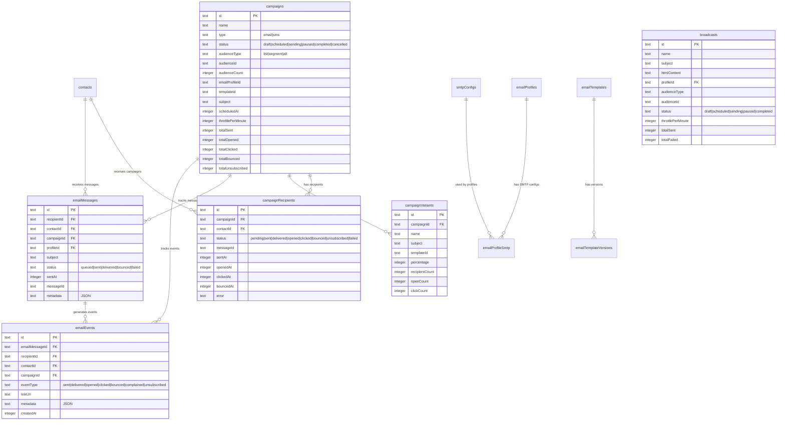

#### Campaign Lifecycle

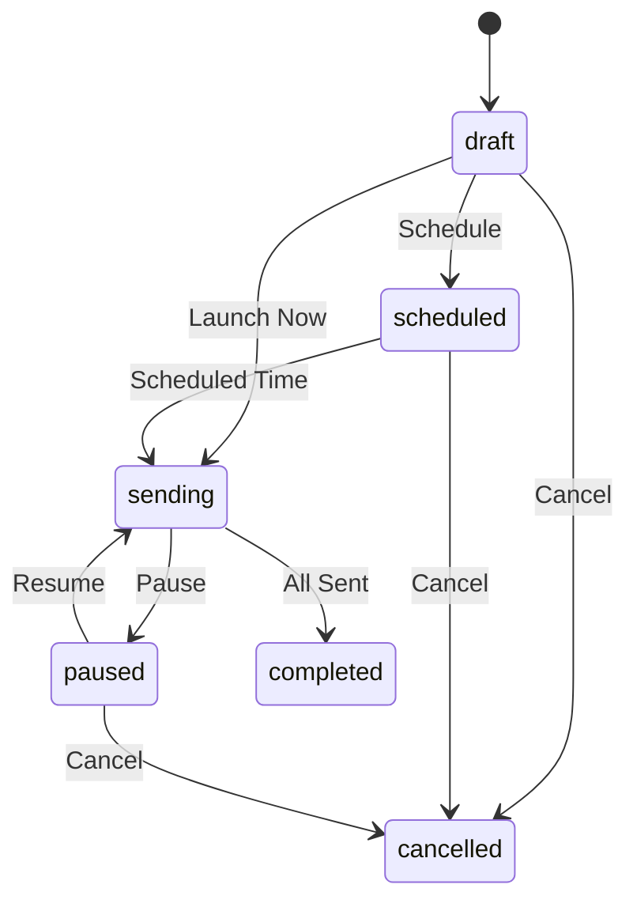

#### Query Functions (`lib/db/campaign-queries.ts`, `broadcast-queries.ts`, `email-event-queries.ts`, `template-queries.ts`, `email-profile-queries.ts`)

| Function | Description |
|----------|-------------|
| `listCampaigns(filters)` | Paginated campaign list with status filter |
| `getCampaignById(id)` | Campaign detail with aggregate stats |
| `createCampaign(data)` | Create new campaign |
| `launchCampaign(id, config)` | Start sending (populate recipients, set status) |
| `getCampaignRecipients(campaignId)` | Per-recipient delivery status |
| `recordEmailEvent(data)` | Log delivery event |
| `listBroadcasts(filters)` | Paginated broadcast list |
| `createBroadcast(data)` | Create one-time broadcast |
| `listTemplates(filters)` | Email template list |
| `getTemplateById(id)` | Template with version history |

#### API Endpoints

| Method | Path | Description |
|--------|------|-------------|
| GET/POST | `/api/admin/campaigns` | List/create campaigns |
| GET/PUT/DELETE | `/api/admin/campaigns/[id]` | Campaign CRUD |
| POST | `/api/admin/campaigns/[id]/launch` | Launch campaign |
| GET | `/api/admin/campaigns/[id]/recipients` | Recipient status list |
| GET/POST | `/api/admin/broadcasts` | List/create broadcasts |
| GET/PUT/DELETE | `/api/admin/broadcasts/[id]` | Broadcast CRUD |
| GET/POST | `/api/admin/templates` | List/create templates |
| GET/PUT/DELETE | `/api/admin/templates/[id]` | Template CRUD |
| POST | `/api/admin/templates/[id]/test-send` | Send test email |
| GET/POST | `/api/admin/email-profiles` | List/create email profiles |
| GET/PUT/DELETE | `/api/admin/email-profiles/[id]` | Profile CRUD |

---

### 3.3 Marketing Automation Module

#### 8-Step Workflow Design

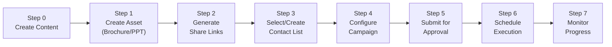

#### Workflow Status Transitions

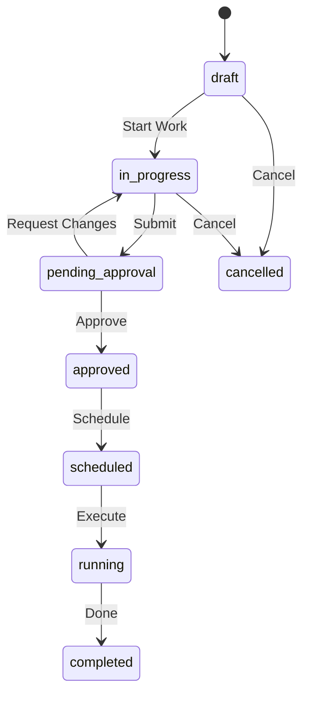

#### Zustand Store (`store/workflow-store.ts`)

```typescript
interface WorkflowState {
  currentStep: number;         // 0-7
  workflowId: string | null;
  workflowName: string;
  contentId: string | null;    // Step 0 output
  assetId: string | null;      // Step 1 output
  shareLinkIds: string[];      // Step 2 output
  listId: string | null;       // Step 3 output
  campaignId: string | null;   // Step 4 output
  approvalStatus: string;      // Step 5 output

  // Navigation
  setStep(step: number): void;
  nextStep(): void;            // max 7
  prevStep(): void;            // min 0

  // Step data setters
  setContentId(id: string | null): void;
  setAssetId(id: string | null): void;
  addShareLinkId(id: string): void;
  removeShareLinkId(id: string): void;
  setListId(id: string | null): void;
  setCampaignId(id: string | null): void;
  setApprovalStatus(status: string): void;

  reset(): void;
}
```

Persisted to `localStorage` under key `th-marketing-workflow`.

#### Tables

| Table | Columns | Purpose |
|-------|---------|---------|
| `marketingWorkflows` | id, name, status, currentStep, contentId, assetId, shareLinkIds (JSON), listId, campaignId, approvedBy, approvedAt, scheduledAt, completedAt, metadata, createdBy | Workflow instance |
| `workflowComments` | id, workflowId, userId, content, stepIndex, createdAt | Step-level comments |

#### API Endpoints

| Method | Path | Description |
|--------|------|-------------|
| GET/POST | `/api/admin/workflows` | List/create workflows |
| GET/PUT/DELETE | `/api/admin/workflows/[id]` | Workflow CRUD |
| POST | `/api/admin/workflows/[id]/approve` | Approve workflow |
| GET/POST | `/api/admin/workflows/[id]/comments` | List/add comments |

---

### 3.4 AI Analysis Module

#### Framework Structure

Each of the 35 frameworks contains:
- A unique `categoryKey` (e.g., `reliable-ai`, `trustworthy-ai`)
- A display `categoryName`
- A `description` explaining the framework's purpose
- An `analysisTypes` JSON array of 18-20 assessment items, each with `{index, name}`

#### Assessment Lifecycle

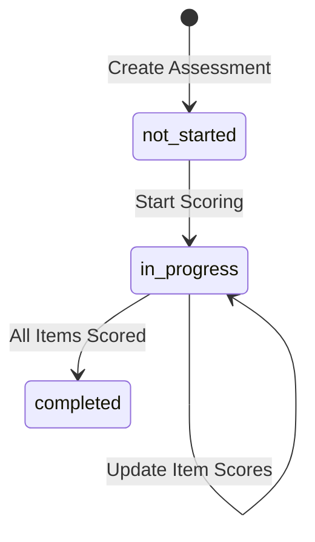

#### Scoring Model

Each assessment item can be scored independently:

| Field | Type | Description |
|-------|------|-------------|
| `itemIndex` | number | Position in the framework (1-based) |
| `itemName` | string | Name of the analysis type |
| `status` | enum | `not_started`, `in_progress`, `completed`, `not_applicable` |
| `score` | number (0-100) or null | Assessment score |
| `notes` | string | Free-text assessor notes |
| `updatedAt` | string | Last modification timestamp |

**Overall Score:** Calculated as the average of all scored items (excluding `not_applicable`).

#### Tables

| Table | Key Columns | Indexes |
|-------|-------------|---------|
| `analysisFrameworks` | id, categoryKey (UK), categoryName, description, analysisTypes (JSON), totalItems, sortOrder | `idx_frameworks_key` |
| `analysisAssessments` | id, frameworkId (FK), projectName, assessorId, status, overallScore, completedItems, totalItems, itemScores (JSON) | `idx_assessments_framework`, `idx_assessments_project`, `idx_assessments_status` |

#### API Endpoints

| Method | Path | Description |
|--------|------|-------------|
| GET | `/api/admin/analysis/frameworks` | List all 35 frameworks |
| GET | `/api/admin/analysis/frameworks/[key]` | Get framework by category key |
| GET/POST | `/api/admin/analysis/assessments` | List/create assessments |
| GET/PUT/DELETE | `/api/admin/analysis/assessments/[id]` | Assessment CRUD |
| GET | `/api/admin/analysis/assessments/[id]/export` | Export assessment as report |
| GET | `/api/admin/analysis/dashboard` | Aggregate analytics |

---

### 3.5 RAG Pipeline Module

#### Pipeline Stages

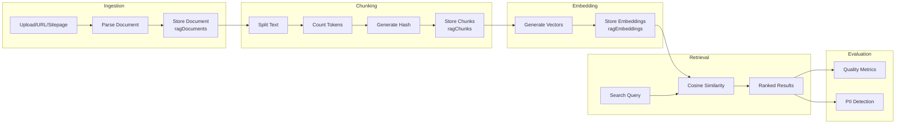

#### Document Status Flow

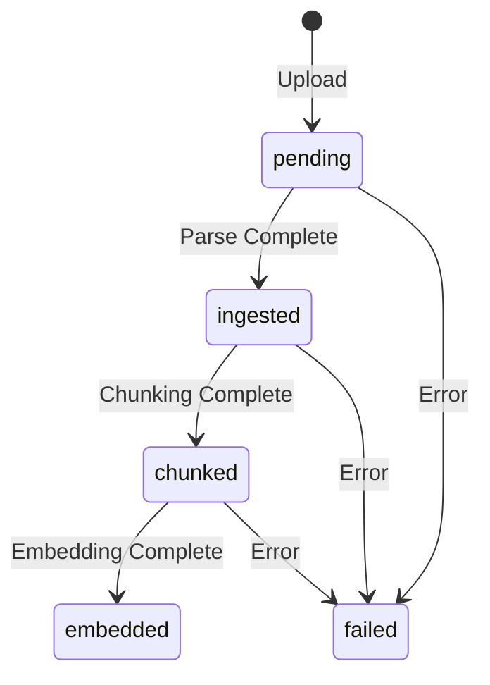

#### Tables

| Table | Key Columns | Purpose |
|-------|-------------|---------|
| `ragDocuments` | id, name, sourceType, sourceUrl, filePath, mimeType, size, status, chunkCount | Document metadata |
| `ragChunks` | id, documentId, chunkIndex, content, tokenCount, hash | Text chunks with dedup hash |
| `ragEmbeddings` | id, chunkId, model, dimensions, vector (JSON float array) | Vector embeddings |
| `ragCache` | id, queryHash, query, results, hitCount, expiresAt | Query result caching |
| `ragRuns` | id, type, status, config, documentIds, error | Pipeline execution tracking |
| `ragRunSteps` | id, runId, stepName, status, input, output, durationMs | Step-level execution |
| `ragRunMetrics` | id, runId, metricName, value (0-1), details | Quality metrics per run |
| `ragConfigs` | id, name, version, config (JSON), isActive | Pipeline configuration |

#### Library Files (`lib/rag/`)

| File | Purpose |
|------|---------|
| `ingestion.ts` | Document parsing and text extraction |
| `chunking.ts` | Text splitting with configurable size and overlap |
| `embedding.ts` | Vector embedding generation |
| `retrieval.ts` | Semantic search with ranking |
| `evaluation.ts` | Quality metric computation (faithfulness, relevance, precision, recall) |
| `pii.ts` | PII pattern detection (email, phone, SSN, credit card, IP) |
| `vector-store.ts` | In-memory vector storage and cosine similarity search |

#### API Endpoints

| Method | Path | Description |
|--------|------|-------------|
| GET/POST | `/api/admin/rag/documents` | List/upload documents |
| GET/DELETE | `/api/admin/rag/documents/[id]` | Document detail/delete |
| POST | `/api/admin/rag/documents/[id]/ingest` | Trigger ingestion pipeline |
| GET | `/api/admin/rag/documents/[id]/chunks` | List chunks for document |
| GET/POST | `/api/admin/rag/runs` | List/create pipeline runs |
| GET | `/api/admin/rag/runs/[id]` | Run detail with steps and metrics |
| POST | `/api/admin/rag/search` | Semantic search query |
| POST | `/api/admin/rag/evaluate` | Run evaluation pipeline |
| GET/PUT | `/api/admin/rag/config` | Get/update pipeline config |
| GET | `/api/admin/rag/health` | RAG pipeline health status |

---

### 3.6 CRM Module

#### Tables

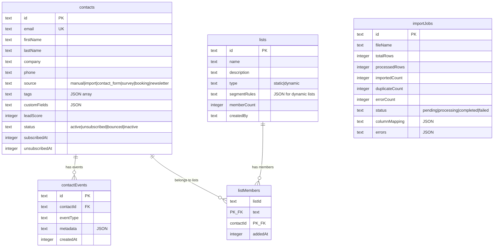

#### Segment Evaluator Design (`lib/crm/segment-evaluator.ts`)

Dynamic lists use a rule-based segment evaluator:

```typescript
interface RuleCondition {
  field: string;       // Column name (sanitized)
  operator: string;    // equals, not_equals, contains, starts_with,
                       // greater_than, less_than, is_empty, is_not_empty
  value: string | number | string[];
}

interface RuleGroup {
  logic: 'AND' | 'OR';
  conditions: (RuleCondition | RuleGroup)[];  // Recursive nesting
}
```

The evaluator:
1. Parses the JSON `segmentRules` from the list
2. Recursively builds SQL WHERE clauses using Drizzle's `sql` template tag
3. Sanitizes column names to prevent injection (`[^a-zA-Z0-9_]` stripped)
4. Supports nested AND/OR groups for complex segmentation

#### Lead Scoring (`lib/contact/lead-scoring.ts`)

Contact form submissions receive automated lead scores based on:
- Budget range selection
- Project timeline urgency
- Company size indicators
- Interest area matches

---

### 3.7 RBAC Module

#### Tables

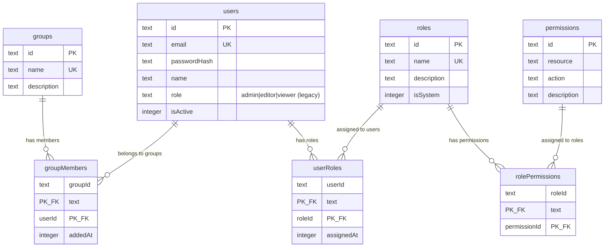

#### JWT Session Flow

```mermaid
sequenceDiagram
    participant Client
    participant LoginAPI as POST /api/auth/login
    participant SessionLib as lib/security/session.ts
    participant PasswordLib as lib/security/password.ts
    participant DB as SQLite

    Client->>LoginAPI: { email, password }
    LoginAPI->>DB: Find user by email
    DB-->>LoginAPI: User record
    LoginAPI->>PasswordLib: verifyPassword(input, hash)
    PasswordLib-->>LoginAPI: true/false
    alt Invalid credentials
        LoginAPI-->>Client: 401 Unauthorized
    end
    LoginAPI->>DB: Get user roles & permissions
    DB-->>LoginAPI: Role names array
    LoginAPI->>SessionLib: signToken({ userId, email, name, role, roles })
    SessionLib-->>LoginAPI: JWT string (HS256, 24h expiry)
    LoginAPI-->>Client: Set-Cookie: admin_session=<JWT>; HttpOnly
```

#### Middleware Chain

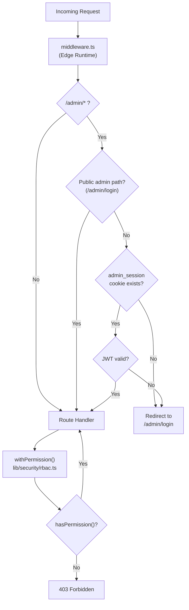

---

## 4. State Management Design

### 4.1 Zustand Stores

| Store | File | Persisted | Key | Purpose |
|-------|------|-----------|-----|---------|
| `useWorkflowStore` | `store/workflow-store.ts` | Yes | `th-marketing-workflow` | 8-step marketing workflow wizard state |
| `useChatbotStore` | `store/chatbot-store.ts` | Yes | `th-chatbot` | Chatbot message history and typing state |
| `useSurveyStore` | `store/survey-store.ts` | Yes | `th-survey` | Survey wizard answers and results |
| `useBookingStore` | `store/booking-store.ts` | Yes | `th-booking` | 5-step appointment booking wizard state |
| `useThemeStore` | `store/theme-store.ts` | Yes | `th-theme` | Dark/light theme preference |
| `useUIStore` | `store/ui-store.ts` | No | N/A | UI state (chatbot visibility, mobile menu, modals, toasts) |
| `QueryProvider` | `store/query-provider.tsx` | No | N/A | React Query provider wrapper |

### 4.2 Store Patterns

**Wizard Stores** (workflow, booking, survey):
```typescript
// Common pattern across all wizard stores
interface WizardStore {
  currentStep: number;
  // ... step-specific data
  setStep(step: number): void;
  nextStep(): void;   // bounded by max step
  prevStep(): void;   // bounded by 0
  reset(): void;      // return to initial state
}
```

**UI Store** (non-persisted):
```typescript
interface UIState {
  isChatbotOpen: boolean;
  isMobileMenuOpen: boolean;
  activeModal: string | null;
  toasts: Toast[];    // { id, type, message, duration }
  // ... action methods
}
```

---

## 5. Validation Layer

### 5.1 Zod Schemas (`lib/validation/`)

#### Content Schemas (`content-schemas.ts`)

| Schema | Used By | Key Validations |
|--------|---------|----------------|
| `CreateContentSchema` | POST `/api/admin/content` | title (1-300 chars), contentType enum, optional body/tags/category |
| `UpdateContentSchema` | PUT `/api/admin/content/[id]` | All fields optional, status enum validation |
| `CreateAssetSchema` | POST `/api/admin/assets` | title (1-300 chars), assetType enum, slides array with per-slide validation |
| `UpdateAssetSchema` | PUT `/api/admin/assets/[id]` | Optional title, description, coverImage, metadata |
| `UpdateAssetSlidesSchema` | PUT (slides) | Slides array: index, title, htmlContent, optional layout/notes |
| `UpdateAssetStatusSchema` | PUT (status) | Status enum: draft, review, approved, published |
| `CreateShareLinkSchema` | POST `/api/admin/links` | title (1-300 chars), originalUrl (valid URL), optional UTM params |
| `UpdateShareLinkSchema` | PUT `/api/admin/links/[id]` | Optional title, isActive, UTM params |
| `CreateWorkflowSchema` | POST `/api/admin/workflows` | name (1-300 chars), optional contentId/assetId/listId/campaignId |
| `UpdateWorkflowStepSchema` | PUT (step) | step (0-7), optional entity IDs |
| `UpdateWorkflowStatusSchema` | PUT (status) | Status enum (8 values) |
| `WorkflowCommentSchema` | POST comments | content (1-2000 chars), optional stepIndex (0-7) |
| `CreateAssessmentSchema` | POST assessments | frameworkId, projectName (1-200 chars) |
| `UpdateItemScoresSchema` | PUT scores | itemScores array: itemIndex, itemName, status enum, score (0-100 nullable), notes |

#### Marketing Schemas (`marketing-schemas.ts`)

| Schema | Used By | Key Validations |
|--------|---------|----------------|
| `CreateTemplateSchema` | POST `/api/admin/templates` | name (1-200), subject (1-500), htmlContent required |
| `UpdateTemplateSchema` | PUT `/api/admin/templates/[id]` | All optional, variables as string array |
| `CreateCampaignSchema` | POST `/api/admin/campaigns` | name (1-200), type enum, throttle (1-1000, default 60) |
| `LaunchCampaignSchema` | POST launch | Optional scheduledAt, A/B test config (max 2 variants) |
| `TestSendSchema` | POST test-send | Valid email, optional variables map |
| `ImportContactsSchema` | POST import | Optional columnMapping record |

### 5.2 Validation Pattern in Route Handlers

```typescript
// Standard validation pattern used across all admin routes
export async function POST(request: NextRequest) {
  try {
    const body = await request.json();
    const parsed = CreateContentSchema.safeParse(body);
    if (!parsed.success) {
      return NextResponse.json(
        { error: 'Validation failed', details: parsed.error.issues },
        { status: 400 }
      );
    }
    // ... proceed with parsed.data
  } catch {
    return NextResponse.json({ error: 'Invalid request' }, { status: 400 });
  }
}
```

---

## 6. Error Handling Patterns

### 6.1 API Route Error Handling

All route handlers follow a consistent try/catch pattern:

```typescript
export async function GET(request: NextRequest) {
  try {
    // 1. Auth check
    const userId = await getSessionUserIdAsync(request);
    if (!userId) {
      return NextResponse.json({ error: 'Unauthorized' }, { status: 401 });
    }

    // 2. Input validation (for POST/PUT)
    // 3. Business logic via query functions
    // 4. Success response

    return NextResponse.json({ items, total });
  } catch (error) {
    console.error('Operation failed:', error);
    return NextResponse.json(
      { error: 'Internal server error' },
      { status: 500 }
    );
  }
}
```

### 6.2 Error Response Codes

| Code | Usage |
|------|-------|
| `400` | Validation failure (Zod parse error, malformed input) |
| `401` | Missing or invalid session token |
| `403` | Valid session but insufficient permissions (RBAC) |
| `404` | Entity not found |
| `429` | Rate limit exceeded (contact form, survey, auth) |
| `500` | Unhandled server error |

### 6.3 Rate Limit Error Response

```typescript
// Rate limiter returns structured result
const result = contactLimiter.check(clientIp);
if (!result.allowed) {
  return NextResponse.json(
    { error: 'Too many requests', retryAfter: result.retryAfter },
    { status: 429 }
  );
}
```

### 6.4 Safe JSON Parsing

JSON fields stored as text in SQLite are parsed defensively:

```typescript
// Pattern used in query functions when reading JSON columns
const tags = row.tags ? JSON.parse(row.tags) : [];
const metadata = row.metadata ? JSON.parse(row.metadata) : null;
```

---

## 7. Database Indexing Strategy

### 7.1 Index Categories

The schema defines indexes across four categories:

**1. Foreign Key Indexes** (for JOIN performance):
```
idx_posts_author          ON blogPosts(authorId)
idx_campaign_recipients_campaign  ON campaignRecipients(campaignId)
idx_campaign_recipients_contact   ON campaignRecipients(contactId)
idx_email_messages_contact ON emailMessages(contactId)
idx_email_events_contact  ON emailEvents(contactId)
idx_rag_chunks_doc        ON ragChunks(documentId)
idx_rag_embed_chunk       ON ragEmbeddings(chunkId)
idx_chat_messages_session ON chatMessages(sessionId)
idx_job_runs_job          ON jobRuns(jobId)
```

**2. Status/Filter Indexes** (for WHERE clause performance):
```
idx_posts_status          ON blogPosts(status)
idx_contacts_status       ON contacts(status)
idx_contacts_source       ON contacts(source)
idx_campaigns_status      ON campaigns(status)
idx_broadcasts_status     ON broadcasts(status)
idx_jobs_status           ON jobs(status)
idx_runs_status           ON runs(status)
idx_rag_docs_status       ON ragDocuments(status)
idx_chat_requests_status  ON chatRequests(status)
idx_banners_active        ON banners(isActive)
idx_feature_flags_key     ON featureFlags(key)
idx_feature_flags_module  ON featureFlags(module)
```

**3. Timestamp Indexes** (for ORDER BY / range queries):
```
idx_posts_published_at    ON blogPosts(publishedAt)
idx_contact_created_at    ON contactSubmissions(createdAt)
idx_audit_created_at      ON auditLog(createdAt)
idx_email_events_created  ON emailEvents(createdAt)
idx_survey_created_at     ON surveyResponses(createdAt)
idx_import_jobs_created   ON importJobs(createdAt)
```

**4. Unique Lookup Indexes** (for direct lookups):
```
idx_contacts_email        ON contacts(email)
idx_links_short_code      ON shareLinks(shortCode)
idx_chat_sessions_token   ON chatSessions(sessionToken)
idx_unsubscribe_tokens_token ON unsubscribeTokens(token)
idx_mktg_content_slug     ON marketingContent(slug)
```

**5. Composite Indexes** (for multi-column queries):
```
idx_views_session         ON blogViews(postId, sessionId)
idx_audit_entity          ON auditLog(entityType, entityId)
idx_admin_notes_entity    ON adminNotes(entityType, entityId)
idx_content_overrides_page ON contentOverrides(pageSlug)
```

### 7.2 Primary Key Strategy

- All tables use `text` primary keys with UUIDs (generated via `crypto.randomUUID()`)
- Junction tables use composite primary keys (e.g., `blogPostCategories(postId, categoryId)`)
- Unique constraints on natural keys: `email`, `slug`, `token`, `shortCode`, `key`, `providerKey`

---

## 8. Email Subsystem Design

### 8.1 Components

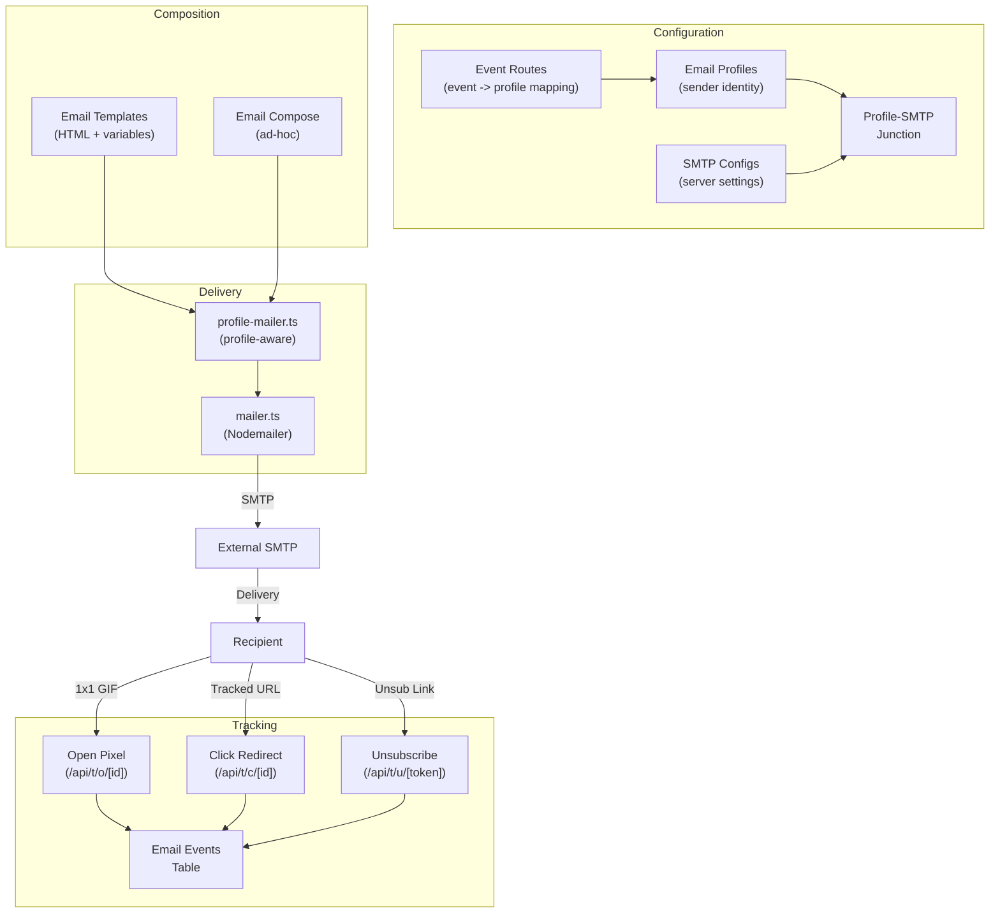

### 8.2 Tracking Flow

**Open Tracking:**
1. Email HTML contains `` (1x1 transparent GIF)
2. When email client loads image, the API endpoint records an `opened` event
3. Updates `campaignRecipients.openedAt` and increments `campaigns.totalOpened`

**Click Tracking:**
1. All links in email HTML are rewritten to `/api/t/c/[linkId]?url=<original>`
2. Click endpoint records a `clicked` event with the link URL
3. Redirects user to the original destination URL

**Unsubscribe:**
1. Emails include an unsubscribe link with a unique token
2. Token resolves to the contact via `unsubscribeTokens` table
3. Contact status set to `unsubscribed`, token marked as used

---

## 9. Integration Provider Design

### 9.1 Registry Pattern (`lib/integrations/registry.ts`)

```typescript
// Each provider implements a standard interface
interface IntegrationProvider {
  testConnection(credentials: Record<string, string>): Promise<boolean>;
  sendMessage?(payload: unknown): Promise<unknown>;
  getData?(query: unknown): Promise<unknown>;
}
```

### 9.2 Provider Implementations (`lib/integrations/providers/`)

| Provider | File | Category | Capabilities |
|----------|------|----------|-------------|
| Slack | `slack.ts` | Messaging | Channel messaging |
| WhatsApp | `whatsapp.ts` | Messaging | Business messaging |
| Gmail | `gmail.ts` | Messaging | Email integration |
| LinkedIn | `linkedin.ts` | Social | Profile/page posting |
| Facebook | `facebook.ts` | Social | Page posting |
| Instagram | `instagram.ts` | Social | Content publishing |
| X (Twitter) | `x.ts` | Social | Tweet posting |
| Quora | `quora.ts` | Social | Answer posting |
| Dropbox | `dropbox.ts` | Productivity | File sync |
| Database | `database.ts` | Data | External DB connection |
| Webhook | `webhook.ts` | Webhook | HTTP callbacks |

### 9.3 Credential Security

- Credentials stored encrypted in `integrationCredentials` table
- Each credential has an optional `expiresAt` for token rotation
- Connection status tracked: `connected`, `disconnected`, `error`
- Request/response logging with duration in `integrationLogs`

---

## 10. Feature Flag System

### 10.1 Architecture

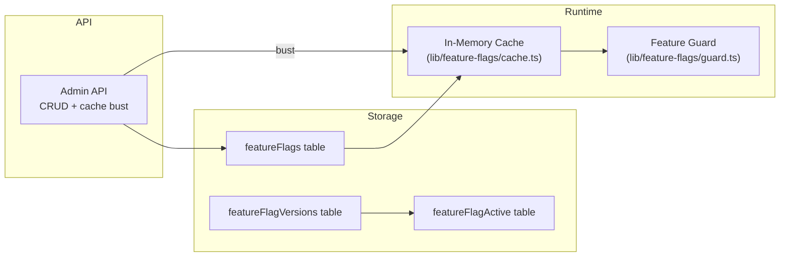

### 10.2 Flag Structure

| Field | Type | Description |
|-------|------|-------------|
| `key` | string (unique) | Machine-readable identifier (e.g., `enable_rag_pipeline`) |
| `label` | string | Human-readable name |
| `description` | string | Explanation of what the flag controls |
| `module` | string | Logical grouping (e.g., `rag`, `chat`, `marketing`) |
| `isEnabled` | boolean | Current active state |

### 10.3 Version Tracking

Each flag change creates a version record with:
- Version number (incrementing)
- Config snapshot (JSON)
- Changed by (user ID)
- Changed at (timestamp)

The `featureFlagActive` table tracks which version is currently active per flag.

---

## 11. Chatbot Design

### 11.1 Session Lifecycle

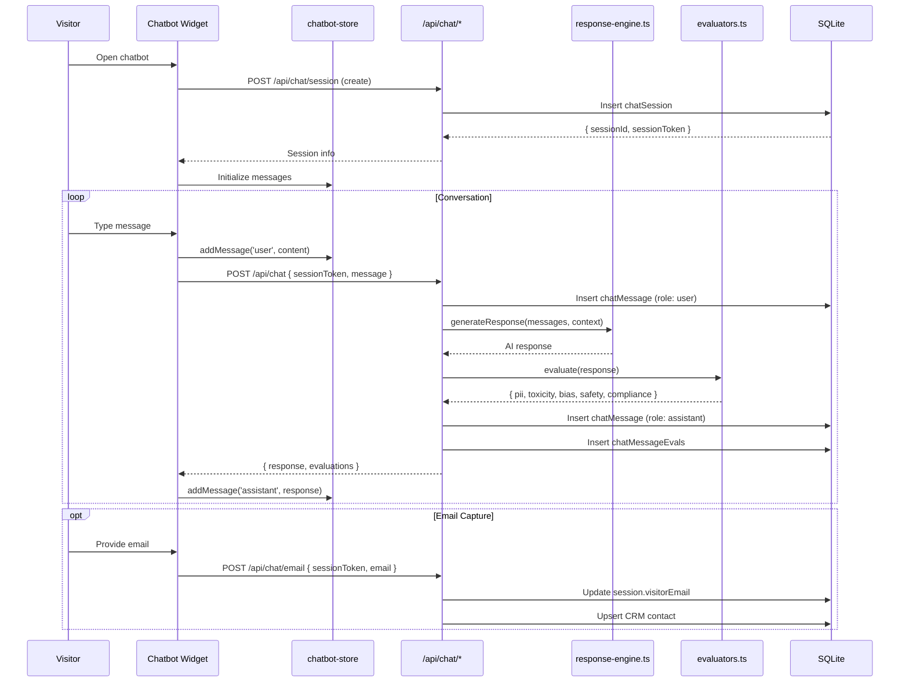

### 11.2 Message Evaluation

Each assistant message is evaluated by safety evaluators:

| Evaluator | Scoring | Purpose |
|-----------|---------|---------|
| PII | 0-100 | Detect leaked personal information |
| Toxicity | 0-100 | Detect harmful or offensive content |
| Bias | 0-100 | Detect discriminatory language |
| Safety | 0-100 | General safety assessment |
| Compliance | 0-100 | Regulatory compliance check |

Evaluation results are stored in `chatMessageEvals` with pass/fail status.

---

## 12. Appointment Booking Design

### 12.1 Booking Flow (5 Steps)

Managed by `useBookingStore` Zustand store:

| Step | Data | Fields |
|------|------|--------|
| 0 | Service Selection | category, service |
| 1 | Date/Time | date, time, timezone, duration (30/60/90 min) |
| 2 | Contact Info | name, email, phone, company, jobTitle, companySize |
| 3 | Requirements | useCase, budget, timeline, goals[], challenges |
| 4 | Confirmation | Summary + lead score display |

### 12.2 Data Storage

Appointments are stored in `data/appointments.json` (not in SQLite):

```typescript
interface Appointment {
  id: string;
  service: { category: string; service: string };
  dateTime: { date: string; time: string; timezone: string; duration: string };
  contact: { name: string; email: string; phone: string; company: string; jobTitle: string; companySize: string };
  requirements: { useCase: string; budget: string; timeline: string; goals: string[]; challenges: string };
  status: 'pending' | 'confirmed' | 'completed' | 'cancelled';
  leadScore: number;
  leadTier: 'hot' | 'warm' | 'cool' | 'cold';
  createdAt: string;
  updatedAt: string;
}
```

---

## 13. Public Website Architecture

### 13.1 Public Pages

| Path | Page | Features |
|------|------|----------|
| `/` | Home | Hero, services preview, industries preview, engagement flow |
| `/services` | Services | Service catalog with categories |
| `/industries` | Industries | Industry listing |
| `/solutions/genai` | GenAI Solutions | Solution detail page |
| `/solutions/quantum-ai` | Quantum AI | Solution detail page |
| `/solutions/robotics-ai` | Robotics AI | Solution detail page |
| `/blog` | Blog | Post listing with categories and tags |
| `/blog/[slug]` | Blog Post | Markdown-rendered post with view tracking |
| `/videos` | Videos | Video gallery |
| `/contact` | Contact | Contact form with lead scoring |
| `/demo` | Demo Request | Demo booking form |
| `/book` | Appointment | 5-step booking wizard |
| `/survey` | AI Maturity Survey | Multi-step survey with scoring |
| `/careers` | Careers | Job listing |
| `/careers/[id]` | Job Detail | Job description with apply |
| `/unsubscribe` | Unsubscribe | Email unsubscribe confirmation |
| `/maintenance` | Maintenance | Maintenance mode page |

### 13.2 SEO Features

- `robots.ts` -- Dynamic robots.txt generation
- `sitemap.ts` -- Dynamic XML sitemap generation
- `feed.xml/` -- RSS feed for blog posts
- `lib/seo.ts` -- Metadata generation helpers
- Per-post SEO: `metaTitle`, `metaDescription` fields on blog posts

---

## 14. Seed Data Design

### 14.1 Seed Scripts (`lib/db/seed*.ts`)

| Script | Purpose | Idempotent |
|--------|---------|-----------|
| `seed.ts` | Master seed runner (calls all sub-seeds) | Yes |
| `seed-admin.ts` | Creates default admin user | Yes (checks existence) |
| `seed-rbac.ts` | Creates default roles and permissions | Yes (checks existence) |
| `seed-analysis-frameworks.ts` | Seeds 35 AI analysis frameworks | Yes (checks count) |
| `seed-flags.ts` | Creates default feature flags | Yes (checks existence) |
| `seed-integrations.ts` | Registers 11 integration providers | Yes (checks existence) |

### 14.2 Default Roles (seeded by `seed-rbac.ts`)

| Role | System | Description |
|------|--------|-------------|
| `admin` | Yes | Full access to all resources |
| `editor` | Yes | Create and edit content, campaigns, contacts |
| `viewer` | Yes | Read-only access to all resources |

---

## 15. Testing Infrastructure

- **Test Runner:** Vitest (configured in `vitest.config.mts`)
- **Test Directory:** `tests/`
- **Configuration:** TypeScript-based Vitest configuration

---

## 16. Key Design Decisions

| Decision | Rationale |
|----------|-----------|
| **SQLite over PostgreSQL** | Single-server deployment, no external DB dependency, WAL mode for read concurrency |
| **Drizzle ORM over Prisma** | Better SQLite support, synchronous operations via better-sqlite3, smaller bundle |
| **Zustand over Redux** | Simpler API, smaller bundle, easy persistence via middleware, suitable for moderate state complexity |
| **CSS Modules over Tailwind** | Component-scoped styles, no global class name conflicts, standard CSS syntax |
| **JSON files for appointments** | Separate from main DB, simpler schema, suitable for low-volume data |
| **JWT over sessions table** | Stateless auth, no DB lookup per request, 24h auto-expiry |
| **Zod over TypeScript-only validation** | Runtime validation at API boundaries, structured error messages, schema reuse |
| **Monolithic over microservices** | Appropriate for team size and traffic level, simpler deployment, no inter-service communication overhead |
| **Text PKs (UUIDs) over auto-increment** | Globally unique, safe for distributed generation, no sequence locking |
