# TalentsHill Enterprise Admin Portal -- Business Process Flows

> This document contains Mermaid diagrams illustrating the core business processes in the TalentsHill admin portal.
> Each diagram maps to actual database tables, API endpoints, and UI flows documented in [FEATURES.md](./FEATURES.md).

---

## Table of Contents

1. [Content Creation Process](#1-content-creation-process)
2. [Lead Generation Process](#2-lead-generation-process)
3. [Email Campaign Process](#3-email-campaign-process)
4. [Marketing Workflow Process](#4-marketing-workflow-process)
5. [AI Assessment Process](#5-ai-assessment-process)
6. [RAG Knowledge Base Process](#6-rag-knowledge-base-process)
7. [Contact Lifecycle Process](#7-contact-lifecycle-process)
8. [Approval Process](#8-approval-process)
9. [Integration Setup Process](#9-integration-setup-process)
10. [Incident/Issue Process](#10-incidentissue-process)

---

## 1. Content Creation Process

This flow covers the lifecycle of marketing content from creation through publication.

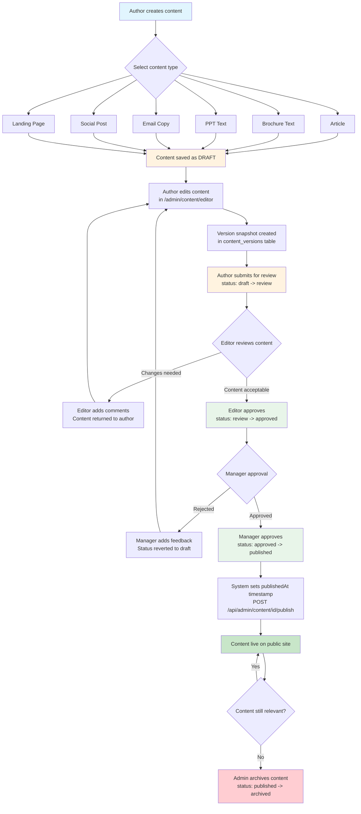

**Key Database Tables:** `marketing_content`, `content_versions`, `content_assets`

**Key API Endpoints:**
- `POST /api/admin/content` -- Create content
- `PATCH /api/admin/content/[id]` -- Update content and status
- `POST /api/admin/content/[id]/publish` -- Publish content
- `POST /api/admin/content/[id]/versions` -- Create version or rollback

---

## 2. Lead Generation Process

This flow shows how visitors become contacts and enter the marketing pipeline.

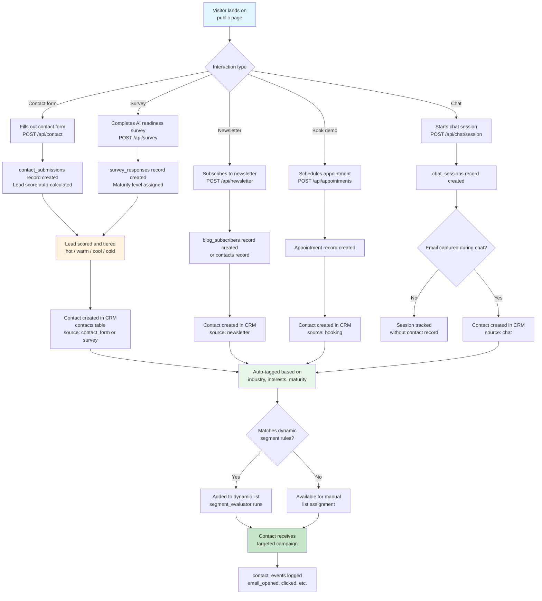

**Key Database Tables:** `contact_submissions`, `survey_responses`, `contacts`, `contact_events`, `lists`, `list_members`

**Key API Endpoints:**
- `POST /api/contact` -- Contact form submission
- `POST /api/survey` -- Survey submission
- `POST /api/newsletter` -- Newsletter signup
- `POST /api/appointments` -- Appointment booking

---

## 3. Email Campaign Process

This flow details the full email campaign lifecycle from template to analytics.

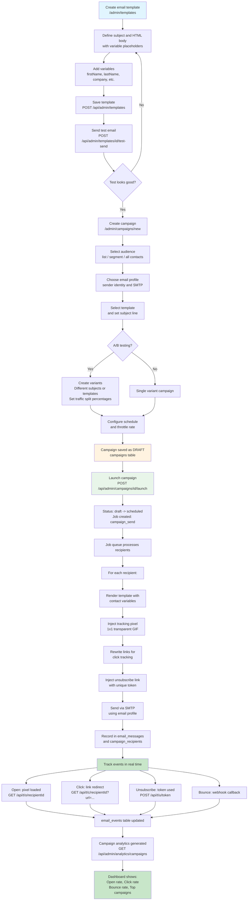

**Key Database Tables:** `email_templates`, `campaigns`, `campaign_recipients`, `campaign_variants`, `email_messages`, `email_events`, `unsubscribe_tokens`

**Key API Endpoints:**
- `POST /api/admin/templates` -- Create template
- `POST /api/admin/templates/[id]/test-send` -- Test send
- `POST /api/admin/campaigns` -- Create campaign
- `POST /api/admin/campaigns/[id]/launch` -- Launch campaign
- `GET /api/t/o/[id]` -- Open tracking pixel
- `GET /api/t/c/[id]` -- Click tracking redirect
- `POST /api/t/u/[token]` -- Unsubscribe

---

## 4. Marketing Workflow Process

This flow represents the 8-step marketing automation wizard.

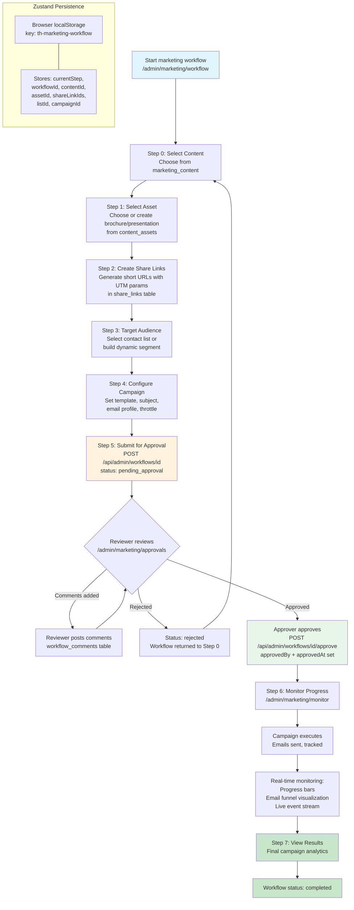

**Key Database Tables:** `marketing_workflows`, `workflow_comments`, `marketing_content`, `content_assets`, `share_links`, `lists`, `campaigns`

**Key API Endpoints:**
- `POST /api/admin/workflows` -- Create workflow
- `PATCH /api/admin/workflows/[id]` -- Update workflow step
- `POST /api/admin/workflows/[id]/approve` -- Approve workflow
- `POST /api/admin/workflows/[id]/comments` -- Add comments

**State Management:** Zustand store with `persist` middleware in `/store/workflow-store.ts`

---

## 5. AI Assessment Process

This flow covers the AI analysis framework assessment lifecycle.

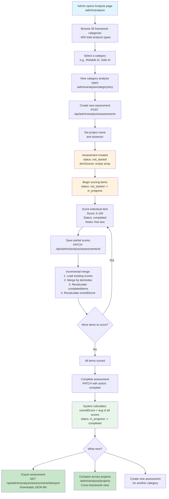

**Key Database Tables:** `analysis_frameworks`, `analysis_assessments`

**Key API Endpoints:**
- `GET /api/admin/analysis/frameworks` -- List all frameworks
- `GET /api/admin/analysis/frameworks/[key]` -- Get framework detail
- `POST /api/admin/analysis/assessments` -- Create assessment
- `PATCH /api/admin/analysis/assessments/[id]` -- Update scores or complete
- `GET /api/admin/analysis/assessments/[id]/export` -- Export as JSON
- `GET /api/admin/analysis/dashboard` -- Dashboard overview

---

## 6. RAG Knowledge Base Process

This flow illustrates the complete RAG (Retrieval-Augmented Generation) pipeline.

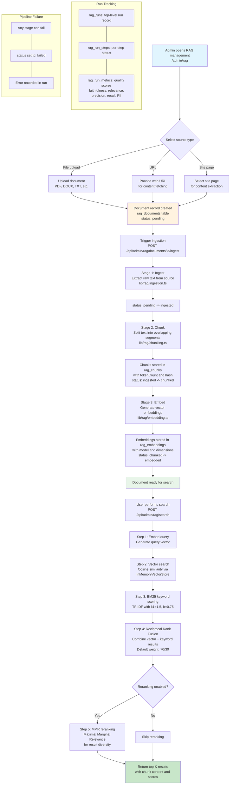

**Key Database Tables:** `rag_documents`, `rag_chunks`, `rag_embeddings`, `rag_cache`, `rag_runs`, `rag_run_steps`, `rag_run_metrics`, `rag_configs`

**Key API Endpoints:**
- `POST /api/admin/rag/documents` -- Upload document
- `POST /api/admin/rag/documents/[id]/ingest` -- Trigger ingestion
- `GET /api/admin/rag/documents/[id]/chunks` -- View chunks
- `POST /api/admin/rag/search` -- Hybrid search
- `GET /api/admin/rag/runs` -- List pipeline runs
- `POST /api/admin/rag/evaluate` -- Run evaluation metrics
- `GET /api/admin/rag/health` -- Pipeline health check

---

## 7. Contact Lifecycle Process

This flow shows the complete lifecycle of a contact from lead to retained customer.

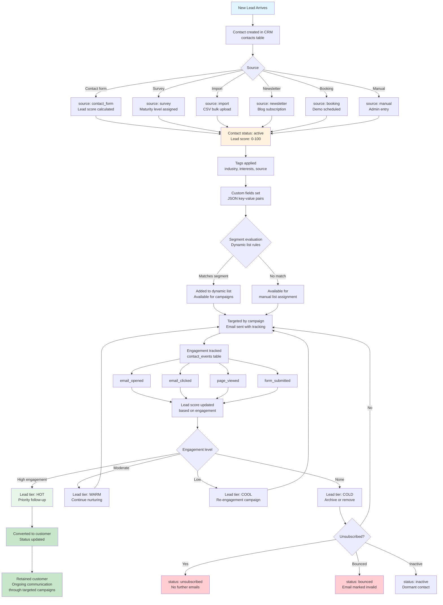

**Key Database Tables:** `contacts`, `contact_events`, `lists`, `list_members`, `contact_submissions`, `survey_responses`

**Contact Statuses:** `active` -> `unsubscribed` / `bounced` / `inactive`

**Lead Tiers:** `hot`, `warm`, `cool`, `cold`

---

## 8. Approval Process

This flow details the generic approval workflow used across content and marketing workflows.

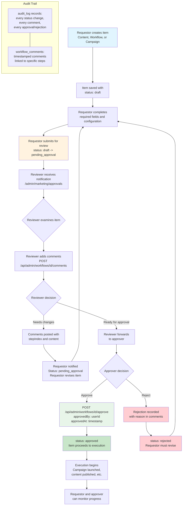

**Key Database Tables:** `marketing_workflows`, `workflow_comments`, `audit_log`

**Key API Endpoints:**
- `POST /api/admin/workflows/[id]/approve` -- Approve workflow
- `POST /api/admin/workflows/[id]/comments` -- Add review comments
- `PATCH /api/admin/workflows/[id]` -- Update workflow status

---

## 9. Integration Setup Process

This flow shows how third-party integrations are configured and monitored.

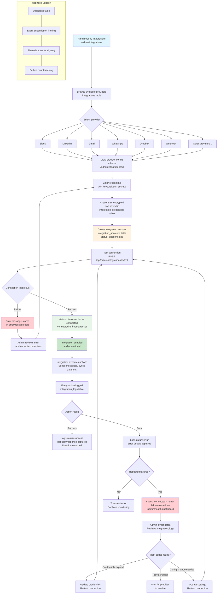

**Key Database Tables:** `integrations`, `integration_accounts`, `integration_credentials`, `integration_logs`, `webhooks`

**Key API Endpoints:**
- `GET /api/admin/integrations` -- List integrations
- `POST /api/admin/integrations` -- Create integration
- `POST /api/admin/integrations/[id]/test` -- Test connection
- `GET /api/admin/integrations/[id]/logs` -- View activity logs
- `PATCH /api/admin/integrations/[id]` -- Update integration

**Provider Interface Methods:** `connect()`, `disconnect()`, `testConnection()`, `sync()`, `getStatus()`

---

## 10. Incident/Issue Process

This flow covers system health monitoring and incident resolution.

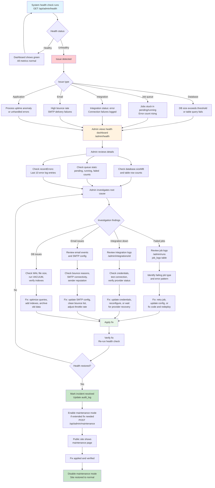

**Key Database Tables:** `jobs`, `job_runs`, `job_logs`, `runs`, `run_events`, `integration_logs`, `audit_log`

**Key API Endpoints:**
- `GET /api/admin/health` -- System health check
- `GET /api/admin/jobs` -- Job listing
- `GET /api/admin/jobs/[id]` -- Job detail with logs
- `GET /api/admin/runs` -- Operation run listing
- `GET /api/admin/runs/[id]` -- Run detail with events
- `GET/POST /api/admin/maintenance` -- Maintenance mode toggle

**Health Check Returns:**
- Database file size (MB)
- Row counts for 14 key tables
- Job queue statistics (pending, running, completed, failed)
- Last 10 error entries from job logs
- Process uptime
- Server timestamp

---

## Cross-Process Dependencies

The following diagram shows how the major processes interconnect.

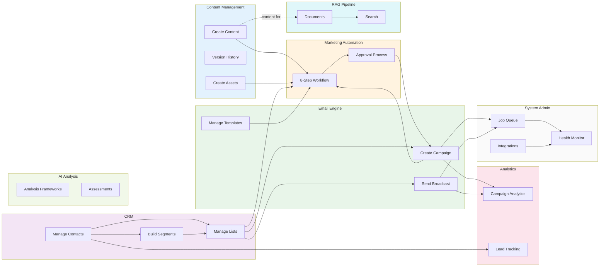

---

## Legend

| Color            | Meaning                  |
|------------------|--------------------------|
| Blue (#e1f5fe)   | Process entry point      |
| Orange (#fff3e0) | In-progress / pending    |
| Green (#e8f5e9)  | Approved / successful    |
| Dark Green (#c8e6c9) | Completed / final state |
| Red (#ffcdd2)    | Error / rejected state   |
