# System & Software Architecture -- TalentsHill Enterprise Admin Portal

This document provides a comprehensive view of the TalentsHill platform's system architecture, software design, module structure, security model, data layer, state management, API design, CSS strategy, deployment model, and scalability considerations.

---

## Table of Contents

1. [Architecture Overview](#architecture-overview)
2. [Technology Stack](#technology-stack)
3. [System Architecture Diagram](#system-architecture-diagram)
4. [Software Architecture](#software-architecture)
5. [Module Architecture](#module-architecture)
6. [Security Architecture](#security-architecture)
7. [Data Architecture](#data-architecture)
8. [State Management Architecture](#state-management-architecture)
9. [API Design Principles](#api-design-principles)
10. [CSS Architecture](#css-architecture)
11. [Deployment Architecture](#deployment-architecture)
12. [Scalability Considerations](#scalability-considerations)

---

## 1. Architecture Overview

TalentsHill is a monolithic full-stack enterprise application built on Next.js 15 App Router. It serves two audiences through a single deployment:

- **Public website**: Marketing pages, blog, chatbot, survey, demo booking, career listings, and contact forms.
- **Admin portal**: 62 pages for managing content, CRM, email campaigns, RAG pipelines, analytics, integrations, and system settings.

The application follows a layered architecture with clear separation between presentation (React components), API (route handlers), business logic (query files + library modules), and data access (Drizzle ORM over SQLite). All state mutations flow through API routes, and all database access is centralized in the `lib/db/` query layer.

### Key Metrics

| Metric | Count |
|--------|-------|
| Database tables | 79 |
| API route handlers | 124 |
| Admin pages | 62 |
| Query files | 40+ |
| Zustand stores | 7 |
| Integration providers | 10 |
| Zod validation schemas | 15+ |

---

## 2. Technology Stack

| Layer | Technology | Version | Purpose |
|-------|-----------|---------|---------|
| **Framework** | Next.js | 15.1 | Full-stack React framework with App Router, SSR, API routes |
| **Runtime** | React | 19.0 | UI component library with Server Components |
| **Language** | TypeScript | 5.7 | Static type safety across frontend and backend |
| **Database** | SQLite | via better-sqlite3 12.6 | Embedded relational database, WAL mode, zero-config |
| **ORM** | Drizzle ORM | 0.45 | Type-safe SQL builder with schema-first design |
| **DB Tooling** | Drizzle Kit | 0.31 | Schema migrations and introspection |
| **Validation** | Zod | 4.3 | Runtime request/response validation with TypeScript inference |
| **Auth (JWT)** | jose | 6.1 | JWT creation, signing, and verification |
| **Password Hashing** | bcryptjs | 3.0 | Secure password hashing for admin users |
| **State Management** | Zustand | 5.0 | Lightweight client-side stores with persist middleware |
| **Server State** | TanStack React Query | 5.90 | Server state caching, background refetch, optimistic updates |
| **Forms** | React Hook Form | 7.71 | Performant form state management |
| **Form Validation** | @hookform/resolvers | 5.2 | Bridge between Zod schemas and React Hook Form |
| **Animation** | Framer Motion | 11.15 | Declarative animations and page transitions |
| **Email** | Nodemailer | 8.0 | SMTP email sending (campaigns, broadcasts, transactional) |
| **CSV Processing** | csv-parse | 6.1 | Contact import from CSV files |
| **File Upload** | Multer | 2.0 | Multipart form-data parsing for media uploads |
| **RSS/Atom** | feed | 5.2 | Blog RSS/Atom feed generation |
| **Markdown** | remark + remark-html | 15.0 / 16.0 | Blog post markdown rendering |
| **Markdown Metadata** | gray-matter | 4.0 | Front-matter parsing for blog posts |
| **Reading Time** | reading-time | 1.5 | Estimated read time calculation |
| **Testing** | Vitest | 4.0 | Unit and integration testing |
| **Linting** | ESLint + eslint-config-next | 9.0 / 15.1 | Code quality and Next.js best practices |
| **Infrastructure** | Terraform | -- | AWS infrastructure (CloudFront, S3, WAF, IAM, DNS) |

---

## 3. System Architecture Diagram

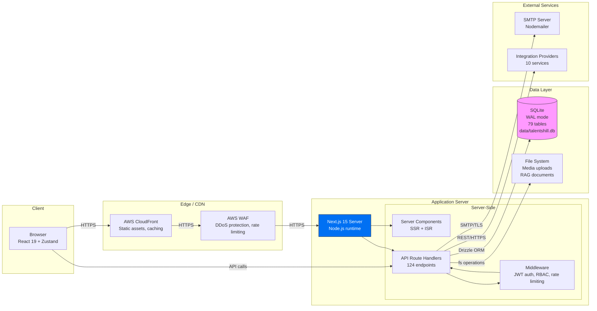

### Request Flow

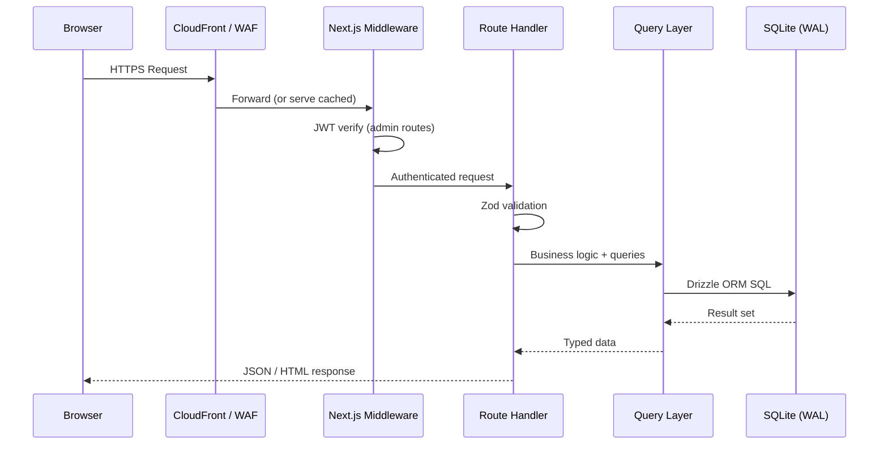

---

## 4. Software Architecture

The application follows a strict layered architecture. Each layer has defined responsibilities and depends only on the layer directly below it.

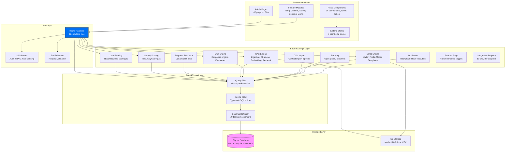

### Layer Responsibilities

| Layer | Responsibility | Key Files |
|-------|---------------|-----------|
| **Presentation** | Render UI, handle user interactions, manage client state | `app/admin/*/page.tsx`, `components/`, `store/`, `features/` |
| **API** | HTTP request handling, input validation, response formatting | `app/api/**/route.ts`, `middleware.ts`, `lib/validation/` |
| **Business Logic** | Domain rules, scoring algorithms, pipeline orchestration | `lib/contact/`, `lib/survey/`, `lib/rag/`, `lib/chat/`, `lib/email/`, `lib/jobs/` |
| **Data Access** | Database queries, ORM operations, schema definitions | `lib/db/*-queries.ts`, `lib/db/schema.ts`, `lib/db/index.ts` |
| **Storage** | Persistent data storage | `data/talentshill.db`, `public/uploads/` |

---

## 5. Module Architecture

The platform is organized into 12 functional modules, each with its own tables, routes, admin pages, and query files.

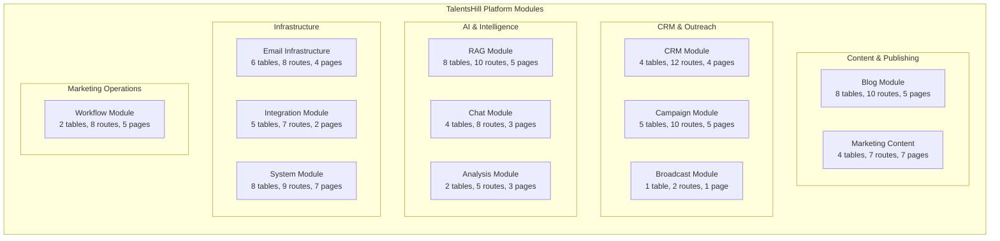

### Module Detail Table

| Module | Tables | Routes | Pages | Query Files | Key Features |
|--------|--------|--------|-------|-------------|--------------|
| **Blog** | blog_authors, blog_categories, blog_tags, blog_posts, blog_post_categories, blog_post_tags, blog_views, blog_subscribers | 10 | 5 | blog-queries.ts | Post editor, categories/tags, view tracking, subscribers, RSS feed, SEO |
| **Marketing Content** | marketing_content, content_versions, content_assets, content_overrides | 7 | 7 | marketing-content-queries.ts, content-version-queries.ts, content-asset-queries.ts, content-override-queries.ts | Rich editor, version history, brochures, presentations, page overrides |
| **CRM** | contacts, contact_events, lists, list_members | 12 | 4 | contact-crm-queries.ts, contact-queries.ts, list-queries.ts, import-job-queries.ts | Contact CRUD, CSV import/export, dynamic segments, lead scoring, event tracking |
| **Campaign** | campaigns, campaign_recipients, campaign_variants, email_messages, unsubscribe_tokens | 10 | 5 | campaign-queries.ts, email-event-queries.ts | Multi-step campaigns, A/B testing, throttling, recipient tracking, unsubscribe |
| **Broadcast** | broadcasts | 2 | 1 | broadcast-queries.ts | Quick one-off email blasts to lists/segments |
| **Email Infrastructure** | email_profiles, smtp_configs, email_profile_smtp, event_routes, email_templates, email_template_versions | 8 | 4 | email-profile-queries.ts, template-queries.ts | Multiple SMTP configs, sender profiles, HTML templates, event routing |
| **RAG Pipeline** | rag_documents, rag_chunks, rag_embeddings, rag_cache, rag_runs, rag_run_steps, rag_run_metrics, rag_configs | 10 | 5 | rag-document-queries.ts, rag-chunk-queries.ts, rag-embedding-queries.ts, rag-run-queries.ts, rag-cache-queries.ts | Document ingestion, chunking, vector embeddings, retrieval, evaluation metrics, PII detection |
| **Chat** | chat_sessions, chat_messages, chat_requests, chat_message_evals | 8 | 3 | chat-queries.ts, chat-eval-queries.ts, admin-note-queries.ts | Visitor chatbot, session tracking, request triage, message evaluation (PII, toxicity, bias) |
| **Integration** | integrations, integration_accounts, integration_credentials, integration_logs, webhooks | 7 | 2 | integration-queries.ts, integration-log-queries.ts, webhook-queries.ts | 10 providers, credential management, sync logs, webhook delivery |
| **Analysis** | analysis_frameworks, analysis_assessments | 5 | 3 | analysis-framework-queries.ts, analysis-assessment-queries.ts | Assessment frameworks, scoring rubrics, project assessments, export |
| **Marketing Workflows** | marketing_workflows, workflow_comments, share_links | 8 | 5 | marketing-workflow-queries.ts, share-link-queries.ts | Content-to-campaign pipeline, approval flows, comments, UTM-tagged share links |
| **System** | site_settings, audit_log, feature_flags, feature_flag_versions, feature_flag_active, jobs, job_runs, job_logs, users, roles, permissions, role_permissions, user_roles, groups, group_members | 9 | 7 | admin-queries.ts, feature-flag-queries.ts, job-queries.ts, run-queries.ts, rbac-queries.ts, tracking-queries.ts, survey-queries.ts, banner-queries.ts | User management, RBAC, feature flags, job queue, audit log, health checks, maintenance |

---

## 6. Security Architecture

### 6.1 Authentication Flow

```mermaid
sequenceDiagram
    participant B as Browser
    participant LP as /admin/login page
    participant AUTH as /api/auth/login
    participant DB as SQLite
    participant MW as middleware.ts
    participant ADMIN as Admin Routes

    B->>LP: Navigate to /admin/login
    LP->>B: Render login form

    B->>AUTH: POST /api/auth/login {email, password}
    AUTH->>DB: Lookup user by email
    DB-->>AUTH: User record (password_hash)
    AUTH->>AUTH: bcrypt.compare(password, hash)
    AUTH->>AUTH: Sign JWT {userId, email, role}
    AUTH-->>B: Set-Cookie: admin_session=JWT; HttpOnly; SameSite=Lax

    B->>MW: GET /admin/dashboard
    MW->>MW: Extract admin_session cookie
    MW->>MW: jwtVerify(token, SESSION_SECRET)
    alt Valid token
        MW->>ADMIN: Forward request
        ADMIN-->>B: 200 Admin page
    else Invalid/missing token
        MW-->>B: 302 Redirect to /admin/login
    end
```

### 6.2 Authorization Matrix

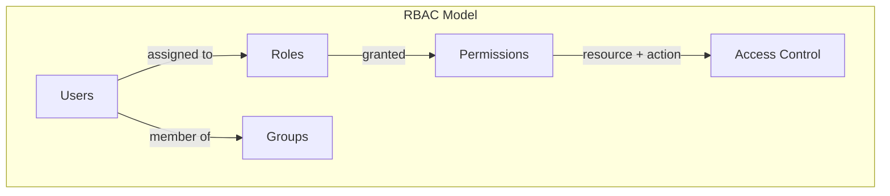

| Role | Permissions | Scope |
|------|------------|-------|
| **admin** | Full CRUD on all modules, user management, system settings | Unrestricted |
| **editor** | CRUD on content, CRM, campaigns; read analytics | Cannot manage users or system settings |
| **viewer** | Read-only access to all modules | No create, update, or delete operations |

### 6.3 Security Components

```mermaid
graph LR
    subgraph "Security Layer (lib/security/)"
        PASSWORD[password.ts<br/>bcrypt hashing<br/>cost factor: 10+]
        SESSION[session.ts<br/>JWT sign/verify<br/>jose library]
        RBAC[rbac.ts<br/>Permission checks<br/>hasPermission()]
        RATE[rate-limiter.ts<br/>Sliding window<br/>per-IP throttling]
        SANITIZE[sanitize.ts<br/>HTML strip<br/>email normalize<br/>IP hashing]
    end
```

### 6.4 Rate Limiting

| Endpoint Pattern | Limit | Window |
|-----------------|-------|--------|
| `/api/admin/*` | 100 requests | 60 seconds |
| `/api/auth/login` | 5 requests | 60 seconds |
| `/api/contact` | 5 requests | 60 seconds |
| `/api/chat` | 10 requests | 60 seconds |

Rate limiting uses an in-memory sliding window per IP address. When exceeded, the server returns HTTP 429 with a `Retry-After` header.

### 6.5 Input Validation

| Boundary | Technique | Implementation |
|----------|-----------|----------------|
| API request bodies | Zod schema validation | `lib/validation/*.ts` |
| URL parameters | Type coercion + bounds checking | Route handler validation |
| HTML content | Tag stripping | `sanitize.ts → sanitizeText()` |
| Email addresses | Normalization + format check | `sanitize.ts → normalizeEmail()` |
| IP addresses | SHA-256 hashing (privacy) | `sanitize.ts → hashIp()` |
| File uploads | Extension allowlist + size limit | `lib/media/upload.ts` |
| SQL queries | Parameterized via Drizzle ORM | All `*-queries.ts` files |

### 6.6 Infrastructure Security (Terraform)

| Resource | Security Measure |
|----------|-----------------|
| AWS WAF | DDoS protection, IP rate limiting, SQL injection rules |
| CloudFront | HTTPS-only, TLS 1.2+, custom headers |
| S3 | Private bucket, CloudFront OAI, server-side encryption |
| IAM | Least-privilege roles, no wildcard policies |

---

## 7. Data Architecture

### 7.1 SQLite Design Decisions

| Decision | Rationale |
|----------|-----------|
| **SQLite over PostgreSQL** | Single-process deployment, zero-config, file-based backup, sufficient for expected load |
| **WAL mode** | Concurrent readers during writes, better performance for read-heavy workload |
| **better-sqlite3** | Synchronous API avoids callback complexity, fastest SQLite binding for Node.js |
| **Drizzle ORM** | Type-safe schema-first approach, lightweight, no heavy abstraction layer |
| **busy_timeout = 5000ms** | Prevents immediate SQLITE_BUSY errors under concurrent writes |
| **foreign_keys = ON** | Enforces referential integrity at the database level |

### 7.2 Database Configuration

```typescript
// lib/db/index.ts
const sqlite = new Database(DB_PATH);
sqlite.pragma('journal_mode = WAL');     // Write-Ahead Logging
sqlite.pragma('busy_timeout = 5000');    // 5s wait on lock contention
sqlite.pragma('foreign_keys = ON');      // Enforce FK constraints
```

### 7.3 Schema Design

```mermaid
erDiagram
    users ||--o{ user_roles : "assigned"
    roles ||--o{ user_roles : "grants"
    roles ||--o{ role_permissions : "has"
    permissions ||--o{ role_permissions : "granted_to"
    users ||--o{ groups : "creates"
    groups ||--o{ group_members : "contains"

    contacts ||--o{ contact_events : "generates"
    contacts ||--o{ list_members : "belongs_to"
    lists ||--o{ list_members : "contains"

    campaigns ||--o{ campaign_recipients : "targets"
    campaigns ||--o{ campaign_variants : "tests"
    contacts ||--o{ campaign_recipients : "receives"
    contacts ||--o{ email_messages : "sent_to"
    contacts ||--o{ email_events : "tracked"

    blog_posts ||--o{ blog_post_categories : "categorized"
    blog_posts ||--o{ blog_post_tags : "tagged"
    blog_posts ||--o{ blog_views : "viewed"

    marketing_content ||--o{ content_versions : "versioned"
    marketing_content ||--o{ content_assets : "has_assets"
    marketing_workflows ||--o{ workflow_comments : "discussed"

    rag_documents ||--o{ rag_chunks : "split_into"
    rag_chunks ||--o{ rag_embeddings : "embedded"
    rag_runs ||--o{ rag_run_steps : "has_steps"
    rag_runs ||--o{ rag_run_metrics : "measured"

    chat_sessions ||--o{ chat_messages : "contains"
    chat_sessions ||--o{ chat_requests : "triaged_as"
    chat_messages ||--o{ chat_message_evals : "evaluated"

    integrations ||--o{ integration_accounts : "configured_as"
    integration_accounts ||--o{ integration_credentials : "stores"
    integration_accounts ||--o{ integration_logs : "logged"
```

### 7.4 Indexing Strategy

Every table with query-heavy columns has explicit indexes defined in the Drizzle schema. The strategy follows these rules:

| Index Type | Applied To | Example |
|-----------|-----------|---------|
| **Status indexes** | All status/state columns | `idx_posts_status`, `idx_campaigns_status`, `idx_jobs_status` |
| **Foreign key indexes** | All reference columns | `idx_post_tags_tag`, `idx_campaign_recipients_contact` |
| **Timestamp indexes** | Created/updated columns used in sorting | `idx_contact_created_at`, `idx_email_events_created` |
| **Lookup indexes** | Unique identifiers and slugs | `idx_links_short_code`, `idx_chat_sessions_token` |
| **Composite indexes** | Multi-column queries | `idx_audit_entity(entity_type, entity_id)`, `idx_views_session(post_id, session_id)` |

Total indexed columns: 80+ across 79 tables.

### 7.5 JSON Column Usage

Several tables use JSON-serialized TEXT columns for flexible, semi-structured data:

| Table | Column | Content |
|-------|--------|---------|
| contacts | tags | `["enterprise", "hot-lead"]` |
| contacts | customFields | `{"industry": "finance", "size": "500+"}` |
| campaigns | config | Campaign configuration snapshot |
| rag_embeddings | vector | Float array for similarity search |
| rag_chunks | metadata | `{"headings": [...], "page": 3}` |
| analysis_assessments | itemScores | `[{"index": 0, "score": 85}]` |
| content_assets | slides | `[{"title": "...", "body": "...", "image": "..."}]` |
| feature_flags | config (versions) | Version-specific configuration |
| integrations | configSchema | JSON schema for provider configuration |

### 7.6 Data Lifecycle

| Data Type | Retention Policy | Mechanism |
|-----------|-----------------|-----------|
| Audit log | Configurable (default: retained indefinitely) | Maintenance endpoint cleanup |
| Job logs | Archived after completion | Job runner cleanup |
| RAG cache | TTL-based expiration | `expiresAt` column |
| Email events | Retained for analytics | No auto-purge |
| Chat sessions | Retained for CRM linkage | No auto-purge |
| Feature flag versions | All versions retained | Audit trail |

---

## 8. State Management Architecture

The client uses 7 Zustand stores, each serving a specific domain. TanStack React Query handles server-state synchronization.

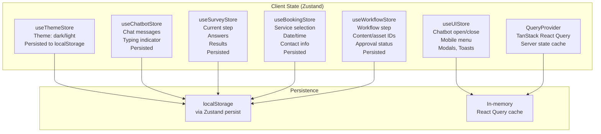

### Store Selection Guide

| Scenario | Store | Why |
|----------|-------|-----|
| Toggle dark/light mode | `useThemeStore` | User preference, persisted across sessions |
| Open/close chatbot widget | `useUIStore` | Ephemeral UI state, no persistence needed |
| Chat message history | `useChatbotStore` | Visitor conversation, persisted so chat survives page navigation |
| Survey progress tracking | `useSurveyStore` | Multi-step form, persisted so users can resume |
| Demo booking flow | `useBookingStore` | Multi-step form with service + datetime selection |
| Marketing workflow wizard | `useWorkflowStore` | Multi-step admin workflow (content, asset, link, list, campaign) |
| Server data (lists, contacts, posts) | `QueryProvider` (React Query) | Automatic cache invalidation, background refetch, stale-while-revalidate |

### Store Interaction Pattern

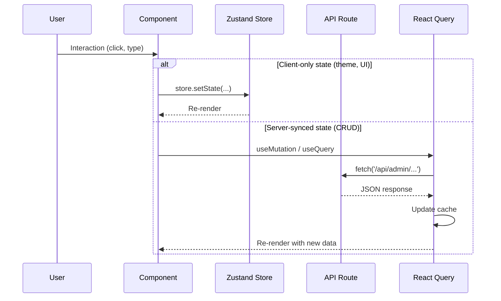

---

## 9. API Design Principles

### 9.1 RESTful Route Structure

All API routes follow Next.js App Router conventions:

```
app/api/
  admin/                          # Protected (JWT middleware)
    {resource}/
      route.ts                    # GET (list) + POST (create)
      [id]/
        route.ts                  # GET (detail) + PUT (update) + DELETE
        {action}/
          route.ts                # POST (e.g., publish, launch, approve)
  {public-resource}/              # Public (no auth required)
    route.ts                      # GET or POST
```

### 9.2 HTTP Method Mapping

| Method | Purpose | Status Codes |
|--------|---------|-------------|
| `GET` | List or retrieve resources | 200, 404 |
| `POST` | Create resource or trigger action | 201, 400, 409 |
| `PUT` | Full update of a resource | 200, 400, 404 |
| `PATCH` | Partial update (rare, PUT preferred) | 200, 400, 404 |
| `DELETE` | Remove a resource | 200, 404 |

### 9.3 Pagination

All list endpoints support offset-based pagination:

```typescript
// Request
GET /api/admin/contacts?offset=0&limit=50&status=active&search=acme

// Response
{
  "items": [...],
  "total": 1234,
  "offset": 0,
  "limit": 50
}
```

### 9.4 Error Response Format

All error responses use a consistent envelope:

```typescript
// 400 Bad Request
{
  "error": "Validation failed",
  "details": { "email": "Invalid email format" }
}

// 404 Not Found
{
  "error": "Contact not found"
}

// 429 Too Many Requests (with Retry-After header)
{
  "error": "Rate limit exceeded",
  "retryAfter": 42
}

// 500 Internal Server Error
{
  "error": "Internal server error"
}
```

### 9.5 Zod Validation

Every write endpoint validates its request body with Zod before processing:

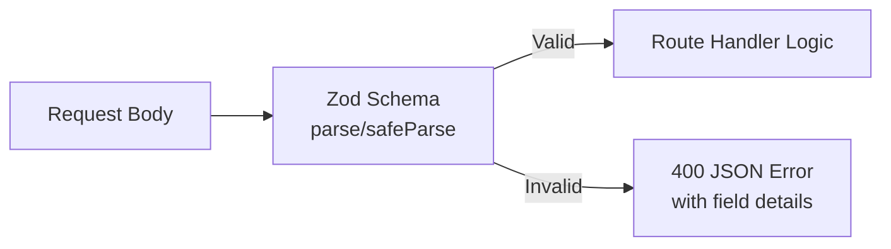

Validation schemas are centralized in `lib/validation/`:

| File | Schemas |
|------|---------|
| `content-schemas.ts` | CreateContentSchema, UpdateContentSchema |
| `marketing-schemas.ts` | CreateWorkflowSchema, UpdateWorkflowSchema |

Additional inline Zod validation exists in route handlers for simpler schemas.

### 9.6 API Route Categories

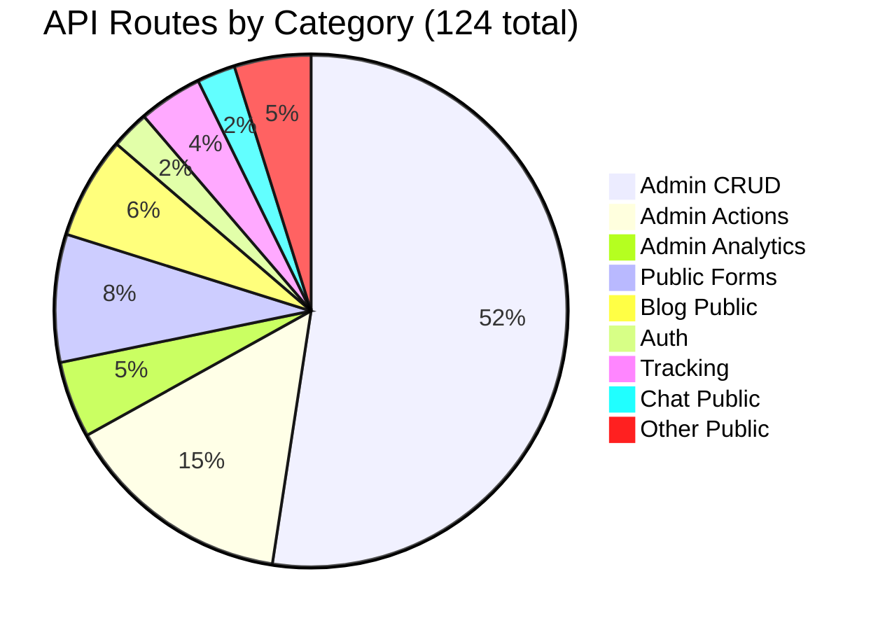

---

## 10. CSS Architecture

### 10.1 CSS Modules Strategy

The application uses CSS Modules for component-scoped styling, preventing class name collisions and enabling maintainable styles at scale.

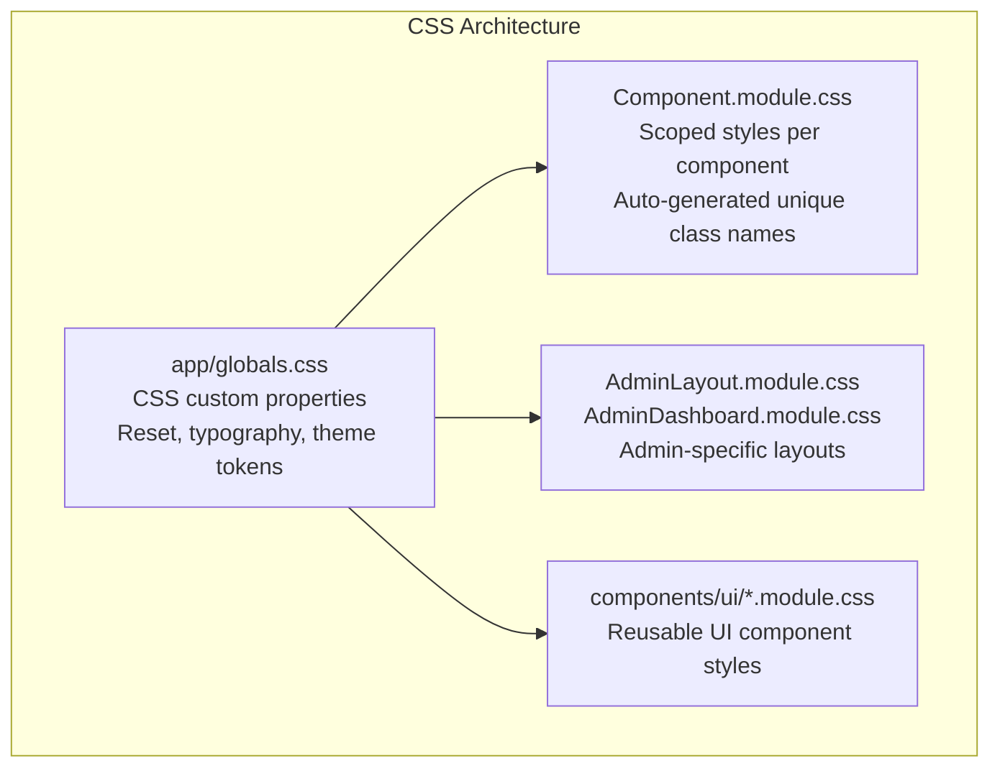

### 10.2 Design Tokens (CSS Custom Properties)

Global design tokens are defined in `app/globals.css` and `styles/globals.css`:

| Token Category | Examples | Purpose |
|---------------|----------|---------|
| **Colors** | `--primary`, `--background`, `--foreground` | Theme-aware color palette |
| **Typography** | `--font-sans`, `--font-mono` | Font family definitions |
| **Spacing** | `--gap-sm`, `--gap-md`, `--gap-lg` | Consistent spacing scale |
| **Borders** | `--radius-sm`, `--radius-md` | Border radius tokens |
| **Shadows** | `--shadow-sm`, `--shadow-lg` | Elevation system |

### 10.3 Responsive Design

| Breakpoint | Target | Strategy |
|-----------|--------|----------|
| `< 768px` | Mobile | Single-column layout, collapsible nav |
| `768px - 1024px` | Tablet | Two-column layout, sidebar toggle |
| `> 1024px` | Desktop | Full admin layout with persistent sidebar |

### 10.4 Theme System

Dark and light themes are managed by `useThemeStore` (Zustand) and applied via the `ThemeProvider` component:

```mermaid
graph LR
    STORE[useThemeStore<br/>theme: dark or light] --> PROVIDER[ThemeProvider<br/>Sets data-theme attribute]
    PROVIDER --> CSS[CSS Variables<br/>Swap color values]
    CSS --> COMPONENTS[All Components<br/>Use var(--color-*)]
```

### 10.5 Component Style Files

| Component | Style File | Scope |
|-----------|-----------|-------|
| Navbar | `Navbar.module.css` | Site navigation |
| Footer | `Footer.module.css` | Site footer |
| HeroSection | `HeroSection.module.css` | Landing page hero |
| ServicesPreview | `ServicesPreview.module.css` | Service cards |
| IndustriesPreview | `IndustriesPreview.module.css` | Industry cards |
| EngagementFlow | `EngagementFlow.module.css` | CTA flow |
| ThemeToggle | `ThemeToggle.module.css` | Dark/light toggle |
| WhatsAppWidget | `WhatsAppWidget.module.css` | Floating chat widget |
| AdminLayout | `AdminLayout.module.css` | Admin sidebar + content |
| AdminDashboard | `AdminDashboard.module.css` | Dashboard grid |

---

## 11. Deployment Architecture

### 11.1 Single-Process Deployment

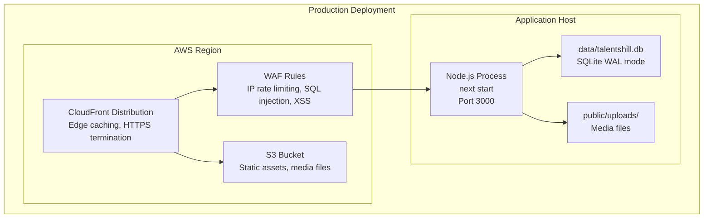

### 11.2 Infrastructure Components (Terraform)

The `terraform/` directory defines the complete AWS infrastructure:

| Resource | File | Purpose |
|----------|------|---------|
| S3 Bucket | `s3.tf` | Static asset storage, media files |
| CloudFront | `cloudfront.tf` | CDN distribution, edge caching |
| WAF | `waf.tf` | Web application firewall rules |
| IAM | `iam.tf` | Least-privilege access roles |
| DNS | `dns.tf` | Domain routing configuration |
| Monitoring | `monitoring.tf` | CloudWatch alarms and dashboards |

### 11.3 Build and Run

```bash
# Development
npm run dev          # next dev (hot reload, port 3000)

# Production
npm run build        # next build (SSR + static generation)
npm run start        # next start (production server)

# Testing
npm run test         # vitest run

# Linting
npm run lint         # next lint (ESLint)
```

### 11.4 Database Backup Strategy

Since SQLite uses a single file (`data/talentshill.db`), backups are straightforward:

- **WAL checkpoint**: Ensure WAL file is merged before backup
- **File copy**: Copy `talentshill.db` (WAL mode allows hot backups of the main DB file)
- **S3 upload**: Automated backup to S3 with versioning enabled

---

## 12. Scalability Considerations

### 12.1 Current Architecture Limits

| Constraint | Current Capacity | Bottleneck |
|-----------|-----------------|------------|
| **Concurrent writes** | ~50-100 write TPS | SQLite single-writer lock (WAL mitigates) |
| **Concurrent reads** | 1000+ read TPS | No limit in WAL mode |
| **Database size** | Practical limit ~10GB | SQLite supports up to 281 TB |
| **API throughput** | ~500 req/s per Node.js process | Single-threaded event loop |
| **File storage** | Limited by disk space | Local filesystem |
| **Email sending** | Throttled per campaign (configurable) | SMTP server capacity |

### 12.2 Horizontal Scaling Path

If the platform outgrows the single-process deployment:

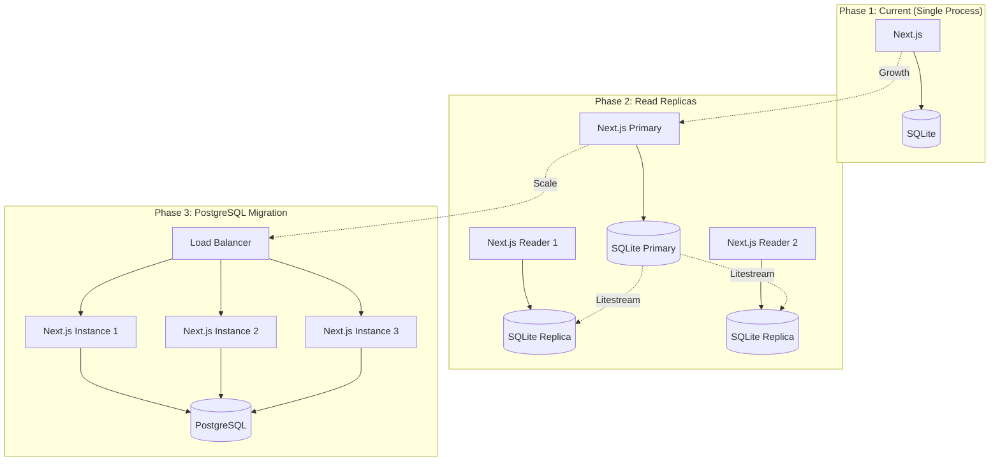

### 12.3 Optimization Opportunities

| Area | Current State | Optimization |
|------|--------------|-------------|
| **Static pages** | SSR on every request | ISR (Incremental Static Regeneration) for public pages |
| **API caching** | No HTTP caching | Add `Cache-Control` headers for read-heavy endpoints |
| **Image delivery** | Unoptimized (`images.unoptimized: true`) | Enable Next.js Image Optimization or use CDN transforms |
| **RAG vectors** | JSON-serialized in TEXT column | Migrate to dedicated vector DB (pgvector, Qdrant) at scale |
| **Email queue** | Direct SMTP sending | Add Redis-backed queue (BullMQ) for async delivery |
| **Background jobs** | In-process job runner | Migrate to separate worker process with Redis queue |
| **Search** | SQL LIKE queries | Add full-text search index (SQLite FTS5 or Meilisearch) |
| **Session storage** | JWT in cookies (stateless) | Already scalable, no change needed |

### 12.4 Performance Characteristics

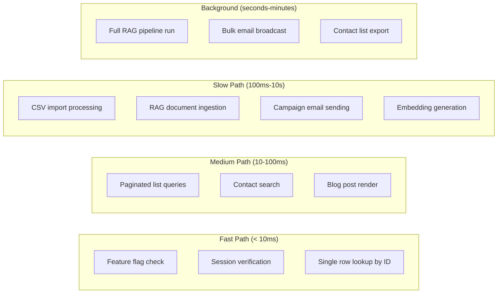

### 12.5 Monitoring

The Terraform monitoring configuration (`terraform/monitoring.tf`) provides:

- CloudWatch dashboards for request metrics
- Latency alarms (P95 response time)
- Error rate alarms (5xx responses)
- WAF blocked request metrics
- S3 storage utilization tracking

---

## Appendix: Directory Structure Reference

```
talentshill/
  app/
    admin/                        # 62 admin pages
      layout.tsx                  # Admin layout with sidebar
      page.tsx                    # Dashboard
      analysis/                   # Assessment frameworks
      analytics/                  # Campaign + contact analytics
      appointments/               # Booking management
      banners/                    # Site banner management
      blog/                       # Blog post editor
      broadcasts/                 # Email broadcasts
      campaigns/                  # Email campaigns + A/B
      chat/                       # Chat requests + sessions
      contacts/                   # CRM contacts + import
      content/                    # Marketing content + assets
      content-overrides/          # Page content overrides
      email-compose/              # One-off email composer
      email-profiles/             # SMTP profile management
      features/                   # Feature flag toggles
      health/                     # System health dashboard
      industries/                 # Industry management
      integrations/               # Third-party connectors
      leads/                      # Lead management
      lists/                      # Contact lists + segments
      login/                      # Authentication
      maintenance/                # System maintenance
      marketing/                  # Workflow, approvals, segments
      media/                      # File/image management
      rag/                        # RAG pipeline management
      roles/                      # RBAC role management
      runs/                       # Operations console
      services/                   # Service catalog
      settings/                   # Site settings
      survey/                     # Survey responses
      templates/                  # Email templates
      users/                      # User management
      videos/                     # Video library
    api/                          # 124 API route handlers
      admin/                      # Protected admin APIs
      auth/                       # Login, logout, session
      blog/                       # Public blog APIs
      chat/                       # Public chatbot
      contact/                    # Contact form
      survey/                     # Public survey
      ...
    (public pages)                # Blog, services, industries, careers, etc.
  components/                     # Shared React components
    ui/                           # Reusable UI primitives
  data/                           # SQLite database + static JSON
  features/                       # Feature-specific components
    blog/                         # Blog feature components
    booking/                      # Booking flow
    careers/                      # Career listings
    chatbot/                      # Chatbot widget
    demo/                         # Demo request flow
    forms/                        # Shared form components
    survey/                       # Survey wizard
  lib/                            # Business logic + data access
    chat/                         # Chat response engine + evaluators
    contact/                      # Lead scoring
    crm/                          # CSV import, segment evaluator
    db/                           # Drizzle schema, queries, seeds
    email/                        # Mailer, templates
    feature-flags/                # Cache, guard
    integrations/                 # Provider registry + 10 providers
    jobs/                         # Job runner + handlers
    media/                        # File upload handling
    ops/                          # Maintenance operations
    rag/                          # Ingestion, chunking, embedding, retrieval, evaluation, PII
    security/                     # Password, session, RBAC, rate limiter, sanitize
    survey/                       # Scoring logic
    tracking/                     # Open pixels, click links
    validation/                   # Zod schemas
  services/                       # (reserved for future service layer)
  store/                          # 7 Zustand stores
  styles/                         # Global CSS
  terraform/                      # AWS infrastructure (CloudFront, S3, WAF, IAM, DNS)
  tests/                          # Vitest test files
  types/                          # TypeScript type definitions
  middleware.ts                   # Next.js middleware (JWT auth for /admin/*)
  drizzle.config.ts               # Drizzle Kit configuration
  next.config.js                  # Next.js configuration
  package.json                    # Dependencies and scripts
  tsconfig.json                   # TypeScript configuration
  vitest.config.mts               # Vitest configuration
```
