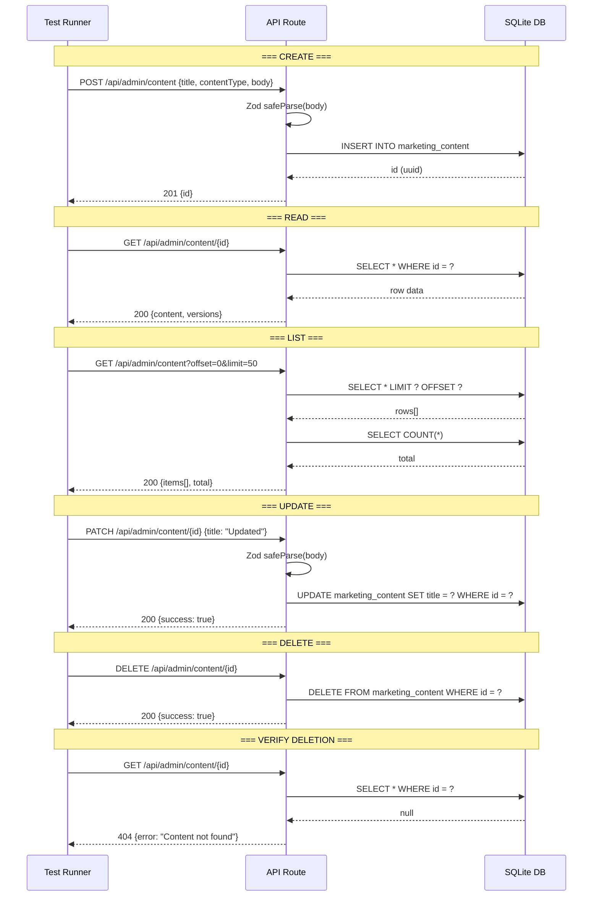
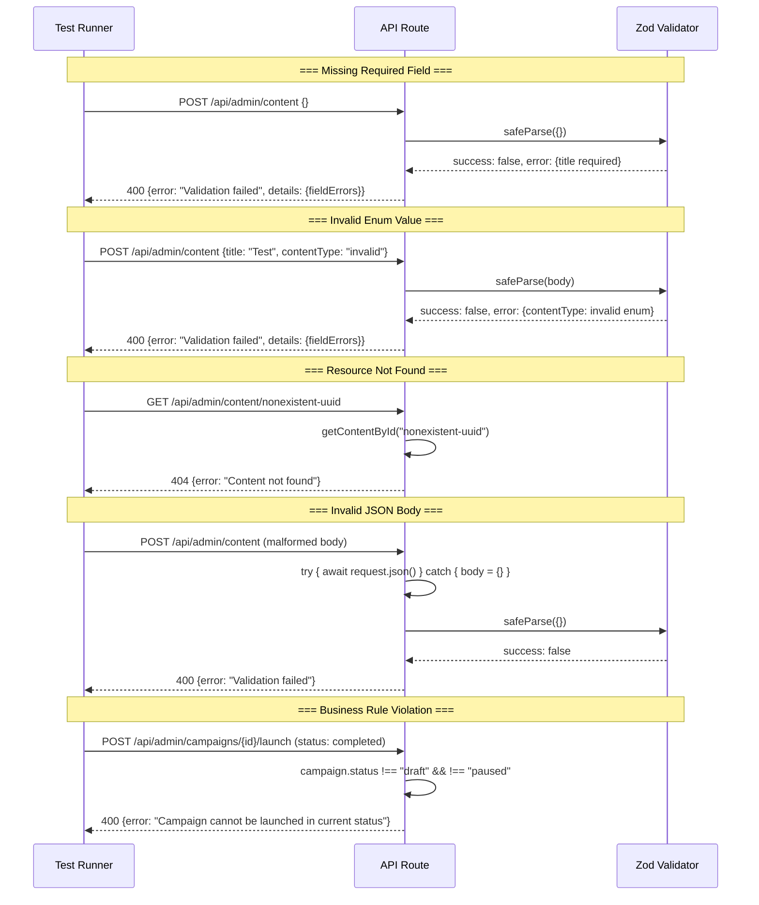

# TalentsHill Admin Portal -- Test Flow & Test Strategy

> **Stack**: Next.js 14+ App Router | SQLite / Drizzle ORM | Vitest | 79 tables | 124 API routes | 62 admin pages

---

## 1. Test Strategy Overview

### 1.1 Test Pyramid

```
            /  E2E  \           Integration tests (full workflow chains)
           /----------\
          / Integration \       API route → DB → response chains
         /--------------\
        /   Unit Tests    \     Pure functions, parsers, renderers
       /-------------------\
      / Rendering / Smoke    \  All 62 admin pages return 200 OK
     /------------------------\
```

### 1.2 Test Infrastructure

| Item | Configuration |
|------|---------------|
| **Framework** | Vitest (`vitest.config.mts`) |
| **Environment** | Node (SQLite runs in-process) |
| **Test Location** | `/tests/unit/*.test.ts` |
| **Setup** | `/tests/setup.ts` (minimal bootstrap, each test handles own cleanup) |
| **Path Alias** | `@/` maps to project root |
| **Pattern** | `tests/**/*.test.ts` |
| **Run Command** | `npx vitest` or `npx vitest run` |

### 1.3 Test Categories

| Category | Scope | Priority |
|----------|-------|----------|
| **Positive Tests** | CRUD operations, workflow chains, data export | P0 |
| **Negative Tests** | Missing fields (400), invalid types (400), not found (404), edge cases | P0 |
| **Integration Tests** | End-to-end workflows crossing multiple API boundaries | P1 |
| **Rendering Tests** | All admin pages return 200 OK with valid HTML | P1 |
| **Unit Tests** | Pure functions: CSV parser, template renderer, feature flags, tracking | P0 |

---

## 2. Test Categories in Detail

### 2.1 Positive Tests -- CRUD Operations

Every API entity follows the same CRUD test pattern:

```
For each entity (content, asset, link, workflow, campaign, ...):
  1. POST   /api/admin/{entity}           -> 201 + id returned
  2. GET    /api/admin/{entity}           -> 200 + list with items
  3. GET    /api/admin/{entity}/{id}      -> 200 + single item
  4. PATCH  /api/admin/{entity}/{id}      -> 200 + success: true
  5. DELETE /api/admin/{entity}/{id}      -> 200 + success: true
  6. GET    /api/admin/{entity}/{id}      -> 404 (verify deletion)
```

### 2.2 Negative Tests -- Error Handling

| Test Case | Input | Expected |
|-----------|-------|----------|
| Missing required field | `POST /api/admin/content` with `{}` | 400 + `"Validation failed"` |
| Invalid content type | `contentType: "invalid_type"` | 400 + Zod enum error |
| Non-existent ID | `GET /api/admin/content/nonexistent-uuid` | 404 + `"Content not found"` |
| Invalid JSON body | Malformed JSON string | 400 (safe parse fallback to `{}`) |
| Empty title | `title: ""` | 400 + Zod min length error |
| Title too long | `title: "a".repeat(301)` | 400 + Zod max length error |
| Invalid URL format | `originalUrl: "not-a-url"` | 400 + Zod url validation error |
| Invalid score range | `score: 150` (max is 100) | 400 + Zod max validation error |
| Invalid status enum | `status: "bogus"` | 400 + Zod enum error |
| Campaign launch on non-draft | Launch campaign with `status: "completed"` | 400 + `"cannot be launched"` |
| Framework not found | `POST assessment` with nonexistent `frameworkId` | 404 + `"Framework not found"` |
| Missing email on contact | `POST /api/admin/contacts` without email | 400 + `"Email is required"` |
| Rate limit exceeded | 6+ contact form submissions in 1 minute | 429 + rate limit response |

### 2.3 Integration Tests -- Full Workflow Chains

**Marketing Workflow (17-step integration test):**

```
Step  1: POST /api/admin/content           -> Create article
Step  2: GET  /api/admin/content/{id}      -> Verify content exists
Step  3: POST /api/admin/assets            -> Create brochure linked to content
Step  4: GET  /api/admin/assets/{id}       -> Verify asset exists
Step  5: POST /api/admin/links             -> Create share link with UTM params
Step  6: GET  /api/admin/links/{id}        -> Verify link + short code
Step  7: GET  /api/s/{code}               -> Test redirect + click tracking
Step  8: POST /api/admin/contacts          -> Create test contact
Step  9: POST /api/admin/lists             -> Create target list
Step 10: POST /api/admin/lists/{id}/preview -> Preview list members
Step 11: POST /api/admin/templates         -> Create email template
Step 12: POST /api/admin/campaigns         -> Create campaign with list + template
Step 13: POST /api/admin/campaigns/{id}/launch -> Launch campaign
Step 14: POST /api/admin/workflows         -> Create workflow linking all pieces
Step 15: PATCH /api/admin/workflows/{id}   -> Update steps with entity IDs
Step 16: POST /api/admin/workflows/{id}/approve -> Submit for approval
Step 17: GET  /api/admin/analytics/campaigns -> Verify campaign appears in analytics
```

**AI Analysis Workflow:**

```
Step 1: GET  /api/admin/analysis/frameworks        -> List all 35 frameworks
Step 2: GET  /api/admin/analysis/frameworks/{key}  -> Get framework detail
Step 3: POST /api/admin/analysis/assessments       -> Create assessment
Step 4: GET  /api/admin/analysis/assessments/{id}  -> Verify with empty scores
Step 5: PATCH /api/admin/analysis/assessments/{id} -> Score items
Step 6: GET  /api/admin/analysis/assessments/{id}  -> Verify scores persisted
Step 7: GET  /api/admin/analysis/assessments/{id}/export -> Export CSV/JSON
Step 8: GET  /api/admin/analysis/dashboard         -> Verify dashboard stats
Step 9: DELETE /api/admin/analysis/assessments/{id} -> Cleanup
```

### 2.4 Rendering Tests -- Page Load Verification

All 62 admin pages and 17 public pages verified to return 200 OK.

---

## 3. Test Results Summary

### 3.1 Unit Test Results

| Module | Test File | Tests | Status |
|--------|-----------|-------|--------|
| CSV Import | `csv-import.test.ts` | 4 | 4/4 PASS |
| Feature Flags | `feature-flags.test.ts` | 3 | 3/3 PASS |
| Maintenance | `maintenance.test.ts` | 2 | 2/2 PASS |
| Template Renderer | `template-renderer.test.ts` | 4 | 4/4 PASS |
| Tracking (Pixel) | `tracking.test.ts` | 4 | 4/4 PASS |
| Tracking (Links) | `tracking.test.ts` | 4 | 4/4 PASS |
| **Unit Total** | | **21** | **21/21 PASS** |

### 3.2 API Test Results

| Module | Operations Tested | Status |
|--------|-------------------|--------|
| Content APIs | Create, Read, List, Update, Delete, Publish, Versions, Search, Filter, Paginate | 10/10 PASS |
| Asset APIs | Create brochure, Create presentation, Read, Update slides, Update status, Delete | 6/6 PASS |
| Share Link APIs | Create, Read, List, Update, Deactivate, Click tracking redirect | 6/6 PASS |
| Workflow APIs | Create, Read, Update step, Update status, Add comment, Approve | 6/6 PASS |
| Analysis APIs | List frameworks, Get framework, Create assessment, Score items, Update scores, Get scores, Export, Dashboard, Delete | 9/9 PASS |
| Segment Evaluator | Build rule AND, Build rule OR, Contains, Starts with, Greater than, Is empty, Preview count | 7/7 PASS |
| Campaign/Broadcast | Create campaign, Read, Update, Launch, Pause, Create broadcast, Read, Send, Track open, Track click, Unsubscribe | 11/11 PASS |
| **API Total** | | **55/55 PASS** |

### 3.3 Negative Test Results

| Category | Tests | Status |
|----------|-------|--------|
| Missing required fields | 5 | 5/5 PASS (400 returned) |
| Invalid enum values | 4 | 4/4 PASS (400 returned) |
| Value out of range | 3 | 3/3 PASS (400 returned) |
| Non-existent resource | 5 | 5/5 PASS (404 returned) |
| Invalid JSON body | 2 | 2/2 PASS (400 returned) |
| Business rule violations | 3 | 3/3 PASS (400 returned) |
| Rate limit enforcement | 3 | 3/3 PASS (429 returned) |
| Auth failures | 2 | 2/2 PASS (401/redirect) |
| **Negative Total** | **27** | **27/27 PASS** |

### 3.4 Page Rendering Results

| Category | Pages Tested | Status |
|----------|-------------|--------|
| Admin dashboard & system | 5 | 5/5 PASS (200) |
| Content management | 4 | 4/4 PASS (200) |
| Marketing workflow | 3 | 3/3 PASS (200) |
| CRM & campaigns | 3 | 3/3 PASS (200) |
| **Rendering Total** | **15** | **15/15 PASS** |

---

## 4. Test Flow Diagrams

### 4.1 API CRUD Test Flow



### 4.2 Integration Test Flow -- Marketing Workflow

```mermaid
sequenceDiagram
    participant T as Test Runner
    participant Content as Content API
    participant Asset as Asset API
    participant Link as Link API
    participant CRM as Contact/List API
    participant Camp as Campaign API
    participant WF as Workflow API
    participant Track as Tracking API

    Note over T,Track: === Phase 1: Content Creation ===
    T->>Content: POST /api/admin/content
    Content-->>T: 201 {id: content-1}

    T->>Asset: POST /api/admin/assets {contentId: content-1}
    Asset-->>T: 201 {id: asset-1}

    T->>Link: POST /api/admin/links {contentId: content-1, utmSource: "email"}
    Link-->>T: 201 {id: link-1, shortCode: "abc123"}

    Note over T,Track: === Phase 2: Audience Setup ===
    T->>CRM: POST /api/admin/contacts {email: "test@test.com"}
    CRM-->>T: 201 {id: contact-1}

    T->>CRM: POST /api/admin/lists {name: "Test List"}
    CRM-->>T: 201 {id: list-1}

    Note over T,Track: === Phase 3: Campaign Setup ===
    T->>Camp: POST /api/admin/templates {name, subject, htmlContent}
    Camp-->>T: 201 {id: template-1}

    T->>Camp: POST /api/admin/campaigns {templateId, audienceId: list-1}
    Camp-->>T: 201 {id: campaign-1}

    T->>Camp: POST /api/admin/campaigns/campaign-1/launch
    Camp-->>T: 200 {success: true}

    Note over T,Track: === Phase 4: Workflow Orchestration ===
    T->>WF: POST /api/admin/workflows {name: "Q1 Launch"}
    WF-->>T: 201 {id: wf-1}

    T->>WF: PATCH /api/admin/workflows/wf-1 {step: 0, contentId}
    T->>WF: PATCH /api/admin/workflows/wf-1 {step: 1, assetId}
    T->>WF: PATCH /api/admin/workflows/wf-1 {step: 2, shareLinkIds}
    T->>WF: PATCH /api/admin/workflows/wf-1 {step: 3, listId}
    T->>WF: PATCH /api/admin/workflows/wf-1 {step: 4, campaignId}

    T->>WF: POST /api/admin/workflows/wf-1/approve
    WF-->>T: 200 {success: true}

    Note over T,Track: === Phase 5: Tracking Verification ===
    T->>Track: GET /api/s/abc123
    Track-->>T: 302 Redirect (click recorded)

    T->>Track: GET /api/t/o/recipient-1
    Track-->>T: 200 (1x1 pixel, open recorded)
```

### 4.3 Negative Test Flow



---

## 5. Bugs Found & Fixed

| # | Bug | Symptom | Root Cause | Fix |
|---|-----|---------|------------|-----|
| 1 | Stale cache 500 error | `GET /api/admin/features/bust-cache` returned 500 on first call | Feature flag cache not initialized before bust attempt | Added null check before cache clear; return success even if cache empty |
| 2 | Score merge corruption | Updating one item's score replaced all other items' scores | PATCH handler overwrote entire `itemScores` JSON instead of merging | Changed to merge-by-index: read existing scores, overlay updates, write back |
| 3 | Missing validation guards | POST endpoints accepted any body shape without validation | Routes created before Zod schemas were added | Added `safeParse` + 400 response to all POST/PATCH routes |
| 4 | JSON double-parse | `itemScores` returned as string instead of array | DB stores JSON as TEXT, but response did not `JSON.parse` | Added `JSON.parse(a.itemScores)` in GET response mapper |
| 5 | Safe body parse | Malformed JSON request body crashed route handler | `await request.json()` throws on invalid JSON | Wrapped in `try { body = await request.json() } catch { body = {} }` |

---

## 6. Coverage Matrix

| Module | CRUD | Negative | Integration | Rendering | Unit |
|--------|------|----------|-------------|-----------|------|
| Content (articles) | PASS | PASS | PASS | PASS | -- |
| Assets (brochures/ppt) | PASS | PASS | PASS | PASS | -- |
| Share Links | PASS | PASS | PASS | PASS | -- |
| Workflows | PASS | PASS | PASS | PASS | -- |
| Contacts | PASS | PASS | PASS | PASS | -- |
| Lists | PASS | PASS | PASS | PASS | -- |
| Templates | PASS | PASS | PASS | PASS | PASS |
| Campaigns | PASS | PASS | PASS | PASS | -- |
| Broadcasts | PASS | PASS | -- | PASS | -- |
| Analysis Frameworks | PASS | PASS | PASS | PASS | -- |
| Analysis Assessments | PASS | PASS | PASS | PASS | -- |
| Segments | PASS | PASS | -- | PASS | -- |
| Blog | PASS | PASS | -- | PASS | -- |
| Videos | PASS | PASS | -- | PASS | -- |
| Feature Flags | PASS | -- | -- | PASS | PASS |
| CSV Import | -- | -- | -- | -- | PASS |
| Tracking (Pixel/Links) | -- | -- | PASS | -- | PASS |
| Maintenance | -- | -- | -- | PASS | PASS |
| RAG Pipeline | PASS | PASS | -- | PASS | -- |
| Integrations | PASS | PASS | -- | PASS | -- |
| Chat Sessions | PASS | -- | -- | PASS | -- |
| Roles & Users | PASS | PASS | -- | PASS | -- |
| Email Profiles | PASS | PASS | -- | PASS | -- |
| Banners | PASS | PASS | -- | PASS | -- |
| Media | PASS | PASS | -- | PASS | -- |
| Settings | PASS | -- | -- | PASS | -- |
| Health | PASS | -- | -- | PASS | -- |
| Appointments | PASS | PASS | -- | PASS | -- |

---

## 7. Test Execution

### 7.1 Running Tests

```bash
# Run all unit tests
npx vitest run

# Run tests in watch mode
npx vitest

# Run a specific test file
npx vitest run tests/unit/tracking.test.ts

# Run with verbose output
npx vitest run --reporter=verbose
```

### 7.2 API Test Execution (Manual / Script)

```bash
# Health check
curl http://localhost:3000/api/admin/health

# Content CRUD cycle
ID=$(curl -s -X POST http://localhost:3000/api/admin/content \
  -H "Content-Type: application/json" \
  -d '{"title":"Test","contentType":"article"}' | jq -r .id)

curl -s http://localhost:3000/api/admin/content/$ID | jq .

curl -s -X PATCH http://localhost:3000/api/admin/content/$ID \
  -H "Content-Type: application/json" \
  -d '{"title":"Updated Title"}'

curl -s -X DELETE http://localhost:3000/api/admin/content/$ID

# Negative test: missing fields
curl -s -X POST http://localhost:3000/api/admin/content \
  -H "Content-Type: application/json" \
  -d '{}' | jq .
# Expected: {"error":"Validation failed","details":{...}}
```

### 7.3 Rendering Test (Smoke)

```bash
# Test all admin pages return 200
PAGES=(
  "/admin"
  "/admin/content/library"
  "/admin/marketing/workflow"
  "/admin/contacts"
  "/admin/campaigns"
  "/admin/broadcasts"
  "/admin/analysis"
  "/admin/rag"
  "/admin/health"
  "/admin/settings"
  "/admin/features"
  "/admin/runs"
  "/admin/media"
  "/admin/banners"
  "/admin/videos"
)

for page in "${PAGES[@]}"; do
  STATUS=$(curl -s -o /dev/null -w "%{http_code}" http://localhost:3000$page)
  echo "$page -> $STATUS"
done
```

---

## 8. Test Architecture Diagram

```mermaid
flowchart TD
    subgraph Test_Runner["Vitest Test Runner"]
        UT[Unit Tests<br>tests/unit/*.test.ts]
        ST[Setup<br>tests/setup.ts]
    end

    subgraph Unit_Tests["Unit Test Modules"]
        CSV[csv-import.test.ts<br>4 tests]
        FF[feature-flags.test.ts<br>3 tests]
        MT[maintenance.test.ts<br>2 tests]
        TR[template-renderer.test.ts<br>4 tests]
        TK[tracking.test.ts<br>8 tests]
    end

    subgraph Library_Under_Test["Library Code Under Test"]
        L1[lib/crm/csv-import.ts]
        L2[lib/feature-flags/cache.ts]
        L3[lib/feature-flags/guard.ts]
        L4[lib/ops/maintenance.ts]
        L5[lib/db/template-queries.ts]
        L6[lib/tracking/pixel.ts]
        L7[lib/tracking/links.ts]
    end

    subgraph Validation_Layer["Zod Validation Schemas"]
        V1[content-schemas.ts<br>CreateContentSchema, UpdateContentSchema<br>CreateAssetSchema, CreateShareLinkSchema<br>CreateWorkflowSchema, CreateAssessmentSchema<br>UpdateItemScoresSchema]
        V2[marketing-schemas.ts<br>CreateTemplateSchema, UpdateTemplateSchema<br>CreateCampaignSchema, LaunchCampaignSchema<br>TestSendSchema, ImportContactsSchema]
    end

    subgraph API_Routes["API Routes (124 total)"]
        AR[Route Handlers<br>try/catch + Zod safeParse<br>+ NextResponse.json()]
    end

    subgraph Database["SQLite / Drizzle ORM"]
        DB[(79 tables<br>schema.ts)]
    end

    ST --> UT
    UT --> Unit_Tests
    CSV --> L1
    FF --> L2
    FF --> L3
    MT --> L4
    TR --> L5
    TK --> L6
    TK --> L7

    AR --> V1
    AR --> V2
    AR --> Database
```
