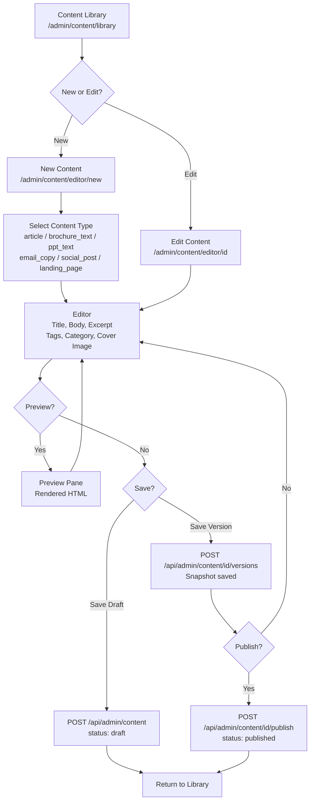
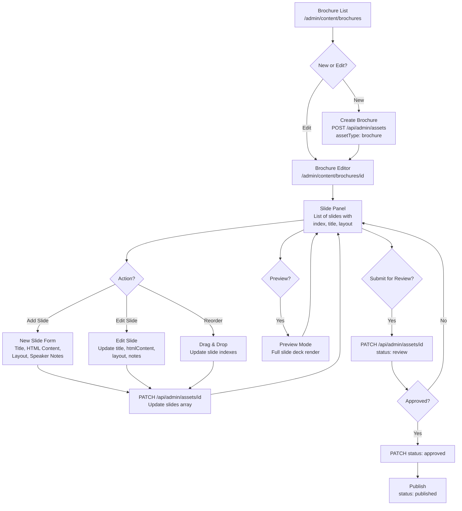
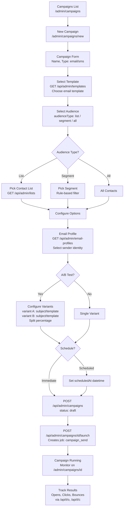
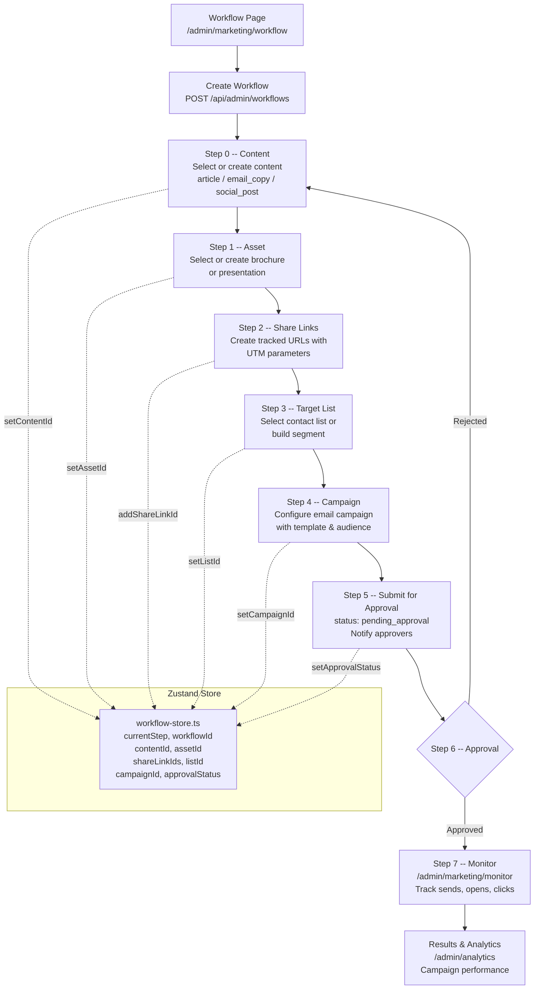

# TalentsHill Admin Portal -- UI Flow & Screen Flow

> **Stack**: Next.js 14+ App Router | SQLite / Drizzle ORM | 79 tables | 124 API routes | 62 admin pages | 17 public pages

---

## 1. Admin Navigation Structure

```
Admin Portal (/admin)
|
+-- Dashboard
|   (KPI cards, recent activity, quick actions)
|
+-- Content
|   +-- Library           /admin/content/library
|   +-- Editor (New)      /admin/content/editor/new
|   +-- Editor (Edit)     /admin/content/editor/[id]
|   +-- Brochures         /admin/content/brochures
|   +-- Brochure Editor   /admin/content/brochures/[id]
|   +-- Presentations     /admin/content/presentations
|   +-- Presentation Edit /admin/content/presentations/[id]
|   +-- Share Links       /admin/content/links
|
+-- Marketing
|   +-- Workflow           /admin/marketing/workflow
|   +-- Approvals          /admin/marketing/approvals
|   +-- Monitor            /admin/marketing/monitor
|   +-- Segments           /admin/marketing/segments
|
+-- CRM
|   +-- Contacts           /admin/contacts
|   +-- Contact Import     /admin/contacts/import
|   +-- Lists              /admin/lists
|   +-- Templates          /admin/templates
|   +-- Template Editor    /admin/templates/[id]
|   +-- Campaigns          /admin/campaigns
|   +-- Campaign Editor    /admin/campaigns/[id]
|   +-- Campaign New       /admin/campaigns/new
|   +-- Broadcasts         /admin/broadcasts
|
+-- Chat
|   +-- Conversations      /admin/chat
|   +-- Requests           /admin/chat/requests/[id]
|   +-- Sessions           /admin/chat/sessions/[id]
|
+-- Integrations
|   +-- Hub                /admin/integrations
|   +-- Integration Detail /admin/integrations/[id]
|
+-- Operations
|   +-- Runs               /admin/runs
|   +-- Email Compose      /admin/email-compose
|   +-- Banners            /admin/banners
|   +-- Media Library      /admin/media
|   +-- Maintenance        /admin/maintenance
|   +-- Content Overrides  /admin/content-overrides
|
+-- RAG Pipeline
|   +-- Dashboard          /admin/rag
|   +-- Documents          /admin/rag/documents
|   +-- Document Detail    /admin/rag/documents/[id]
|   +-- Runs               /admin/rag/runs
|   +-- Config             /admin/rag/config
|   +-- Search             /admin/rag/search
|
+-- AI Analysis
|   +-- Hub (35 frameworks) /admin/analysis
|   +-- Assessment Detail   /admin/analysis/[key]
|   +-- Projects            /admin/analysis/projects
|
+-- Analytics
|   +-- Dashboard           /admin/analytics
|   +-- Leads               /admin/leads
|   +-- Lead Detail         /admin/leads/[id]
|   +-- Survey Results      /admin/survey
|
+-- System
|   +-- Health              /admin/health
|   +-- Roles & Users       /admin/roles
|   +-- Users               /admin/users
|   +-- Features            /admin/features
|   +-- Email Profiles      /admin/email-profiles
|   +-- Appointments        /admin/appointments
|   +-- Appointment Detail  /admin/appointments/[id]
|   +-- Settings            /admin/settings
|
+-- Content Management
|   +-- Blog Posts          /admin/blog
|   +-- Blog Editor         /admin/blog/[id]
|   +-- Blog Preview        /admin/blog/[id]/preview
|   +-- Blog New            /admin/blog/new
|   +-- Videos              /admin/videos
|   +-- Services            /admin/services
|   +-- Industries          /admin/industries
```

---

## 2. Screen Flow Diagrams

### 2.1 Content Editor Flow



### 2.2 Brochure Builder Flow



### 2.3 Campaign Creation Flow



### 2.4 Marketing Workflow Flow (8-Step Pipeline)



### 2.5 AI Analysis Flow

```mermaid
flowchart TD
    A[Analysis Hub<br>/admin/analysis<br>35 Framework Cards] --> B{Select Framework}

    B --> C[Framework Detail<br>/admin/analysis/key]
    C --> D[Create Assessment<br>POST /api/admin/analysis/assessments<br>frameworkId + projectName]

    D --> E[Assessment Matrix<br>Grid of items from framework]
    E --> F[Score Each Item<br>status: not_started / in_progress<br>/ completed / not_applicable<br>score: 0-100, notes]

    F --> G[PATCH /api/admin/analysis/assessments/id<br>Update itemScores array]
    G --> H[Progress Bar Updates<br>completedItems / totalItems]

    H --> I{All Items Scored?}
    I -->|No| F
    I -->|Yes| J[Assessment Complete<br>Overall score calculated]

    J --> K[Export Report<br>GET /api/admin/analysis/assessments/id/export<br>CSV / JSON download]
    J --> L[Projects Dashboard<br>/admin/analysis/projects<br>Compare assessments]

    subgraph Frameworks (35 Available)
        F1[Technology Readiness]
        F2[Digital Maturity]
        F3[Cloud Migration]
        F4[AI Adoption]
        F5[Security Posture]
        F6[... 30 more]
    end
```

---

## 3. UI Component Library

All shared UI components live in `/components/ui/` and are exported from `/components/ui/index.ts`.

### 3.1 Component Inventory

| Component | File | CSS Module | Description |
|-----------|------|------------|-------------|
| **Button** | `Button.tsx` | `Button.module.css` | Primary, secondary, danger, ghost, outline variants. Supports loading state, disabled, icon placement. |
| **Card** | `Card.tsx` | `Card.module.css` | Container with CardHeader, CardBody, CardFooter sub-components. Elevation via `--shadow-*` tokens. |
| **Input** | `Input.tsx` | `Input.module.css` | Text input, Textarea, and Select components. Label, placeholder, error message, helper text support. |
| **Modal** | `Modal.tsx` | `Modal.module.css` | Dialog overlay with header, body, footer slots. Click-outside-to-close, ESC key handler. |
| **Tabs** | `Tabs.tsx` | `Tabs.module.css` | Tabbed navigation with active indicator. Controlled via activeTab/onChange props. |
| **Badge** | `Badge.tsx` | `Badge.module.css` | Status indicators: success, warning, error, info, neutral. Small pill-shaped labels. |
| **Accordion** | `Accordion.tsx` | `Accordion.module.css` | Collapsible sections with expand/collapse toggle. Single or multi-open modes. |
| **SectionHeader** | `SectionHeader.tsx` | `SectionHeader.module.css` | Page section title with optional subtitle, action button slot. Consistent heading hierarchy. |
| **Toast** | `Toast.tsx` | `Toast.module.css` | Notification container for success, error, warning, info messages. Auto-dismiss with timer. |

### 3.2 Usage Patterns

```tsx
// Importing components
import { Button, Card, CardBody, Input, Modal, Tabs, Badge, SectionHeader } from '@/components/ui';

// Button variants
<Button variant="primary" onClick={handleSave}>Save</Button>
<Button variant="danger" onClick={handleDelete}>Delete</Button>
<Button variant="ghost" loading={isLoading}>Loading...</Button>

// Card layout
<Card>
  <CardHeader>Title</CardHeader>
  <CardBody>Content here</CardBody>
  <CardFooter>Actions</CardFooter>
</Card>

// Form inputs
<Input label="Email" type="email" error={errors.email} />
<Textarea label="Description" rows={4} />
<Select label="Status" options={statusOptions} />

// Status badges
<Badge variant="success">Published</Badge>
<Badge variant="warning">Draft</Badge>
<Badge variant="error">Failed</Badge>
```

---

## 4. CSS Architecture

### 4.1 Methodology

- **CSS Modules** for all component and page styles (`.module.css` files)
- **Design tokens** defined as CSS custom properties in `/app/globals.css`
- **No Tailwind** -- all styling via handcrafted CSS Modules referencing design tokens
- **Dark mode** via `[data-theme="dark"]` attribute on root element (managed by `ThemeProvider` + `theme-store`)

### 4.2 Design Tokens

```
Source: /app/globals.css and /styles/globals.css

Colors:
  --color-primary, --color-primary-light, --color-primary-dark
  --color-accent (#0891b2), --color-accent-light, --color-accent-dark
  --color-heading (#1e40af), --color-subheading (#059669)
  --color-cta (#9f1239), --color-cta-light, --color-cta-dark
  --color-surface, --color-surface-light, --color-surface-lighter
  --color-text (#0f172a), --color-text-secondary, --color-text-muted
  --color-border, --color-border-light
  --color-success (#10b981), --color-warning (#f59e0b)
  --color-error (#ef4444), --color-info (#3b82f6)

Typography:
  --font-sans: system-ui, -apple-system, ...
  --font-mono: 'SF Mono', 'Fira Code', ...
  --font-size-xs (0.75rem) through --font-size-6xl (3.75rem)
  --font-weight-normal (400) / medium (500) / semibold (600) / bold (700)
  --line-height-tight (1.25) / normal (1.5) / relaxed (1.75)

Spacing:
  --space-1 (0.25rem) through --space-24 (6rem)

Border Radius:
  --radius-sm (0.375rem) / md (0.5rem) / lg (0.75rem)
  --radius-xl (1rem) / 2xl (1.5rem) / full (9999px)

Shadows:
  --shadow-sm / md / lg / xl
  --shadow-glow, --shadow-glow-lg (accent-colored glows)

Layout Breakpoints:
  --container-sm (640px), --container-md (768px)
  --container-lg (1024px), --container-xl (1200px)
  --container-2xl (1400px)

Transitions:
  --transition-fast (150ms), --transition-base (250ms), --transition-slow (400ms)
```

### 4.3 CSS Module Naming Convention

```
Component-level:  /components/ui/Button.module.css
Page-level:       /app/admin/AdminDashboard.module.css
                  /app/admin/marketing/workflow/AdminWorkflow.module.css
Public pages:     /components/HeroSection.module.css
                  /components/Footer.module.css
```

---

## 5. Public Website Pages

| Route | Page | Description |
|-------|------|-------------|
| `/` | Home | Hero section, services preview, industries preview, engagement flow, WhatsApp widget |
| `/services` | Services | All service offerings with descriptions and CTAs |
| `/industries` | Industries | Industry verticals served with use cases |
| `/blog` | Blog | Published articles with categories and tags |
| `/blog/[slug]` | Blog Post | Individual article with full content |
| `/videos` | Videos | Video content library |
| `/careers` | Careers | Open positions listing |
| `/careers/[id]` | Job Detail | Individual career posting with apply form |
| `/contact` | Contact | Contact form with rate limiting (5/min) |
| `/demo` | Demo | Request a demo form |
| `/book` | Book Appointment | Appointment booking with time slot picker |
| `/survey` | Survey | Customer survey form with rate limiting (3/min) |
| `/solutions/genai` | GenAI Solutions | Generative AI solution offerings |
| `/solutions/quantum-ai` | Quantum AI | Quantum AI solution offerings |
| `/solutions/robotics-ai` | Robotics AI | Robotics AI solution offerings |
| `/unsubscribe` | Unsubscribe | Email unsubscribe handler |
| `/maintenance` | Maintenance | Maintenance mode page |

### Public Website Components

| Component | Description |
|-----------|-------------|
| `Navbar` | Top navigation with theme toggle, responsive hamburger menu |
| `HeroSection` | Landing hero with animated engagement flow |
| `ServicesPreview` | Grid of service cards on home page |
| `IndustriesPreview` | Industry cards with icons on home page |
| `EngagementFlow` | Interactive engagement visualization |
| `Footer` | Site footer with links, social media, newsletter signup |
| `BackToTop` | Scroll-to-top floating button |
| `CookieConsent` | GDPR cookie consent banner |
| `WhatsAppWidget` | Floating WhatsApp chat button |
| `ThemeProvider` | Dark/light mode context provider |
| `ThemeToggle` | Sun/moon toggle switch |

---

## 6. State Management

All client-side state is managed via **Zustand** stores in the `/store/` directory.

| Store | File | Purpose | Persistence |
|-------|------|---------|-------------|
| **Booking** | `booking-store.ts` | Appointment booking flow state: selected date, time slot, form data | Session |
| **Chatbot** | `chatbot-store.ts` | Chatbot widget state: messages, session ID, open/closed | Session |
| **Survey** | `survey-store.ts` | Survey form progress: answers, current step, completion status | Session |
| **Theme** | `theme-store.ts` | Dark/light mode preference | LocalStorage |
| **UI** | `ui-store.ts` | Global UI state: sidebar collapsed, mobile menu open, modals | Memory |
| **Workflow** | `workflow-store.ts` | Marketing workflow 8-step pipeline: currentStep, linked entity IDs, approval status | LocalStorage (`th-marketing-workflow`) |
| **Query Provider** | `query-provider.tsx` | React Query provider wrapper for server-state caching | N/A (provider) |

### Workflow Store Detail

The workflow store is the most complex, tracking the 8-step marketing pipeline:

```typescript
interface WorkflowState {
  currentStep: number;       // 0-7
  workflowId: string | null;
  workflowName: string;
  contentId: string | null;  // Step 0: Content piece
  assetId: string | null;    // Step 1: Brochure/Presentation
  shareLinkIds: string[];    // Step 2: Tracked URLs
  listId: string | null;     // Step 3: Target contact list
  campaignId: string | null; // Step 4: Email campaign
  approvalStatus: string;    // Step 5-6: Approval state
  // Steps 7: Monitor (read from API, not stored locally)
}
```

---

## 7. Admin Page Inventory (62 Pages)

| # | Route | Category | Description |
|---|-------|----------|-------------|
| 1 | `/admin` | Dashboard | Main admin dashboard with KPIs |
| 2 | `/admin/content/library` | Content | Content library listing |
| 3 | `/admin/content/editor/new` | Content | Create new content |
| 4 | `/admin/content/editor/[id]` | Content | Edit existing content |
| 5 | `/admin/content/brochures` | Content | Brochure listing |
| 6 | `/admin/content/brochures/[id]` | Content | Brochure slide editor |
| 7 | `/admin/content/presentations` | Content | Presentation listing |
| 8 | `/admin/content/presentations/[id]` | Content | Presentation editor |
| 9 | `/admin/content/links` | Content | Share link management |
| 10 | `/admin/marketing/workflow` | Marketing | 8-step workflow pipeline |
| 11 | `/admin/marketing/approvals` | Marketing | Approval queue |
| 12 | `/admin/marketing/monitor` | Marketing | Campaign monitoring |
| 13 | `/admin/marketing/segments` | Marketing | Segment rule builder |
| 14 | `/admin/contacts` | CRM | Contact list with search/filter |
| 15 | `/admin/contacts/import` | CRM | CSV contact import |
| 16 | `/admin/lists` | CRM | Contact list management |
| 17 | `/admin/templates` | CRM | Email template listing |
| 18 | `/admin/templates/[id]` | CRM | Template editor |
| 19 | `/admin/campaigns` | CRM | Campaign listing |
| 20 | `/admin/campaigns/new` | CRM | New campaign wizard |
| 21 | `/admin/campaigns/[id]` | CRM | Campaign detail & analytics |
| 22 | `/admin/broadcasts` | CRM | Broadcast messaging |
| 23 | `/admin/chat` | Chat | Chat conversations |
| 24 | `/admin/chat/requests/[id]` | Chat | Chat request detail |
| 25 | `/admin/chat/sessions/[id]` | Chat | Chat session detail |
| 26 | `/admin/integrations` | Integrations | Integration hub |
| 27 | `/admin/integrations/[id]` | Integrations | Integration config & logs |
| 28 | `/admin/runs` | Operations | Job/run queue |
| 29 | `/admin/email-compose` | Operations | Email composer |
| 30 | `/admin/banners` | Operations | Banner management |
| 31 | `/admin/media` | Operations | Media library |
| 32 | `/admin/maintenance` | Operations | Maintenance mode & cleanup |
| 33 | `/admin/content-overrides` | Operations | Content override rules |
| 34 | `/admin/rag` | RAG | RAG pipeline dashboard |
| 35 | `/admin/rag/documents` | RAG | Document management |
| 36 | `/admin/rag/documents/[id]` | RAG | Document detail & chunks |
| 37 | `/admin/rag/runs` | RAG | Ingestion run history |
| 38 | `/admin/rag/config` | RAG | Pipeline configuration |
| 39 | `/admin/rag/search` | RAG | Semantic search interface |
| 40 | `/admin/analysis` | AI Analysis | 35 analysis framework cards |
| 41 | `/admin/analysis/[key]` | AI Analysis | Assessment matrix & scoring |
| 42 | `/admin/analysis/projects` | AI Analysis | Project comparison dashboard |
| 43 | `/admin/analytics` | Analytics | Analytics overview |
| 44 | `/admin/leads` | Analytics | Lead listing |
| 45 | `/admin/leads/[id]` | Analytics | Lead detail |
| 46 | `/admin/survey` | Analytics | Survey results |
| 47 | `/admin/health` | System | System health checks |
| 48 | `/admin/roles` | System | Role & permission management |
| 49 | `/admin/users` | System | User management |
| 50 | `/admin/features` | System | Feature flag toggles |
| 51 | `/admin/email-profiles` | System | Email sender profiles |
| 52 | `/admin/appointments` | System | Appointment listing |
| 53 | `/admin/appointments/[id]` | System | Appointment detail |
| 54 | `/admin/settings` | System | System settings |
| 55 | `/admin/blog` | Content Mgmt | Blog post listing |
| 56 | `/admin/blog/new` | Content Mgmt | New blog post |
| 57 | `/admin/blog/[id]` | Content Mgmt | Blog post editor |
| 58 | `/admin/blog/[id]/preview` | Content Mgmt | Blog post preview |
| 59 | `/admin/videos` | Content Mgmt | Video management |
| 60 | `/admin/services` | Content Mgmt | Service page management |
| 61 | `/admin/industries` | Content Mgmt | Industry page management |
| 62 | `/admin/login` | Auth | Admin login page |

---

## 8. API Route Map (124 Routes)

### Admin API Routes (`/api/admin/*`)

| Group | Routes | Methods |
|-------|--------|---------|
| Dashboard | `/admin/dashboard` | GET |
| Activity | `/admin/activity` | GET |
| Content | `/admin/content`, `/admin/content/[id]`, `/admin/content/[id]/publish`, `/admin/content/[id]/versions` | GET, POST, PATCH, DELETE |
| Assets | `/admin/assets`, `/admin/assets/[id]` | GET, POST, PATCH, DELETE |
| Links | `/admin/links`, `/admin/links/[id]` | GET, POST, PATCH, DELETE |
| Workflows | `/admin/workflows`, `/admin/workflows/[id]`, `/admin/workflows/[id]/approve`, `/admin/workflows/[id]/comments` | GET, POST, PATCH, DELETE |
| Contacts | `/admin/contacts`, `/admin/contacts/[id]`, `/admin/contacts/import`, `/admin/contacts/import/[id]`, `/admin/contacts/export` | GET, POST, PATCH, DELETE |
| Lists | `/admin/lists`, `/admin/lists/[id]`, `/admin/lists/[id]/preview` | GET, POST, PATCH, DELETE |
| Templates | `/admin/templates`, `/admin/templates/[id]`, `/admin/templates/[id]/test-send` | GET, POST, PATCH, DELETE |
| Campaigns | `/admin/campaigns`, `/admin/campaigns/[id]`, `/admin/campaigns/[id]/launch`, `/admin/campaigns/[id]/recipients` | GET, POST, PATCH, DELETE |
| Broadcasts | `/admin/broadcasts`, `/admin/broadcasts/[id]` | GET, POST, PATCH, DELETE |
| Analysis | `/admin/analysis/frameworks`, `/admin/analysis/frameworks/[key]`, `/admin/analysis/assessments`, `/admin/analysis/assessments/[id]`, `/admin/analysis/assessments/[id]/export`, `/admin/analysis/dashboard` | GET, POST, PATCH, DELETE |
| Analytics | `/admin/analytics/campaigns`, `/admin/analytics/contacts` | GET |
| Chat | `/admin/chat/sessions`, `/admin/chat/sessions/[id]`, `/admin/chat/requests`, `/admin/chat/requests/[id]`, `/admin/chat/requests/[id]/respond`, `/admin/chat/requests/[id]/notes` | GET, POST, PATCH |
| RAG | `/admin/rag/documents`, `/admin/rag/documents/[id]`, `/admin/rag/documents/[id]/chunks`, `/admin/rag/documents/[id]/ingest`, `/admin/rag/runs`, `/admin/rag/runs/[id]`, `/admin/rag/config`, `/admin/rag/search`, `/admin/rag/evaluate`, `/admin/rag/health` | GET, POST, PATCH, DELETE |
| Integrations | `/admin/integrations`, `/admin/integrations/[id]`, `/admin/integrations/[id]/test`, `/admin/integrations/[id]/logs` | GET, POST, PATCH, DELETE |
| Blog | `/admin/blog/posts`, `/admin/blog/posts/[id]` (in public API prefix) | GET, POST, PATCH, DELETE |
| Videos | `/admin/videos`, `/admin/videos/[id]` | GET, POST, PATCH, DELETE |
| Services | `/admin/services`, `/admin/services/[id]` | GET, POST, PATCH, DELETE |
| Industries | `/admin/industries`, `/admin/industries/[id]` | GET, POST, PATCH, DELETE |
| Jobs | `/admin/jobs`, `/admin/jobs/[id]` | GET, POST, PATCH |
| Runs | `/admin/runs`, `/admin/runs/[id]` | GET, POST, PATCH |
| Roles | `/admin/roles`, `/admin/roles/[id]` | GET, POST, PATCH, DELETE |
| Users | `/admin/users`, `/admin/users/[id]` | GET, POST, PATCH, DELETE |
| Features | `/admin/features`, `/admin/features/[id]`, `/admin/features/bust-cache` | GET, POST, PATCH, DELETE |
| Email Profiles | `/admin/email-profiles`, `/admin/email-profiles/[id]` | GET, POST, PATCH, DELETE |
| Banners | `/admin/banners`, `/admin/banners/[id]` | GET, POST, PATCH, DELETE |
| Media | `/admin/media`, `/admin/media/[id]` | GET, POST, DELETE |
| Webhooks | `/admin/webhooks`, `/admin/webhooks/[id]` | GET, POST, PATCH, DELETE |
| SMTP | `/admin/smtp-configs`, `/admin/smtp-configs/[id]` | GET, POST, PATCH, DELETE |
| Settings | `/admin/settings` | GET, PATCH |
| Maintenance | `/admin/maintenance` | GET, POST |
| Health | `/admin/health` | GET |
| Content Overrides | `/admin/content-overrides` | GET, POST |
| Email Compose | `/admin/email-compose` | POST |
| Event Routes | `/admin/event-routes` | GET, POST |
| Survey | `/admin/survey` | GET |

### Public API Routes

| Route | Methods | Description |
|-------|---------|-------------|
| `/api/auth/login` | POST | Admin login |
| `/api/auth/logout` | POST | Admin logout |
| `/api/auth/session` | GET | Session validation |
| `/api/contact` | POST | Contact form submission (rate limited) |
| `/api/demo` | POST | Demo request form |
| `/api/survey` | POST | Survey submission (rate limited) |
| `/api/newsletter` | POST | Newsletter signup |
| `/api/appointments/*` | GET, POST | Booking flow |
| `/api/appointments/slots` | GET | Available time slots |
| `/api/chat` | POST | Chatbot messages |
| `/api/chat/session` | POST | Chatbot session |
| `/api/chat/email` | POST | Chat email capture |
| `/api/careers` | GET | Job listings |
| `/api/blog/posts/*` | GET | Blog content |
| `/api/blog/categories` | GET | Blog categories |
| `/api/blog/tags` | GET | Blog tags |
| `/api/blog/views` | POST | View tracking |
| `/api/blog/stats` | GET | Blog statistics |
| `/api/blog/subscribers` | POST | Blog subscribe |
| `/api/banners/active` | GET | Active banners |
| `/api/s/[code]` | GET | Share link redirect + click tracking |
| `/api/t/o/[id]` | GET | Email open tracking pixel |
| `/api/t/c/[id]` | GET | Email click tracking redirect |
| `/api/t/u/[token]` | GET | Unsubscribe handler |
